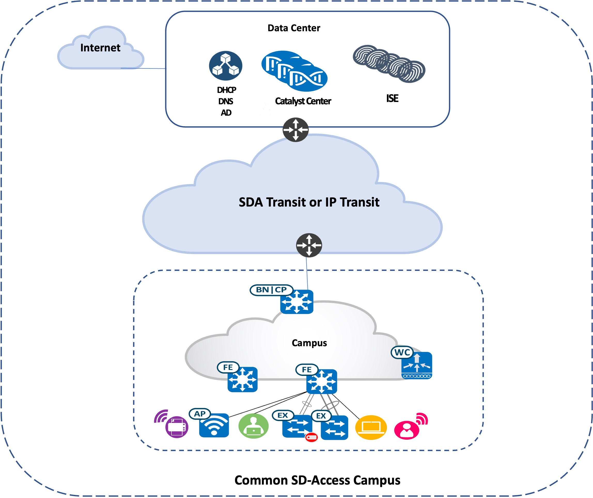
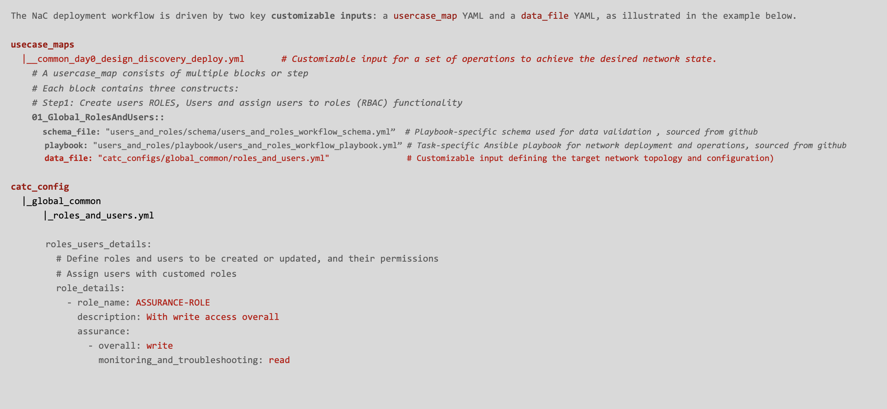

<p align="center">
	<em><code>-  Catalyst Center Network as Code With  Ansible Playbooks User Guide for a common SD Access fabric deployment </code></em>
</p>
<p align="center"><!-- default option, no dependency badges. -->
</p>
<p align="center">
	<!-- default option, no dependency badges. -->
</p>
<br>


##  Table of Contents

-  [Overview](#Overview )
-  [Compatibility Matrix](#compatibility-matrix )
-  [Network Topology](#network-topology )
- [ Project Structure](#project-structure)
- [ Customizable Inputs](#customizable-inputs)
- [ Project Index](#project-index)
- [ Getting Started](#getting-started)
  - [ Prerequisites](#prerequisites)
  - [ Installation](#installation)
  - [ Usage](#usage)
- [ Contributing](#contributing)
- [ License](#license)
- [ Acknowledgments](#acknowledgments)

---
##  Overview
This GitHub project provides a comprehensive Ansible automatioin framework for network deployment and operation of on a freshly installed Catalyst center. By leveraging Ansible's automation capabilities, this project streamlines the end-to-end configuration process, reduces manual errors, provides easy cusotomization, and ensures consistency across your network.

---
##  Compatibility Matrix
The following matrix shows the supported and verified version combinations for the usecases described in this repository.
			<table>
			<tr>
				<td><b>Cisco Catalyst Center version	</b></td>
				<td><b>2.3.7.9</b></td>
			</tr>
			<tr>
				<td><b>Ansible "cisco.dnac" version</b></td>
				<td><b>6.31.2</b></td>
				<td><b><code> ansible-galaxy collection install cisco.dnac:6.31.3 --force --ignore-certs # setup.sh </code></b></td>
			</tr>
			<tr>
				<td><b>Python "dnacentersdk" version </b></td>
				<td><b>2.9.1</b></td>
				<td><b><code>python -m pip install dnacentersdk==2.9.1 # setup.sh </code></b></td>
			</tr>
			</table>

---
## Network Topology


---
##  Project Structure
This project provides a complete Network as Code (NaC) solution for deploying  a typical Cisco Software-Defined Access (SDA) environments using Catalyst Center and Ansible automation. The structure includes declarative YAML configurations (catc_configs/), orchestrated deployment scenarios (usecase_maps/), automated cleanup capabilities (catc_delete_configs/), environment setup script (setup.sh), execution tools (scripts/), and Catalyst Center access configuration (catalystcenter_inventory/). This enables network IT teams to achieve repeatable, reliable SDA deployments with full lifecycle management from initial network setup through ongoing operations and decommissioning.

```sh
└── CatC_Network_as_Code.git/
    ├── ansible.cfg
    ├── ansible_inventory
    │   └── catalystcenter_inventory
    ├── catc_configs
    │   └── global_common
    |        └── YAML Input files for global level Catalyst Center Configurations, i.e. ISE Integrations, Global Credentials, Global IP Pools etc. 
    |        |── catalyst_center_and_ise_integration.yml
    |        |── device_credentials.yml
    |        |── devices_discovery.yml
    |        |── network_hierarchy_design.yml
    |        |── network_settings_global_ip_pools.yml
    |        |── network_settings_servers.yml
    |        └── roles_and_users.yml
    │   └── sites_common
    |        └── YAML Input files for site level configuration 
    |        |── site_device_credentials.yml
    |        |── site_devices_provision.yml
    |        |── site_inventory.yml
    |        |── site_network_compliance.yml
    |        |── site_network_settings_ippools.yml
    |        |── site_network_settings_servers.yml
    |        |── site_sda_fabric_devices.yml
    |        |── site_sda_fabric_gateways.yml
    |        |── site_sda_fabric_hostonboarding.yml
    |        |── site_sda_fabric_sites_zones.yml
    | 	     |── site_sda_fabric_vns.yml
    | 	     └── site_sda_transits.yml
    ├── catc_delete_configs
    │   └── common_cleanup
    |        └── YAML Input files for cleaning up  Catalyst Center global and site level configurations
    |        |── cleanup_global_catalyst_center_and_ise_integration.yml
    |        |── cleanup_global_device_credentials.yml
    |        |── cleanup_global_network_hierarchy_design.yml
    |        |── cleanup_global_network_settings_global_ip_pools.yml
    |        |── cleanup_global_network_settings_servers.yml
    |        |── cleanup_global_roles_and_users.yml
    |        |── cleanup_site_devices_provision.yml
    |        |── cleanup_site_network_settings_ippools.yml
    |        |── cleanup_site_sda_fabric_devices.yml
    |        |── cleanup_site_sda_fabric_gateways.yml
    |        |── cleanup_site_sda_fabric_hostonboarding.yml
    |        |── cleanup_site_sda_fabric_sites_zones.yml
    | 	     |── cleanup_site_sda_fabric_vns.yml
    | 	     └── cleanup_site_sda_transits.yml
    ├── requirements.txt
    ├── scripts
    │   └── run_playbooks.py
    ├── setup.sh
    └── usecase_maps
        ├── common_day0_design_discovery_deploy.yml
        |     └── YAML usecase map for green-field day-0 bring up of a common sd-access fabric deployment managed by CatC.
    	└── common_cleanup.yml
              └── YAML usecase map to completely cleanup all the configurations from CatC. 
```

## Customizable Inputs


##  Project Index
<details open>
	<summary><b><code>CATC_NETWORK_AS_CODE_COMMON.GIT</code></b></summary>
	<details> <!-- __root__ Submodule -->
		<summary><b>__root__</b></summary>
		<blockquote>
			<table>
			<tr>
				<td><b><a href='https://github.com/DNACENSolutions/NetworkasCode_CVPs/tree/main/nac_common/NaC_1_0_Common/setup.sh'>setup.sh</a></b></td>
				<td><code>-  Setup script to create your python environment and install Catalyst Center Python SDK (dnacentersdk) and Ansible collection (cisco.dnac)</code></td>
			</tr>
			<tr>
				<td><b><a href='https://github.com/DNACENSolutions/NetworkasCode_CVPs/tree/main/nac_common/NaC_1_0_Common/requirements.txt'>requirements.txt</a></b></td>
				<td><code>-  This file contains the required python modules. This file is used by setup.sh script</code></td>
			</tr>
			</table>
		</blockquote>
	</details>
	<details> <!-- scripts Submodule -->
		<summary><b>scripts</b></summary>
		<blockquote>
			<table>
			<tr>
				<td><b><a href='https://github.com/DNACENSolutions/NetworkasCode_CVPs/tree/main/nac_common/NaC_1_0_Common/scripts/run_playbooks.py'>run_playbooks.py</a></b></td>
				<td><code>-  This Python tool is to run the Ansible playbooks with Inputs files preprogrammed in the usecase_maps files. The Tools lets you choose option to Validate the input, Execute the playbook or do both. Further it gives option for user to run the Catalyst Center Configuration usecases individually, or in a sub-group of usecase , or all the usecase in the order specified in the input file selected from usecase_maps directory.</code></td>
			</tr>
			</table>
		</blockquote>
	</details>
	<details> <!-- usecase_maps Submodule -->
		<summary><b>usecase_maps </b></summary>
		<blockquote>
			<table>
			<tr>
			    <td><b><a href='https://github.com/DNACENSolutions/NetworkasCode_CVPs/tree/main/nac_common/NaC_1_0_Common/usecase_maps/common_day0_design_discovery_deploy.yml'>common_day0_design_discovery_deploy.yml</a></b></td>
                <td> - This yaml usecase deploys a typical campus fabric. <br> 
				- This usecase consists of 19 operations in below sequence :<br><br>
                #    Step_01_Global RBAC Management <br>
                #    Step_02_Global AAA Integration  <br>
                #    Step_03_Global Device Credetials <br>
                #    Step_04_Global Devices Discovery <br>
                #    Step_05_Global Network Site Hierachy  <br>
                #    Step_06_Global Network Settings (ISE, DHCP, DNS, NTP etc) <br> 
                #    Step_07_Global IP Address Pool allocation <br> 
                #    Step_08_site Device Credetials<br> 
                #    Step_09_site Network Settings <br> 
                #    Step_10_site IP Pool reservation<br> 
                #    Step_11_site Device invenotry roles<br> 
                #    Step_12_site Device provision to site<br> 
                #    Step_13_site Fabric Sites and Zones<br> 
                #    Step_14_site Fabric Transits<br> 
                #    Step_15_site Fabric VNs<br> 
                #    Step_16_site Fabric L2L3 gateways <br>
                #    Step_17_site Fabric Device Deploy - B, C, E <br>
                #    Step_18_site Fabric Edge Host on Boarding <br>
                #    Step_19_site Network Compliance <br>
                </td>
			</tr>
			<tr>
				<td><b><a href='https://github.com/DNACENSolutions/NetworkasCode_CVPs/tree/main/nac_common/NaC_1_0_Common/usecase_maps/common_cleanup.yml'>common_cleanup.yml</a></b></td>
                <td>
                - This yaml usecase completely cleanup all the configurations (global level and site level)  from CatC. <br>
                - This usecase consists of 14 operations in below sequence :<br><br>
                #    Step_01 Cleanup Site Fabric Edge Host on Boarding<br>
                #    Step_02 Cleanup Site Fabric Devices<br>
                #    Step_03 Cleanup Site Fabric L2L3 gateways<br>
                #    Step_04 Cleanup Site Fabric Virtual Networks<br>
                #    Step_05 Cleanup Site Fabric Transits<br>
                #    Step_06 Cleanup Site Fabric Sites and Zones<br>
                #    Step_07 Cleanup Site Provisioned Devices<br>
                #    Step_08 Cleanup Site IP Pool reservation<br>
                #    Step_09 Cleanup Global IP Address Pool allocation<br>
                #    Step_10 Cleanup Global Network Settings (ISE, DHCP, DNS, NTP etc) <br>
                #    Step_11 Cleanup Global Network Site Hierachy <br>
                #    Step_12 Cleanup Global Device Credetials<br>
                #    Step_13 Cleanup Global AAA/ISE Integration <br>
                #    Step_14 Cleanup Global RBAC Management<br>
                </td>
			</tr>
			</table>
		</blockquote>
	</details>
	<details> <!-- catc_configs Submodule -->
		<summary><b>catc_configs</b></summary>
				<blockquote>
					<details>
						<summary><b>global_common</b></summary>
						<blockquote>
							<table>
							<tr>
								<td><b><a href='https://github.com/DNACENSolutions/NetworkasCode_CVPs/tree/main/nac_common/NaC_1_0_Common/catc_configs/global_common/roles_and_users.yml'> roles_and_users.yml </a></b></td>
								<td>
								<code>- This file contains Role-Based Access Control (RBAC) configurations to manage user permissions and roles, which includes : SUPER-ADMIN-ROLE, NETWORK-ADMIN-ROLE, OBSERVER-ROLE and Customized-ROLE.</code><br>
								<code>- This example creates 3 users:</code><br>
								<code> • one user with NETWORK-ADMIN-ROLE</code><br> 
								<code> • one user with OBSERVER-ROLE</code> <br>
								<code> • one user with ASSURANCE-ROLE (new customized role)</code><br> 
								<code>- Related Playbook <a href='https://github.com/cisco-en-programmability/catalyst-center-ansible-iac/blob/main/workflows/users_and_roles/README.md'>users_and_roles_playbook</a></code>
								</td>
							</tr>
							<tr>
								<td><b><a href='https://github.com/DNACENSolutions/NetworkasCode_CVPs/tree/main/nac_common/NaC_1_0_Common/catc_configs/global_common/catalyst_center_and_ise_integration.yml'> catalyst_center_and_ise_integrat.yml </a></b></td>
								<td>
								<code>- This file contains configurations to integrates ISE with Catalyst Center and adds external AAA servers to Catalyst Center.</code><br> 
								<code>- This example integrates ISE server with Catalyst Center. </code><br> 
								<code>- Related Playbook <a href='https://github.com/cisco-en-programmability/catalyst-center-ansible-iac/blob/main/workflows/ise_radius_integration/README.md'>catalyst_center_and_ise_integra_playbook</a></code>
								</td>
							</tr>
							<tr>
								<td><b><a href='https://github.com/DNACENSolutions/NetworkasCode_CVPs/tree/main/nac_common/NaC_1_0_Common/catc_configs/global_common/device_credentials.yml'> device_credentials.yml </a></b></td>
								<td>
								<code>- This file contains to organize and manage network device credentials, including creating, applying, and updating them during deployment or maintenance. </code><br>
								<code>- This example configures cli-credential, snmp-v3 credential and https credential(s) for devices. </code><br>
								<code>- Related Playbook <a href='https://github.com/cisco-en-programmability/catalyst-center-ansible-iac/blob/main/workflows/device_credentials/README.md'>device_credentials_playbook</a></code>
								</td>
							</tr>
							<tr>
								<td><b><a href='https://github.com/DNACENSolutions/NetworkasCode_CVPs/tree/main/nac_common/NaC_1_0_Common/catc_configs/global_common/devices_discovery.yml'> devices_discovery.yml </a></b></td>
								<td>
								<code>- This file contains configurations required to discover network devices and add them to the inventory.</code><br> 
								<code>- This example discovers devices via ip address range(s) </code><br> 
								<code>- Related Playbook <a href='https://github.com/cisco-en-programmability/catalyst-center-ansible-iac/blob/main/workflows/device_credentials/README.md'>device_credentials_playbook</a></code>
								</td>
							</tr>
							<tr>
								<td><b><a href='https://github.com/DNACENSolutions/NetworkasCode_CVPs/tree/main/nac_common/NaC_1_0_Common/catc_configs/global_common/network_hierarchy_design.yml'> network_hierarchy_design.yml </a></b></td>
								<td>
								<code>- This file contains configurations to create a network hierarchy that represents network's geographical locations.</code><br>
								<code>- This example creates a network hierachy including areas, buildings and floors.  </code><br>
								<code>- Related Playbook <a href='https://github.com/cisco-en-programmability/catalyst-center-ansible-iac/blob/main/workflows/site_hierarchyy/README.md'>site_hierarchy_playbook</a></code>
								</td>
							</tr>
							<tr>
								<td><b><a href='https://github.com/DNACENSolutions/NetworkasCode_CVPs/tree/main/nac_common/NaC_1_0_Common/catc_configs/global_common/network_settings_servers.yml'> network_settings_servers.yml </a></b></td>
								<td>
								<code>- This file contains configurations of global level Network Settings.</code><br>
								<code>- This example configures following servers in network settings:  dns_server, dhcp_server, ntp_server, network_AAA, client_and_endpoint_AAA, snmp_server, syslog_server, netflow_collector, wired_data_collection, and wireless_telemetry. </code><br>
                                <code>- Related Playbook <a href='https://github.com/cisco-en-programmability/catalyst-center-ansible-iac/blob/main/workflows/network_settings/README.md'>network_settings_playbook</a></code></td>
							</tr>
							<tr>
								<td><b><a href='https://github.com/DNACENSolutions/NetworkasCode_CVPs/tree/main/nac_common/NaC_1_0_Common/catc_configs/global_common/network_settings_global_ip_pools.yml'> network_settings_global_ip_pools.yml </a></b></td>
								<td>
								<code>- This file contains configurations of global level IP Pools.</code><br>
								<code>- This example configures following global IP Pools: AP_POOL, Extended_Node_POOl, LAN_AUTOMATION_POOL, Multicast_POOL, L3_BORDER_HANDOFF_POOL, WIRED_CLIENT_POOL, and WIRELESS_CLIENT_POOL. </code><br>
                                <code>- Related Playbook <a href='https://github.com/cisco-en-programmability/catalyst-center-ansible-iac/blob/main/workflows/network_settings/README.md'>network_settings_playbook</a></code></td>
							</tr>
							</table>
						</blockquote>
					</details>
					<details>
						<summary><b>site_common</b></summary>
						<blockquote>
							<table>
							<tr>
								<td><b><a href='https://github.com/DNACENSolutions/NetworkasCode_CVPs/tree/main/nac_common/NaC_1_0_Common/catc_configs/sites_common/sanjose/site_device_credentials.yml'> site_device_credentials.yml </a></b></td>
								<td>
								<code>- This file contains configuration to organize and manage network device credentials, including creating, applying, and updating them during deployment or maintenance.</code><br>
								<code>- This example assigns credentials to the sites.</code><br>
								<code>- Related Playbook <a href='https://github.com/cisco-en-programmability/catalyst-center-ansible-iac/blob/main/workflows/device_credentials/README.md'>device_credentials_playbook</a></code><br>
								</td>
							</tr>
							<tr>
								<td><b><a href='https://github.com/DNACENSolutions/NetworkasCode_CVPs/tree/main/nac_common/NaC_1_0_Common/catc_configs/sites_common/sanjose/site_network_settings_servers.yml'> site_network_settings_servers.yml </a></b></td>
								<td>
								<code>- This file contains configurations of Network Settings and IP Pools (GLobal/Sites).</code><br>
								<code>- This example configures site-level network settings.</code><br>
								<code>- Related Playbook <a href='https://github.com/cisco-en-programmability/catalyst-center-ansible-iac/blob/main/workflows/network_settings/README.md'>network_settings_playbook</a></code><br>
								</td>
							</tr>
							<tr>
								<td><b><a href='https://github.com/DNACENSolutions/NetworkasCode_CVPs/tree/main/nac_common/NaC_1_0_Common/catc_configs/sites_common/sanjose/site_network_settings_ippools.yml'> site_network_settings_ippools.yml </a></b></td>
								<td>
								<code>- This file contains configurations of Network Settings and IP Pools (GLobal/Sites).</code><br>
								<code>- This example configures site-level ip pools.</code><br>
								<code>- Related Playbook <a href='https://github.com/cisco-en-programmability/catalyst-center-ansible-iac/blob/main/workflows/network_settings/README.md'>network_settings_playbook</a></code><br>
								</td>
							</tr>
							<tr>
								<td><b><a href='https://github.com/DNACENSolutions/NetworkasCode_CVPs/tree/main/nac_common/NaC_1_0_Common/catc_configs/sites_common/sanjose/site_inventory.yml'> site_inventory.yml </a></b></td>
								<td>
								<code>- This file contains configuration related to various inventory management tasks within your network, such as adding devices, assigning devices to sites, provisioning, updating devices, resyncing devices, changing device roles, and deleting devices from the inventory.</code><br>
								<code>- This example assigns inventory role to all devices - ACCESS, CORE, DISTRIBUTION, BORDER ROUTER.</code><br>
								<code>- Related Playbook <a href='https://github.com/cisco-en-programmability/catalyst-center-ansible-iac/blob/main/workflows/inventory/README.md'>inventory_playbook</a></code><br>
								</td>
							</tr>
							<tr>
								<td><b><a href='https://github.com/DNACENSolutions/NetworkasCode_CVPs/tree/main/nac_common/NaC_1_0_Common/catc_configs/sites_common/sanjose/site_devices_provision.yml'> site_devices_provision.yml </a></b></td>
								<td>
								<code>- This file contains configurations related to device provisioning, such as assigning device to sites, provisioning, reprovisioning and deleting provisioned devices in Catalyst Center inventory.</code><br>
								<code>- This example assigns devices to sites and provision all the devices</code><br>
								<code>- Related Playbook <a href='https://github.com/cisco-en-programmability/catalyst-center-ansible-iac/blob/main/workflows/provision/README.md'>provision_playbook</a></code><br>
								</td>
							</tr>
							<tr>
								<td><b><a href='https://github.com/DNACENSolutions/NetworkasCode_CVPs/tree/main/nac_common/NaC_1_0_Common/catc_configs/sites_common/sanjose/site_sda_fabric_sites_zones.yml'> site_sda_fabric_sites_zones.yml </a></b></td>
								<td>
								<code>- This file contains configuration required to create fabric sites.</code><br>
								<code>- This example creates one fabric sites and one fabric zone with closed-authetication profile</code><br>
								<code>- Related Playbook <a href='https://github.com/cisco-en-programmability/catalyst-center-ansible-iac/blob/main/workflows/sda_fabric_sites_zones/README.md'>sda_fabric_sites_zones_playbook</a></code><br>
								</td>
							</tr>
							<tr>
								<td><b><a href='https://github.com/DNACENSolutions/NetworkasCode_CVPs/tree/main/nac_common/NaC_1_0_Common/catc_configs/sites_common/sanjose/site_sda_transits.yml'> sda_fabric_transits.yml </a></b></td>
								<td>
								<code>- This file contains configuration required to create fabric transits - IP transit or SDA transit.</code><br>
								<code>- This example creates two IP transits for sda fabric site.</code><br>
								<code>- Related Playbook <a href='https://github.com/cisco-en-programmability/catalyst-center-ansible-iac/blob/main/workflows/sda_fabric_transits/README.md'>sda_fabric_transits</a></code><br>
								</td>
							</tr>
							<tr>
								<td><b><a href='https://github.com/DNACENSolutions/NetworkasCode_CVPs/tree/main/nac_common/NaC_1_0_Common/catc_configs/sites_common/sanjose/site_sda_fabric_vns.yml'> site_sda_fabric_vns.yml </a></b></td>
								<td>
								<code>- This file contains configurations required to assign VNs (virtual networks) to Fabric sites.</code><br>
								<code>- This example assigns multiple VNs to fabric sites and zones.</code><br>
								<code>- Related Playbook <a href='https://github.com/cisco-en-programmability/catalyst-center-ansible-iac/blob/main/workflows/sda_virtual_networks_l2_l3_gateways/README.md'>sda_virtual_networks_l2_l3_gateways_playbook</a></code><br>
								</td>
							</tr>
							<tr>
								<td><b><a href='https://github.com/DNACENSolutions/NetworkasCode_CVPs/tree/main/nac_common/NaC_1_0_Common/catc_configs/sites_common/sanjose/site_sda_fabric_gateways.yml'> site_sda_fabric_gateways.yml </a></b></td>
								<td>
								<code>- This file contains configurations required to assign L2 and L3 gateways to Fabric sites.</code><br>
								<code>- This example assigns multiple L3 Gateways to fabric sites and zones.</code><br>
								<code>- Related Playbook <a href='https://github.com/cisco-en-programmability/catalyst-center-ansible-iac/blob/main/workflows/sda_virtual_networks_l2_l3_gateways/README.md'>sda_virtual_networks_l2_l3_gateways_playbook</a></code><br>
								</td>
							</tr>
							<tr>
								<td><b><a href='https://github.com/DNACENSolutions/NetworkasCode_CVPs/tree/main/nac_common/NaC_1_0_Common/catc_configs/sites_common/sanjose/site_sda_fabric_devices.yml'> site_sda_fabric_devices.yml </a></b></td>
								<td>
								<code>- This file contains configurations related to fabric device roles, such as assigning and managing device roles (Control Plane Node, Edge Node, Border Node, Wireless Controller) within the SDA fabric.</code><br>
								<code>- This file also contains configuration of border settings for Layer 2 and Layer 3 handoffs.</code><br>
								<code>- This example assigns one collocated BORDER/CP with IP Transit to the fabric. It also assign one EDGE to a fabric site, and assigns the other EDGE to a fabric zone.</code><br><br>
								<code>⚠️ Performance Consideration:</code><br>
								<code>- If deployments contains multiple fabric sites, when constructing Yaml, putting all devices as one list under the same fabric site or zone will generate one single fabric task for all devices in the same fabric. This will speed up the fabric deployment processes.</code><br>
								<code>✏️ Example Yaml ( 2 fabric sites )</code><br>
								<code>fabric_devices_details::</code><br>
								<code># Add all devices as one list under first fabric site</code><br>
								<code>- fabric_devices:</code><br>
								<code>&nbsp;&nbsp;fabric_name: "scale_fabric_1"</code><br>
								<code>&nbsp;&nbsp;device_config:</code><br>
								<code>&nbsp;&nbsp;- device_ip:</code><br>
								<code>&nbsp;&nbsp;&nbsp;&nbsp;device_roles: [CONTROL_PLANE_NODE, BORDER_NODE]</code><br>
								<code>&nbsp;&nbsp;- device_ip:</code><br>
								<code>&nbsp;&nbsp;&nbsp;&nbsp;device_roles: [EDGE_NODE]</code><br>
								<code>&nbsp;&nbsp;&nbsp;&nbsp;.....</code><br>
								<code>&nbsp;&nbsp;- device_ip:</code><br>
								<code>&nbsp;&nbsp;&nbsp;&nbsp;device_roles: [EDGE_NODE]</code><br><br>
								<code>⚠️ Dependancy Consideration:</code><br>
								<code>- If deployments contains fabric sites which have fabric zones enabled, when constructing Yaml, construct fabric site with Border and CP before constructing fabric zone.</code><br>
								<code>✏️ Example Yaml ( 1 fabric sites with 1 child fabric zone )</code><br>
								<code>fabric_devices_details::</code><br>
								<code># First Fabric site</code><br>
								<code>- fabric_devices:</code><br>
								<code>&nbsp;&nbsp;fabric_name: "fabric_site"</code><br>
								<code>&nbsp;&nbsp;device_config:</code><br>
								<code>&nbsp;&nbsp;- device_ip:</code><br>
								<code>&nbsp;&nbsp;&nbsp;&nbsp;device_roles: [CONTROL_PLANE_NODE, BORDER_NODE]</code><br>
								<code>&nbsp;&nbsp;- device_ip:</code><br>
								<code>&nbsp;&nbsp;&nbsp;&nbsp;device_roles: [EDGE_NODE]</code><br>
								<code>&nbsp;&nbsp;&nbsp;&nbsp;.....</code><br>
								<code># Second Fabric zone</code><br>
								<code>- fabric_devices:</code><br>
								<code>&nbsp;&nbsp;fabric_name: "fabric_zone"</code><br>
								<code>&nbsp;&nbsp;device_config:</code><br>
								<code>&nbsp;&nbsp;- device_ip:</code><br>
								<code>&nbsp;&nbsp;&nbsp;&nbsp;device_roles: [EDGE_NODE]</code><br>
								<code>&nbsp;&nbsp;&nbsp;&nbsp;.....</code><br>
								<code>- Related Playbook <a href='https://github.com/cisco-en-programmability/catalyst-center-ansible-iac/blob/main/workflows/sda_fabric_device_roles/README.md'>sda_fabric_device_roles_playbook</a></code><br>
								</td>
							</tr>
							<tr>
								<td><b><a href='https://github.com/DNACENSolutions/NetworkasCode_CVPs/tree/main/nac_common/NaC_1_0_Common/catc_configs/sites_common/sanjose/site_sda_fabric_hostonboarding.yml'> site_sda_fabric_hostonboarding.yml </a></b></td>
								<td>
								<code>- This file contains configurations for host onboarding operations, such as add, update, and delete port assignments and port channels for network devices.</code><br>
								<code>- This example configures host onboarding on mulitple ports on a fabric edge.</code><br><br>
								<code>⚠️ Scale Consideration:</code><br>
								<code>CatC 2.3.7.9 RAPI for host onboarding supports max 400 ports per payload. Yaml needs to be constructed in blocks where each block contains up to 400 ports.</code><br>
								<code>- Related Playbook <a href='https://github.com/cisco-en-programmability/catalyst-center-ansible-iac/blob/main/workflows/sda_hostonboarding/README.md'>sda_hostonboarding_playbook</a></code><br>
								</td>
							</tr>
							<tr>
								<td><b><a href='https://github.com/DNACENSolutions/NetworkasCode_CVPs/tree/main/nac_common/NaC_1_0_Common/catc_configs/sites_common/sanjose/site_network_compliance.yml'> site_network_compliance.yml </a></b></td>
								<td>
								<code>- This file contains configuration related to management of device compliance within your network.</code><br>
								<code>- This example performs compliance check on multiple fabric devices.</code><br>
								<code>- Related Playbook <a href='https://github.com/cisco-en-programmability/catalyst-center-ansible-iac/blob/main/workflows/network_compliance/README.md'>network_compliance_playbook</a></code><br>
								</td>
							</tr>
							</table>
						</blockquote>
					</details>
		</blockquote>
	</details>
	<details> <!-- catc_delete_config Submodule -->
    <summary><b>catc_delete_config</b></summary>
    <blockquote>
        <details>
            <summary><b>common_cleanup</b></summary>
            <blockquote>
                <table>
				<tr><code>These YAML files are used to automate the cleanup and rollback of all Catalyst Center global and site-level configurations, ensuring a clean state for redeployment or decommissioning. </code><br><br>
				</tr>
                <tr>
                    <td><b><a href='https://github.com/DNACENSolutions/NetworkasCode_CVPs/tree/main/nac_common/NaC_1_0_Common/catc_delete_configs/common_cleanup/cleanup_site_sda_fabric_hostonboarding.yml'>cleanup_site_sda_fabric_hostonboarding.yml</a></b></td>
                    <td>
					<code>- This file contains configurations to remove port and host assignments.</code><br>
                    <code>- Deletes all host onboarding configurations for the SDA fabric site.</code><br><br>
					<code>⚠️ Configuration Tips:</code><br>
					<code>- Remove all port assignments on a device</code><br>
					<code>&nbsp;&nbsp;This will delete all port assignments on the device via a single RAPI request</code><br>
  					<code>&nbsp;&nbsp;✏️ Example Yaml:</code><br>
					<code>&nbsp;&nbsp;- ip_address: 100.0.2.3</code><br>
  					<code>&nbsp;&nbsp;&nbsp;&nbsp;fabric_site_name_hierarchy: Global/USA/California/SAN JOSE</code><br>
  					<code>- Remove specific port assignment(s) on a device</code><br>
					<code>&nbsp;&nbsp;This will delete port assignments one port at a time via multiple RAPI requests</code><br>
  					<code>&nbsp;&nbsp;✏️ Example Yaml:</code><br>
					<code>&nbsp;&nbsp;- ip_address: 100.0.2.3</code><br>
					<code>&nbsp;&nbsp;&nbsp;&nbsp;fabric_site_name_hierarchy: Global/USA/California/SAN JOSE</code><br>
					<code>&nbsp;&nbsp;&nbsp;&nbsp;port_assignments:</code><br>
					<code>&nbsp;&nbsp;&nbsp;&nbsp;- interface_name: "TenGigabitEthernet1/0/1"</code><br>
					<code>&nbsp;&nbsp;&nbsp;&nbsp;- interface_name: "TenGigabitEthernet1/0/2"</code><br>
					<code>- Related Playbook <a href='https://github.com/cisco-en-programmability/catalyst-center-ansible-iac/blob/main/workflows/sda_hostonboarding/README.md'>sda_hostonboarding_playbook</a></code><br>
                    </td>
                </tr>
                <tr>
                    <td><b><a href='https://github.com/DNACENSolutions/NetworkasCode_CVPs/tree/main/nac_common/NaC_1_0_Common/catc_delete_configs/common_cleanup/cleanup_site_sda_fabric_devices.yml'>cleanup_site_sda_fabric_devices.yml</a></b></td>
                    <td>
					<code>- This file contains configurations to remove fabric device configurations.</code><br>
                    <code>- This example deletes all SDA fabric device roles and assignments for the site.</code><br><br>
					<code>⚠️ Configuration Tips:</code><br>
					<code>- If deployments contains both fabric sites and zones:</code><br>
					<code>&nbsp;&nbsp;First, delete fabric edges from fabric zone</code><br>
					<code>&nbsp;&nbsp;Then, delete fabric edges, borders and CPs from parent fabric site</code><br>
  					<code>&nbsp;&nbsp;✏️ Example Yaml:</code><br>
					<code>&nbsp;&nbsp;- fabric_devices:</code><br>
      				<code>&nbsp;&nbsp;&nbsp;&nbsp;fabric_name: Global/USA/California/SAN JOSE/BLD23 # Fabric zone</code><br>
      				<code>&nbsp;&nbsp;&nbsp;&nbsp;device_config:</code><br>
			        <code>&nbsp;&nbsp;&nbsp;&nbsp;- device_ip: 100.0.2.4 # Edge in Fabric Zone</code><br>
					<code>&nbsp;&nbsp;- fabric_devices:</code><br>
      				<code>&nbsp;&nbsp;&nbsp;&nbsp;fabric_name: Global/USA/California/SAN JOSE # Fabric site</code><br>
      				<code>&nbsp;&nbsp;&nbsp;&nbsp;device_config:</code><br>
			        <code>&nbsp;&nbsp;&nbsp;&nbsp;- device_ip: 100.0.2.3 # Edge in Fabric Site</code><br>
			        <code>&nbsp;&nbsp;&nbsp;&nbsp;- device_ip: 100.0.2.2 # Border/CP in Fabric Site</code><br>
					<code>- Related Playbook <a href='https://github.com/cisco-en-programmability/catalyst-center-ansible-iac/blob/main/workflows/sda_fabric_device_roles/README.md'>sda_fabric_device_roles_playbook</a></code><br>
                    </td>
                </tr>
                <tr>
                    <td><b><a href='https://github.com/DNACENSolutions/NetworkasCode_CVPs/tree/main/nac_common/NaC_1_0_Common/catc_delete_configs/common_cleanup/cleanup_site_sda_fabric_gateways.yml'>cleanup_site_sda_fabric_gateways.yml</a></b></td>
                    <td>
					<code>- This file contains configurations to clean up gateway assignments.</code><br>
                    <code>- This example removes all L2/L3 gateways from the SDA fabric site.</code><br><br>
					<code>⚠️ Configuration Tips:</code><br>
					<code>- If deployments contains both fabric sites and zones:</code><br>
					<code>&nbsp;&nbsp;First, delete anycast gateways from fabric zone</code><br>
					<code>&nbsp;&nbsp;Then, delete anycast gateways from parent fabric site</code><br>
  					<code>&nbsp;&nbsp;✏️ Example Yaml:</code><br>
					<code>&nbsp;&nbsp;- anycast_gateways:</code><br>
      				<code>&nbsp;&nbsp;&nbsp;&nbsp;- vn_name: "Customer_VN_1"</code><br>
      				<code>&nbsp;&nbsp;&nbsp;&nbsp;&nbsp;&nbsp;ip_pool_name: "Wired_Clients"</code><br>
      				<code>&nbsp;&nbsp;&nbsp;&nbsp;&nbsp;&nbsp;fabric_site_location:</code><br>
			        <code>&nbsp;&nbsp;&nbsp;&nbsp;&nbsp;&nbsp;- site_name_hierarchy: Global/USA/California/SAN JOSE/BLD23</code><br>
			        <code>&nbsp;&nbsp;&nbsp;&nbsp;&nbsp;&nbsp;- fabric_type: "fabric_zone"</code><br>
      				<code>&nbsp;&nbsp;&nbsp;&nbsp;- vn_name: "Customer_VN_1"</code><br>
      				<code>&nbsp;&nbsp;&nbsp;&nbsp;&nbsp;&nbsp;ip_pool_name: "Wired_Clients"</code><br>
      				<code>&nbsp;&nbsp;&nbsp;&nbsp;&nbsp;&nbsp;fabric_site_location:</code><br>
			        <code>&nbsp;&nbsp;&nbsp;&nbsp;&nbsp;&nbsp;- site_name_hierarchy: Global/USA/California/SAN JOSE</code><br>
			        <code>&nbsp;&nbsp;&nbsp;&nbsp;&nbsp;&nbsp;- fabric_type: "fabric_site"</code><br>
					<code>- Related Playbook <a href='https://github.com/cisco-en-programmability/catalyst-center-ansible-iac/blob/main/workflows/sda_virtual_networks_l2_l3_gateways/README.md'>sda_virtual_networks_l2_l3_gateways_playbook</a></code><br>
                    </td>
                </tr>
                <tr>
                    <td><b><a href='https://github.com/DNACENSolutions/NetworkasCode_CVPs/tree/main/nac_common/NaC_1_0_Common/catc_delete_configs/common_cleanup/cleanup_site_sda_fabric_vns.yml'>cleanup_site_sda_fabric_vns.yml</a></b></td>
                    <td>
					<code>- This file contains configurations to remove VN assignments and configurations.</code><br>
                    <code>- This example deletes all virtual networks (VNs) from the SDA fabric site.</code><br>
					<code>- Related Playbook <a href='https://github.com/cisco-en-programmability/catalyst-center-ansible-iac/blob/main/workflows/sda_virtual_networks_l2_l3_gateways/README.md'>sda_virtual_networks_l2_l3_gateways_playbook</a></code><br>
                    </td>
                </tr>
                <tr>
                    <td><b><a href='https://github.com/DNACENSolutions/NetworkasCode_CVPs/tree/main/nac_common/NaC_1_0_Common/catc_delete_configs/common_cleanup/cleanup_site_sda_transits.yml'>cleanup_site_sda_transits.yml</a></b></td>
                    <td>
					<code>- This file contains configurations to clean up transit configurations.</code><br>
                    <code>- This example removes all SDA fabric transits (IP or SDA) from the site.</code><br>
					<code>- Related Playbook <a href='https://github.com/cisco-en-programmability/catalyst-center-ansible-iac/blob/main/workflows/sda_fabric_transits/README.md'>sda_fabric_transits_playbook</a></code><br>
                    </td>
                </tr>
                <tr>
                    <td><b><a href='https://github.com/DNACENSolutions/NetworkasCode_CVPs/tree/main/nac_common/NaC_1_0_Common/catc_delete_configs/common_cleanup/cleanup_site_sda_fabric_sites_zones.yml'>cleanup_site_sda_fabric_sites_zones.yml</a></b></td>
                    <td>
					<code>- This file contains configurations to clean up fabric site and zone definitions.</code><br>
                    <code>- This example removes all SDA fabric sites and zones.</code><br>
					<code>- Related Playbook <a href='https://github.com/cisco-en-programmability/catalyst-center-ansible-iac/blob/main/workflows/sda_fabric_sites_zones/README.md'>sda_fabric_sites_zones_playbook</a></code><br>
                    </td>
                </tr>
                <tr>
                    <td><b><a href='https://github.com/DNACENSolutions/NetworkasCode_CVPs/tree/main/nac_common/NaC_1_0_Common/catc_delete_configs/common_cleanup/cleanup_site_devices_provision.yml'>cleanup_site_devices_provision.yml</a></b></td>
                    <td>
					<code>- This file contains configurations to remove all device provisioning data.</code><br>
                    <code>- This example deletes device provisioning configurations for the site.</code><br>
					<code>- Related Playbook <a href='https://github.com/cisco-en-programmability/catalyst-center-ansible-iac/blob/main/workflows/provision/README.md'>provision_playbook</a></code><br>
                    </td>
                </tr>
                <tr>
                    <td><b><a href='https://github.com/DNACENSolutions/NetworkasCode_CVPs/tree/main/nac_common/NaC_1_0_Common/catc_delete_configs/common_cleanup/cleanup_site_network_settings_ippools.yml'>cleanup_site_network_settings_ippools.yml</a></b></td>
                    <td>
					<code>- This file contains configurations to remove IP address allocations at the site level.</code><br>
                    <code>- This example deletes all site-level IP pools.</code><br>
					<code>- Related Playbook <a href='https://github.com/cisco-en-programmability/catalyst-center-ansible-iac/blob/main/workflows/network_settings/README.md'>network_settings_playbook</a></code><br>
                    </td>
                </tr>
                <tr>
                    <td><b><a href='https://github.com/DNACENSolutions/NetworkasCode_CVPs/tree/main/nac_common/NaC_1_0_Common/catc_delete_configs/common_cleanup/cleanup_global_network_settings_global_ip_pools.yml'>cleanup_global_network_settings_global_ip_pools.yml</a></b></td>
                    <td>
					<code>- This file contains configurations to remove global IP address allocations.</code><br>
                    <code>- This example deletes all global IP pools configured in Catalyst Center.</code><br>
					<code>- Related Playbook <a href='https://github.com/cisco-en-programmability/catalyst-center-ansible-iac/blob/main/workflows/network_settings/README.md'>network_settings_playbook</a></code><br>
                    </td>
                </tr>
                <tr>
                    <td><b><a href='https://github.com/DNACENSolutions/NetworkasCode_CVPs/tree/main/nac_common/NaC_1_0_Common/catc_delete_configs/common_cleanup/cleanup_global_network_settings_servers.yml'>cleanup_global_network_settings_servers.yml</a></b></td>
                    <td>
					<code>- This file contains configurations to clean up global server settings.</code><br>
                    <code>- This example removes all global network servers (DNS, DHCP, NTP, etc.) from Catalyst Center.</code><br>
					<code>- Related Playbook <a href='https://github.com/cisco-en-programmability/catalyst-center-ansible-iac/blob/main/workflows/network_settings/README.md'>network_settings_playbook</a></code><br>
                    </td>
                </tr>
                <tr>
                    <td><b><a href='https://github.com/DNACENSolutions/NetworkasCode_CVPs/tree/main/nac_common/NaC_1_0_Common/catc_delete_configs/common_cleanup/cleanup_global_network_hierarchy_design.yml'>cleanup_global_network_hierarchy_design.yml</a></b></td>
                    <td>
					<code>- This file contains configurations to remove all site and location definitions.</code><br>
                    <code>- This example cleans up the global network site hierarchy.</code><br>
					<code>- Related Playbook <a href='https://github.com/cisco-en-programmability/catalyst-center-ansible-iac/blob/main/workflows/site_hierarchy/README.md'>site_hierarchy_playbook</a></code><br>
                    </td>
                </tr>
                <tr>
                    <td><b><a href='https://github.com/DNACENSolutions/NetworkasCode_CVPs/tree/main/nac_common/NaC_1_0_Common/catc_delete_configs/common_cleanup/cleanup_global_device_credentials.yml'>cleanup_global_device_credentials.yml</a></b></td>
                    <td>
					<code>- This file contains configurations to remove all global device authentication data.</code><br>
                    <code>- This example deletes global device credentials from Catalyst Center.</code><br>
					<code>- Related Playbook <a href='https://github.com/cisco-en-programmability/catalyst-center-ansible-iac/blob/main/workflows/device_credentials/README.md'>device_credentials_playbook</a></code><br>
                    </td>
                </tr>
                <tr>
                    <td><b><a href='https://github.com/DNACENSolutions/NetworkasCode_CVPs/tree/main/nac_common/NaC_1_0_Common/catc_delete_configs/common_cleanup/cleanup_global_catalyst_center_and_ise_integration.yml'>cleanup_global_catalyst_center_and_ise_integration.yml</a></b></td>
                    <td>
					<code>- This file contains configurations to clean up global AAA/ISE integration settings.</code><br>
                    <code>- This example removes ISE integration and external AAA servers from Catalyst Center.</code><br>
					<code>- Related Playbook <a href='https://github.com/cisco-en-programmability/catalyst-center-ansible-iac/blob/main/workflows/ise_radius_integration/README.md'>ise_radius_integration_playbook</a></code><br>
                    </td>
                </tr>
                <tr>
                    <td><b><a href='https://github.com/DNACENSolutions/NetworkasCode_CVPs/tree/main/nac_common/NaC_1_0_Common/catc_delete_configs/common_cleanup/cleanup_global_roles_and_users.yml'>cleanup_global_roles_and_users.yml</a></b></td>
                    <td>
					<code>- This file contains configurations to reset RBAC to default.</code><br>
                    <code>- This example deletes all custom roles and users from Catalyst Center.</code><br>
					<code>- Related Playbook <a href='https://github.com/cisco-en-programmability/catalyst-center-ansible-iac/blob/main/workflows/users_and_roles/README.md'>users_and_roles_playbook</a></code><br>
                    </td>
                </tr>
                </table>
            </blockquote>
        </details>
    </blockquote>
</details>
	<details> <!-- ansible_inventory Submodule -->
		<summary><b>ansible_inventory</b></summary>
		<blockquote>
			<details>
				<summary><b>catalystcenter_inventory</b></summary>
				<blockquote>
					<table>
					<tr>
						<td><b><a href='https://bitbucket-eng-sjc1.cisco.com/bitbucket/users/yubsong/repos/sol_networkac/browse/nac_healthcare_sda/NaC_1_0_Healthcare_SDA/ansible_inventory/catalystcenter_inventory/hosts.yml'>hosts.yml</a></b></td>
						<td>
						<code>- This is a sample Host file to be created for your Catalyst Center to be able to run the existing playbooks.</code><br>
						<code> ✏️ Sample Inventory file </code><br>
						<code>catalyst_center_hosts:</code><br>
						<code>&emsp; hosts:</code><br>
						<code>&emsp; &emsp; any_hostname:</code><br>
						<code>&emsp; &emsp; &emsp; catalyst_center_password: Catalyst Center Credentials password</code><br>
						<code>&emsp; &emsp; &emsp; catalyst_center_host: Catalyst Center Host IP address Reachable fron ansible server</code><br>
						<code>&emsp; &emsp; &emsp; catalyst_center_port: 443</code><br>
						<code>&emsp; &emsp; &emsp; catalyst_center_timeout: 60</code><br>
						<code>&emsp; &emsp; &emsp; catalyst_center_api_task_timeout: 1200</code><br>
						<code>&emsp; &emsp; &emsp; catalyst_center_username: Catalyst Center Credentials username</code><br>
						<code>&emsp; &emsp; &emsp; catalyst_center_version: Catalyst Center Release. (i.e. 2.3.7.9)</code><br>
						<code>&emsp; &emsp; &emsp; catalyst_center_verify: false</code><br>
						<code>&emsp; &emsp; &emsp; catalyst_center_debug: true</code><br>
						<code>&emsp; &emsp; &emsp; catalyst_center_log_level: DEBUG</code><br>
						<code>&emsp; &emsp; &emsp; catalyst_center_log: true</code><br>
						<code>&emsp; &emsp; &emsp; catalyst_center_log_append: true</code><br>
						<code>&emsp; &emsp; &emsp; catalyst_center_log_file_path: log file location. (i.e.catc_logs)</code><br><br>
						</td>
					</tr>
					</table>
				</blockquote>
			</details>
		</blockquote>
	</details>

---
##  Getting Started

###  Prerequisites

Before getting started with NetworkasCode_CVPs.git, ensure your runtime environment meets the following requirements:

- **Programming Language:** Shell
- **Package Manager:** Pip


###  Installation

Install NetworkasCode_CVPs using one of the following methods:

**Build from source:**

1. Clone the NetworkasCode_CVPs.git repository:
```sh
-  git clone https://github.com/DNACENSolutions/NetworkasCode_CVPs.git
```

2. Navigate to the project directory:
```sh
-  cd NetworkasCode_CVPs
-  cd nac_common/NaC_1_0_Common
```

3. Install the project dependencies:

```sh
Using `bash`
-  source setup.sh
```

###  Usage
Run NetworkasCode_CVPs using the following command:

```sh
Using `Python3
-  python3 scripts/run_playbooks.py
```
---

##  Contributing

- **💬 [Join the Discussions](https://github.com/DNACENSolutions/NetworkasCode_CVPs.git/discussions)**: Share your insights, provide feedback, or ask questions.
- **🐛 [Report Issues](https://github.com/DNACENSolutions/NetworkasCode_CVPs.git/issues)**: Submit bugs found or log feature requests for the `NetworkasCode_CVPs.git` project.
- **💡 [Submit Pull Requests](https://github.com/DNACENSolutions/NetworkasCode_CVPs.git/blob/main/CONTRIBUTING.md)**: Review open PRs, and submit your own PRs.

<details closed>
<summary>Contributing Guidelines</summary>

1. **Fork the Repository**: Start by forking the project repository to your github account.
2. **Clone Locally**: Clone the forked repository to your local machine using a git client.
   ```sh
   git clone https://github.com/DNACENSolutions/NetworkasCode_CVPs.git
   ```
3. **Create a New Branch**: Always work on a new branch, giving it a descriptive name.
   ```sh
   git checkout -b new-feature-x
   ```
4. **Make Your Changes**: Develop and test your changes locally.
5. **Commit Your Changes**: Commit with a clear message describing your updates.
   ```sh
   git commit -m 'Implemented new feature x.'
   ```
6. **Push to github**: Push the changes to your forked repository.
   ```sh
   git push origin new-feature-x
   ```
7. **Submit a Pull Request**: Create a PR against the original project repository. Clearly describe the changes and their motivations.
8. **Review**: Once your PR is reviewed and approved, it will be merged into the main branch. Congratulations on your contribution!
</details>

<details closed>
<summary>Contributor Graph</summary>
<br>
<p align="left">
   <a href="https://github.com{/DNACENSolutions/NetworkasCode_CVPs.git/}graphs/contributors">
      
   </a>
</p>
</details>

---

##  License

This project is protected under the [SELECT-A-LICENSE](https://choosealicense.com/licenses) License. For more details, refer to the [LICENSE](https://choosealicense.com/licenses/) file.

---

##  Acknowledgments

- List any resources, contributors, inspiration, etc. here.

---
