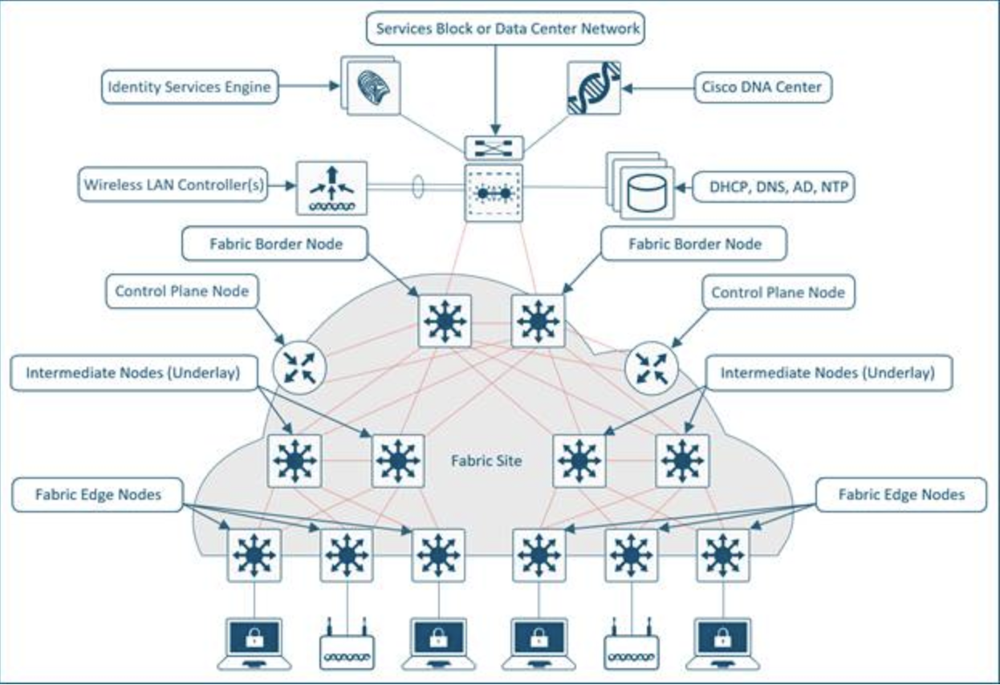

<p align="center">
    
</p>
<p align="center">
	<em><code>❯ Catalyst Center SDA Fabric Bringup with Cisco Validated Ansible Playbooks</code></em>
</p>
<p align="center">
	
	
	
	
</p>
<p align="center"><!-- default option, no dependency badges. -->
</p>
<p align="center">
	<!-- default option, no dependency badges. -->
</p>
<br>




##  Table of Contents

- [ Overview](#-overview)
- [ Features](#-features)
- [ Project Structure](#-project-structure)
  - [ Project Index](#-project-index)
- [ Getting Started](#-getting-started)
  - [ Prerequisites](#-prerequisites)
  - [ Installation](#-installation)
  - [ Usage](#-usage)
  - [ Testing](#-testing)
- [ Project Roadmap](#-project-roadmap)
- [ Contributing](#-contributing)
- [ License](#-license)
- [ Acknowledgments](#-acknowledgments)

---

##  Overview

<code> 
Cisco SD-Access Automation with Ansible
This GitHub project provides a comprehensive Ansible framework for automating the deployment and management of Cisco SD-Access on a freshly installed Catalyst center. By leveraging Ansible's automation capabilities, this project streamlines the configuration process, reduces manual errors, and ensures consistency across your SD-Access fabric.
</code>

---

##  Key Features

This project covers the lifecycle of SD-Access deployment through Ansible Automation, from initial setup to ongoing management.

The Ansible roles are organized in a modular fashion, allowing you to easily adapt and customize the automation to your specific needs.

The playbooks are designed to be idempotent, meaning they can be run multiple times without causing unintended changes to your network.

Clear and concise documentation guides you through the setup and usage of the Ansible playbooks.

### The project automates the following key steps in the SD-Access deployment process:

1. Roles and Users: Creates necessary roles and user accounts on the Catalyst center.
2. Catalyst Center and ISE Integration: Integrates the Catalyst center with Cisco ISE for authentication and authorization.
3. Global Credentials: Configures global credentials for device management.
4. California Site Devices Discovery: Discovers and adds devices at the California site to the Catalyst center.
5. Global Network Settings Servers: Configures global network settings, including DNS and NTP servers.
6. Global Network Settings Global IP Pools: Defines global IP address pools for various purposes.
7. California Site Design: Creates the site hierarchy and defines network settings specific to the California site.
8. California Site Device Credentials: Assigns device-specific credentials for secure access.
9. California Site Network Settings: Configures network settings for the California site, including VLANs and subnets.
10. California Site Network Settings IP Pools: Defines site-specific IP address pools.
11. California Site Devices Inventory: Gathers detailed inventory information for all devices at the California site.
12. California Site Devices Provision: Provisions the discovered devices with the necessary configurations.
13. California Site SWIM Devices Upgrade: Upgrades software images on devices using Cisco Software Image Management (SWIM).
14. California Site Fabric: Builds the SD-Access fabric, including control plane and data plane configurations.
15. California Site Fabric Transits: Configures fabric transit nodes for inter-site connectivity.
16. California Site Virtual Networks: Creates virtual networks (VN) for different user groups and applications.
17. California Site Devices to Fabric: Attaches devices to the SD-Access fabric.
18. California Site Anchor VNs: Configures anchor VNs for external network connectivity.
19. California Site Host Onboarding: Automates the onboarding of hosts onto the SD-Access fabric.

### Configuration Updates
Any changes required to be done in the network can be updated in the configuration files of each related section and rerun the playbook to configurations 
the Updated configurations into Catalyst Center.

### Fabric Sites and Topology


##  Project Structure
```sh
└── CatC_SD_Access_campus.git/
    ├── ansible.cfg
    ├── ansible_inventory
    │   └── catalystcenter_inventory
    ├── catc_configs
    │   ├── global
    |   |   └── YAML Input files for Catalyst Center Global Configurations, i.e. ISE Integrations, Global Credentials, Global IP Pools etc. 
    │   └── sites
    |        |── California
    |        |    |── floor_images
    |        |    |	└── Site Floor image files: pdf, jpeg, jpg or png ext Floor images files to be uploaded on the floors.
    |        |    |        The location of each file is to be specified in the site hierarchy design input file unser floor inputs
    |        |    └── YAML Input files for configuration for Sites California
    |        |       These input files are named to easiy map with the corresponding configurations in the Catalyst Center.
    |        └── New York
    |        └── <Other Sites> 
    ├── images
    │   ├── CCO_swim_image_download.png
    │   ├── CatC_Ise_AAA-Intg.png
    │   ├── CatC_Ise_AAA-Intg1.png
    │   ├── NW_Global_ip_pool.png
    │   ├── inventory_image_distribution_activation.png
    │   └── site_nw_ip_pools.png
    ├── requirements.txt
    ├── scripts
    │   └── run_playbooks.py
    ├── setup.sh
    └── usecase_maps
        ├── delete_confis_sda_fabric.yml
        └── sda_site_fabric_bringup_usecase.yml
```


###  Project Index
<details open>
	<summary><b><code>CATC_SD_ACCESS_CAMPUS.GIT/</code></b></summary>
	<details> <!-- __root__ Submodule -->
		<summary><b>__root__</b></summary>
		<blockquote>
			<table>
			<tr>
				<td><b><a href='https://github.com/DNACENSolutions/CatC_SD_Access_campus.git/blob/master/setup.sh'>setup.sh</a></b></td>
				<td><code>❯ Setup script to create your python environment and install Catalyst Center Python SDK (dnacentersdk) and Ansible collection (cisco.dnac)</code></td>
			</tr>
			<tr>
				<td><b><a href='https://github.com/DNACENSolutions/CatC_SD_Access_campus.git/blob/master/requirements.txt'>requirements.txt</a></b></td>
				<td><code>❯ This file contains the required python modules. This file is used by setup.sh script</code></td>
			</tr>
			</table>
		</blockquote>
	</details>
	<details> <!-- scripts Submodule -->
		<summary><b>scripts</b></summary>
		<blockquote>
			<table>
			<tr>
				<td><b><a href='https://github.com/DNACENSolutions/CatC_SD_Access_campus.git/blob/master/scripts/run_playbooks.py'>run_playbooks.py</a></b></td>
				<td><code>❯ This Python tool is to run the Ansible playbooks with Inputs files preprogrammed in the usecase_maps files. The Tools lets you choose option to Validate the inout, Execute the playbook for do both. Further it give option for user to run the Catalyst Center Configuration usecases in a group, indivisual usecase or all the usecase in the order specified in the input file selected from usecase_maps directory.</code></td>
			</tr>
			</table>
		</blockquote>
	</details>
	<details> <!-- usecase_maps Submodule -->
		<summary><b>usecase_maps This Directory contain yaml file where you can organize your configuration bringup, update or deletion sequences and bundle them as usecase which can be run using scripts/run_playbooks.py. The Order during execution is maintained as given in the this yaml file. 
		Defining a new usecase in existing file or new file:
		1. GIve a name to the usecase
		2. Give the playbvook Location
		3. Give the schema file location
		4. Provide the input for this usecase
		Example:
		# Execute the Network compliance on Site and fix configuration mismatches.
			CaliforniaSiteNetworkCompliance:
			schema_file: "network_compliance/schema/network_compliance_workflow_schema.yml"
			playbook: "network_compliance/playbook/network_compliance_workflow_playbook.yml"
			data_file: "catc_configs/sites/california/site_network_complliance.yml"
		 </b></summary>
		<blockquote>
			<table>
			<tr>
				<td><b><a href='https://github.com/DNACENSolutions/CatC_SD_Access_campus.git/blob/master/usecase_maps/sda_site_fabric_bringup_usecase.yml'>sda_site_fabric_bringup_usecase.yml</a></b></td>
				<td><code>❯ This yaml file contain usecase which are to bringup confguration on the catalyst Center. You are free to add more usecases for your need.</code></td>
			</tr>
			<tr>
				<td><b><a href='https://github.com/DNACENSolutions/CatC_SD_Access_campus.git/blob/master/usecase_maps/delete_confis_sda_fabric.yml'>delete_confis_sda_fabric.yml</a></b></td>
				<td><code>❯ This file contain usecase for removing configurations from catalyst Center for the California site. Delete playbooks are used to remove configurations. </code></td>
			</tr>
			</table>
		</blockquote>
	</details>
	<details> <!-- catc_configs Submodule -->
		<summary><b>catc_configs</b></summary>
		<blockquote>
			<details>
				<summary><b>global</b></summary>
				<blockquote>
					<table>
					<tr>
						<td><b><a href='https://github.com/DNACENSolutions/CatC_SD_Access_campus.git/blob/master/catc_configs/global/network_settings_servers.yml'>network_settings_servers.yml</a></b></td>
						<td><code>❯ These configurations are network setting for Servers like AAA, NTP etc and also telemetry configuration to be configuration at global level.</code></td>
					</tr>
					<tr>
						<td><b><a href='https://github.com/DNACENSolutions/CatC_SD_Access_campus.git/blob/master/catc_configs/global/device_credentials.yml'>device_credentials.yml</a></b></td>
						<td><code>❯ REPLACE-ME</code></td>
					</tr>
					<tr>
						<td><b><a href='https://github.com/DNACENSolutions/CatC_SD_Access_campus.git/blob/master/catc_configs/global/catalyst_center_and_ise_integration.yml'>catalyst_center_and_ise_integration.yml</a></b></td>
						<td><code>❯ REPLACE-ME</code></td>
					</tr>
					<tr>
						<td><b><a href='https://github.com/DNACENSolutions/CatC_SD_Access_campus.git/blob/master/catc_configs/global/network_settings_global_ip_pools.yml'>network_settings_global_ip_pools.yml</a></b></td>
						<td><code>❯ REPLACE-ME</code></td>
					</tr>
					<tr>
						<td><b><a href='https://github.com/DNACENSolutions/CatC_SD_Access_campus.git/blob/master/catc_configs/global/swim_cco_image_tag.yml'>swim_cco_image_tag.yml</a></b></td>
						<td><code>❯ REPLACE-ME</code></td>
					</tr>
					<tr>
						<td><b><a href='https://github.com/DNACENSolutions/CatC_SD_Access_campus.git/blob/master/catc_configs/global/roles_and_users.yml'>roles_and_users.yml</a></b></td>
						<td><code>❯ REPLACE-ME</code></td>
					</tr>
					</table>
				</blockquote>
			</details>
			<details>
				<summary><b>sites</b></summary>
				<blockquote>
					<details>
						<summary><b>california</b></summary>
						<blockquote>
							<table>
							<tr>
								<td><b><a href='https://github.com/DNACENSolutions/CatC_SD_Access_campus.git/blob/master/catc_configs/sites/california/site_sda_fabric_devices.yml'>site_sda_fabric_devices.yml</a></b></td>
								<td><code>❯ This files contains configurations required to create your desired fabric devices in fabric sites. Here you can provide details of your fabric sites with roles and other setting. The Border router shuld be provided with L3 and L2 Handoff details if needed to be added on that border.</code></td>
							</tr>
							<tr>
								<td><b><a href='https://github.com/DNACENSolutions/CatC_SD_Access_campus.git/blob/master/catc_configs/sites/california/site_network_settings_servers.yml'>site_network_settings_servers.yml</a></b></td>
								<td><code>❯ This file contains network Settings configuration required to be customized at this fabric site.</code></td>
							</tr>
							<tr>
								<td><b><a href='https://github.com/DNACENSolutions/CatC_SD_Access_campus.git/blob/master/catc_configs/sites/california/site_sda_fabric_sites_zones.yml'>site_sda_fabric_sites_zones.yml</a></b></td>
								<td><code>❯ This files contains configurations required to create your desired Fabric sites and fabric Zones.</code></td>
							</tr>
							<tr>
								<td><b><a href='https://github.com/DNACENSolutions/CatC_SD_Access_campus.git/blob/master/catc_configs/sites/california/site_swim.yml'>site_swim.yml</a></b></td>
								<td><code>❯ REPLACE-ME</code></td>
							</tr>
							<tr>
								<td><b><a href='https://github.com/DNACENSolutions/CatC_SD_Access_campus.git/blob/master/catc_configs/sites/california/site_sda_fabric_anchor_vns.yml'>site_sda_fabric_anchor_vns.yml</a></b></td>
								<td><code>❯ REPLACE-ME</code></td>
							</tr>
							<tr>
								<td><b><a href='https://github.com/DNACENSolutions/CatC_SD_Access_campus.git/blob/master/catc_configs/sites/california/site_inventory.yml'>site_inventory.yml</a></b></td>
								<td><code>❯ REPLACE-ME</code></td>
							</tr>
							<tr>
								<td><b><a href='https://github.com/DNACENSolutions/CatC_SD_Access_campus.git/blob/master/catc_configs/sites/california/site_device_discovery.yml'>site_device_discovery.yml</a></b></td>
								<td><code>❯ REPLACE-ME</code></td>
							</tr>
							<tr>
								<td><b><a href='https://github.com/DNACENSolutions/CatC_SD_Access_campus.git/blob/master/catc_configs/sites/california/swim_distribution_activate.yml'>swim_distribution_activate.yml</a></b></td>
								<td><code>❯ REPLACE-ME</code></td>
							</tr>
							<tr>
								<td><b><a href='https://github.com/DNACENSolutions/CatC_SD_Access_campus.git/blob/master/catc_configs/sites/california/site_devices_provision.yml'>site_devices_provision.yml</a></b></td>
								<td><code>❯ REPLACE-ME</code></td>
							</tr>
							<tr>
								<td><b><a href='https://github.com/DNACENSolutions/CatC_SD_Access_campus.git/blob/master/catc_configs/sites/california/site_nw_settings_ippools.yml'>site_nw_settings_ippools.yml</a></b></td>
								<td><code>❯ REPLACE-ME</code></td>
							</tr>
							<tr>
								<td><b><a href='https://github.com/DNACENSolutions/CatC_SD_Access_campus.git/blob/master/catc_configs/sites/california/site_hierarchy_design.yml'>site_hierarchy_design.yml</a></b></td>
								<td><code>❯ REPLACE-ME</code></td>
							</tr>
							<tr>
								<td><b><a href='https://github.com/DNACENSolutions/CatC_SD_Access_campus.git/blob/master/catc_configs/sites/california/site_sda_fabric_vn_l2l3_gateways.yml'>site_sda_fabric_vn_l2l3_gateways.yml</a></b></td>
								<td><code>❯ REPLACE-ME</code></td>
							</tr>
							<tr>
								<td><b><a href='https://github.com/DNACENSolutions/CatC_SD_Access_campus.git/blob/master/catc_configs/sites/california/site_sda_transits.yml'>site_sda_transits.yml</a></b></td>
								<td><code>❯ REPLACE-ME</code></td>
							</tr>
							<tr>
								<td><b><a href='https://github.com/DNACENSolutions/CatC_SD_Access_campus.git/blob/master/catc_configs/sites/california/site_device_credentials.yml'>site_device_credentials.yml</a></b></td>
								<td><code>❯ REPLACE-ME</code></td>
							</tr>
							<tr>
								<td><b><a href='https://github.com/DNACENSolutions/CatC_SD_Access_campus.git/blob/master/catc_configs/sites/california/site_network_compliance.yml'>site_network_compliance.yml</a></b></td>
								<td><code>❯ REPLACE-ME</code></td>
							</tr>
							<tr>
								<td><b><a href='https://github.com/DNACENSolutions/CatC_SD_Access_campus.git/blob/master/catc_configs/sites/california/site_sda_fabric_hostonboarding.yml'>site_sda_fabric_hostonboarding.yml</a></b></td>
								<td><code>❯ REPLACE-ME</code></td>
							</tr>
							</table>
						</blockquote>
					</details>
				</blockquote>
			</details>
		</blockquote>
	</details>
	<details> <!-- ansible_inventory Submodule -->
		<summary><b>ansible_inventory</b></summary>
		<blockquote>
			<details>
				<summary><b>catalystcenter_inventory</b></summary>
				<blockquote>
					<table>
					<tr>
						<td><b><a href='https://github.com/DNACENSolutions/CatC_SD_Access_campus.git/blob/master/ansible_inventory/catalystcenter_inventory_10.195.243.53/hosts.yml'>hosts.yml</a></b></td>
						<td><code>❯ This is a sample Host file to be created for your Catalyst Center to be able to run the existing playbooks.
						Sample Inventory file
							---
							catalyst_center_hosts:
								hosts:
									give_any_hostname:
										dnac_password: Catalyst Center Credentials password
										dnac_host: Catalyst Center Host IP address Reachable fron ansible server.
										dnac_port: 443
										dnac_timeout: 60
										dnac_username: Catalyst Center Credentials username
										dnac_verify: false
										dnac_version: Catalyst Center Release. (i.e. 2.3.7.6)
										dnac_debug: true
										dnac_log_level: DEBUG
										dnac_log: true
										dnac_log_append: false
										dnac_log_file_path: log file location i.e.catc_logs
						</code></td>
					</tr>
					</table>
					<details>
						<summary><b>group_vars</b></summary>
						<blockquote>
							<table>
							<tr>
								<td><b><a href='https://github.com/DNACENSolutions/CatC_SD_Access_campus.git/blob/master/ansible_inventory/catalystcenter_inventory_10.195.243.53/group_vars/all.yml'>all.yml</a></b></td>
								<td><code>❯ REPLACE-ME</code></td>
							</tr>
							</table>
						</blockquote>
					</details>
					<details>
						<summary><b>host_vars</b></summary>
						<blockquote>
							<table>
							<tr>
								<td><b><a href='https://github.com/DNACENSolutions/CatC_SD_Access_campus.git/blob/master/ansible_inventory/catalystcenter_inventory_10.195.243.53/host_vars/dnac1.yml'>dnac1.yml</a></b></td>
								<td><code>❯ REPLACE-ME</code></td>
							</tr>
							</table>
						</blockquote>
					</details>
				</blockquote>
			</details>
		</blockquote>
	</details>
</details>

---
##  Getting Started

###  Prerequisites

Before getting started with CatC_SD_Access_campus.git, ensure your runtime environment meets the following requirements:

- **Programming Language:** Shell
- **Package Manager:** Pip


###  Installation

Install CatC_SD_Access_campus using one of the following methods:

**Build from source:**

1. Clone the CatC_SD_Access_campus.git repository:
```sh
❯ git clone https://github.com/DNACENSolutions/CatC_SD_Access_campus.git
```

2. Navigate to the project directory:
```sh
❯ cd CatC_SD_Access_campus
```

3. Install the project dependencies:


**Using `bash`** &nbsp; []()

```sh
❯ source setup.sh
```

###  Usage
Run CatC_SD_Access_campus using the following command:
**Using `Python3`** &nbsp; []()

```sh
❯ python3 scripts/run_playbooks.py
```
Follow the prompts. 
---
##  Project Roadmap

---

##  Contributing

- **💬 [Join the Discussions](https://github.com/DNACENSolutions/CatC_SD_Access_campus.git/discussions)**: Share your insights, provide feedback, or ask questions.
- **🐛 [Report Issues](https://github.com/DNACENSolutions/CatC_SD_Access_campus.git/issues)**: Submit bugs found or log feature requests for the `CatC_SD_Access_campus.git` project.
- **💡 [Submit Pull Requests](https://github.com/DNACENSolutions/CatC_SD_Access_campus.git/blob/main/CONTRIBUTING.md)**: Review open PRs, and submit your own PRs.

<details closed>
<summary>Contributing Guidelines</summary>

1. **Fork the Repository**: Start by forking the project repository to your github account.
2. **Clone Locally**: Clone the forked repository to your local machine using a git client.
   ```sh
   git clone https://github.com/DNACENSolutions/CatC_SD_Access_campus.git
   ```
3. **Create a New Branch**: Always work on a new branch, giving it a descriptive name.
   ```sh
   git checkout -b new-feature-x
   ```
4. **Make Your Changes**: Develop and test your changes locally.
5. **Commit Your Changes**: Commit with a clear message describing your updates.
   ```sh
   git commit -m 'Implemented new feature x.'
   ```
6. **Push to github**: Push the changes to your forked repository.
   ```sh
   git push origin new-feature-x
   ```
7. **Submit a Pull Request**: Create a PR against the original project repository. Clearly describe the changes and their motivations.
8. **Review**: Once your PR is reviewed and approved, it will be merged into the main branch. Congratulations on your contribution!
</details>

<details closed>
<summary>Contributor Graph</summary>
<br>
<p align="left">
   <a href="https://github.com{/DNACENSolutions/CatC_SD_Access_campus.git/}graphs/contributors">
      
   </a>
</p>
</details>

---

##  License

This project is protected under the [SELECT-A-LICENSE](https://choosealicense.com/licenses) License. For more details, refer to the [LICENSE](https://choosealicense.com/licenses/) file.

---

##  Acknowledgments

- List any resources, contributors, inspiration, etc. here.

---
