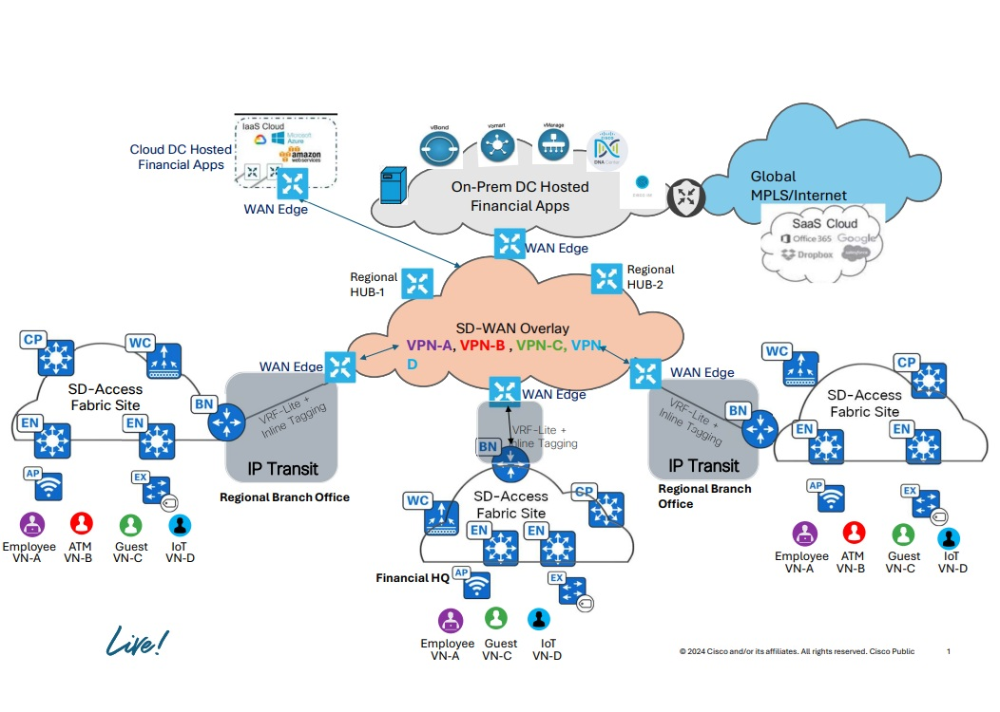
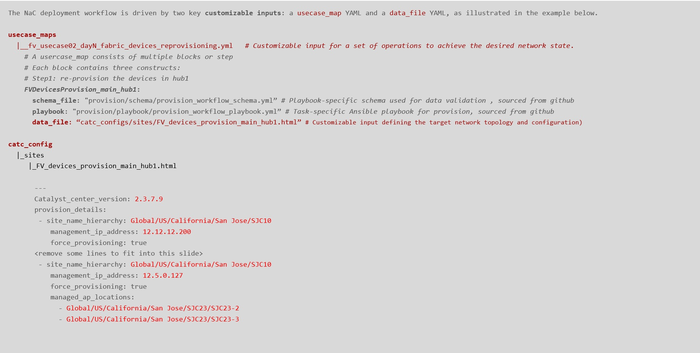

<div align="center"><h1>Catalyst Center Network as Code with Ansible Playbooks User Guide for Financial Vertical</h1></div><br>


##  Table of Contents

- [Overview](#Overview )
- [Compatibility Matrix](#compatibility-matrix )
- [Network Topology](#network-topology )
- [ Project Structure](#project-structure)
- [Compatibility Matrix](#compatibility-matrix )
- [Project Index](#project-index)
- [Getting Started](#getting-started)
  - [Prerequisites](#prerequisites)
  - [Installation](#installation)
  - [Usage](#usage)
- [Contributing](#contributing)
- [License](#license)
- [Acknowledgments](#acknowledgments)

---
##  Overview
This GitHub project provides a complete Network as Code (NaC) framework for deploying Cisco Software-Defined Access (SDA) in Financial Sector environments using Catalyst Center and Ansible automation.
By leveraging Ansible's automation capabilities, this project streamlines the end-to-end configuration process, reduces manual errors, provides easy cusotomization, and ensures consistency across your network.

---
##  Compatibility Matrix
The following matrix shows the supported and verified version combinations for the usecases described in this repository.
			<table>
			<tr>
				<td><b>Cisco Catalyst Center version	</b></td>
				<td><b>2.3.7.9</b></td>
			</tr>
			<tr>
				<td><b>Ansible "cisco.dnac" version</b></td>
				<td><b>6.31.3</b></td>
				<td><b><code> ansible-galaxy collection install cisco.dnac:6.31.3 --force --ignore-certs # setup.sh </code></b></td>
			</tr>
			<tr>
				<td><b>Python "dnacentersdk" version </b></td>
				<td><b>2.9.1</b></td>
				<td><b><code>python -m pip install dnacentersdk==2.9.1 # setup.sh </code></b></td>
			</tr>
			</table>

---
##  Network Topolgy


##  Project Structure
This project provides a complete Network as Code (NaC) solution for deploying Cisco Software-Defined Access (SDA) in Financial sector environments using Catalyst Center and Ansible automation. The structure includes declarative YAML configurations (catc_configs/), orchestrated deployment scenarios (usecase_maps/), automated cleanup capabilities (catc_delete_configs/), environment setup script (setup.sh), execution tools (scripts/), and Catalyst Center access configuration (catalystcenter_inventory/). This enables financial IT teams to achieve repeatable, reliable SDA deployments with full lifecycle management from initial campus setup through ongoing operations and decommissioning.

```sh
└── CatC_Network_as_Code.git/
    ├── ansible.cfg
    ├── ansible_inventory
    │   └── catalystcenter_inventory
    ├── catc_configs
    │   ├── global
    |   |   └── YAML Input files for Catalyst Center Global Configurations, i.e. images names, golden image tagging etc. 
	    |    |── fv_events_and_notifications_create_email_destination.yml
	    |    |── fv_network_devices_CCO_download_tag_golden_images_distribution.yml
	    |    |── fv_setup_events_and_notifications_DR313.yml	
    │   └── sites
    |        └── YAML Input files for configuration for Main Campus Site
    |        |── FV_assign_sites_devices_as_fabric_edges.yml
    |        |── FV_devices_provision_main_hub1.yml
    |        |── FV_devices_provision_main_hub2_SVL_9800HA.yml
    |        |── FV_devices_provision_medium_sites_dual_FIABs_eWLC_N_plus_1.yml
    |        |── FV_devices_provision_small_sites_FIAB_eWLC.yml
    |        |── FV_FQDN_only_main_hub2_expand_sites_using_LAN_automation_devices.yml
    |        |── FV_FQDN_only_main_hub2_provision_LAN_automated_devices.yml
    |        |── FV_network_devices_anchor_site_single_CP_and_border_image_activation.yml
    |        |── FV_network_devices_main_hub1_images_activtion.yml
    |        |── FV_network_devices_main_hub2_SVL_9800HA_images_activation.yml
    |        |── FV_network_devices_medium_site_dual_FIABs_eWLC_N_plus_1_primary_images_distribution.yml
    |        |── FV_network_devices_medium_site_dual_FIABs_eWLC_N_plus_1_primary_images_activation.yml	
	|        |── FV_network_devices_medium_site_dual_FIABs_eWLC_N_plus_1_secondary_images_activation.yml
	|        |── FV_network_devices_small_site_single_FIAB_eWLC_images_activation.yml
	|        |── FV_site_devices_provision.yml
	|        └── FV_site_sda_fabric_setup_hostonboarding_static_hots.yml
    ├── requirements.txt
    ├── scripts_
    │   └── run_playbooks.py
    ├── setup.sh
    └── usecase_maps
        ├── fv_usecase01_dayN_campus_network_devices_upgrade.yml
        ├── fv_usecase02_dayN_fabric_devices_reprovisioning.yml
        ├── fv_usecase03_dayN_manage_onboarding_static_hosts.yml
        ├── fv_usecase04_dayN_manage_events_and_notifications_via_email.yml
        ├── fv_usecase05_dayN_expand_sites_using_LAN_automation.yml
		└── fv_usecase06_dayN_manage_campus_fabric_edeg_onboarding.yml
```

## Customizable Inputs


##  Project Index
<details open>
	<summary><b><code>CATC_NETWORK_AS_CODE_FINANCIAL.GIT</code></b></summary>
	<details> <!-- __root__ Submodule -->
		<summary><b>__root__</b></summary>
		<blockquote>
			<table>
			<tr>
				<td><b><a href='https://github.com/DNACENSolutions/NetworkasCode_CVPs/tree/main/nac_financial_sda/NaC_1_0_Financial_SDA/setup.sh'>setup.sh</a></b></td>
				<td><code>- Setup script to create your python environment and install Catalyst Center Python SDK (dnacentersdk) and Ansible collection (cisco.dnac)</code></td>
			</tr>
			<tr>
				<td><b><a href='https://github.com/DNACENSolutions/NetworkasCode_CVPs/tree/main/nac_financial_sda/NaC_1_0_Financial_SDA/requirements.txt'>requirements.txt</a></b></td>
				<td><code>- This file contains the required python modules. This file is used by setup.sh script</code></td>
			</tr>
			</table>
		</blockquote>
	</details>
	<details> <!-- scripts Submodule -->
		<summary><b>scripts</b></summary>
		<blockquote>
			<table>
			<tr>
				<td><b><a href='https://github.com/DNACENSolutions/NetworkasCode_CVPs/tree/main/nac_financial_sda/NaC_1_0_Financial_SDA/scripts/run_playbooks.py'>run_playbooks.py</a></b></td>
				<td><code>- This Python tool is to run the Ansible playbooks with Inputs files preprogrammed in the usecase_maps files. The Tools lets you choose option to Validate the input, Execute the playbook or do both. Further it gives option for user to run the Catalyst Center Configuration usecases individually, or in a sub-group of usecase , or all the usecase in the order specified in the input file selected from usecase_maps directory.</code></td>
			</tr>
			</table>
		</blockquote>
	</details>
	<details> <!-- usecase_maps Submodule -->
		<summary><b>usecase_maps </b></summary>
		<blockquote>
			<table>
			<tr>
			<td><b><a href='https://github.com/DNACENSolutions/NetworkasCode_CVPs/tree/main/nac_financial_sda/NaC_1_0_Financial_SDA/usecase_maps/fv_usecase01_dayN_campus_network_devices_upgrade.yml'>fv_usecase01_dayN_campus_network_devices_upgrade.yml</a></b>
			</td>
            <td> 
			<code>- This yaml usecase upgrades campus fabric sites with different size, devices models, devices roles and eWLC. </code><br>
			<code>- This usecase consists of 4 operations, CCO images download, images tagging as golden image, image distribution and image activation. Due to flexiable of IAC, the first 3 operations could be executed using one step, some operations are in parallel and some sequential :</code><br>
			<code> #Step1: Images download from CCO in parallel</code><br>
			<code> #Step2: Tag golden images one by one according to device family</code><br>
			<code> #Step3: Image distribution for all the devices, some in sequential and some in parallel, except N+1 primary </code><br>
			<code> #Step4: </code><br>
			<code> a. Image activation for hub1 </code><br>
			<code> b. Image activation for hub2 </code><br>
			<code> c. Image activation for small sites </code><br>
			<code> d. Image activation for medium Sites N+1 Secondary </code><br>
			 <code>⚠️ Image download Consideration: Image download from CCO has a pre-req that the entry for that image has to be in CatC before initiating network devices upgrade use case. To check, go to the device family (Design->Image Repository->click on the device family). If the image entry is not there, initiate the Sync Updates (Design->Image Repository->Sync Updates) and check in Show Tasks to confirm the task completion and recheck in the device family </code><br>
			 <code> ⚠️ Image activation Consideration on SDAccess: Image activation execution starts with fabric Edges and then, fabric borders/control plane nodes. Druing imagee activation, the fabric node would be unavailable, if there is no redundancy, such as multiple fabric border nodes or fabric control plane nodes and impact is a concern, execute image activation on the node during maintenance window</code><br>
			 <code> ⚠️ N+1 Consideration:</code><br>
			 <code> In order to upgrade N+1 pair, N+1 Secondary have to upgrade first before image distribution to N+1 Primary.</code><br>
			</td>
			</tr>
			<tr>
				<td>
				<b><a href='https://github.com/DNACENSolutions/NetworkasCode_CVPs/tree/main/nac_financial_sda/NaC_1_0_Financial_SDA/usecase_maps/fv_usecase02_dayN_fabric_devices_reprovisioning.yml'>fv_usecase02_dayN_fabric_devices_reprovisioning.yml</a></b>
				</td>
                <td>
				<code>- This yaml usecase reprovision devices on different sites. </code><br>
				<code>- This usecase consists of single operation :</code><br>
				<code>  # Step1: device re-provision for the site</code>
				</td>
			</tr>
			<tr>
				<td><b><a href='https://github.com/DNACENSolutions/NetworkasCode_CVPs/tree/main/nac_financial_sda/NaC_1_0_Financial_SDA/usecase_maps/fv_usecase03_dayN_manage_onboarding_static_hosts.yml'>fv_usecase03_dayN_manage_onboarding_static_hosts.yml</a></b></td>
                <td>
				<code>- This yaml usecase performs static host onboarding</code><br>
				<code>- This usecase consists of single operation :</code><br><br>
				<code>  #Step1: static host onboarding on Fabric Edge</code>
				</td>
			</tr>
			<tr>
				<td><b><a href='https://github.com/DNACENSolutions/NetworkasCode_CVPs/tree/main/nac_financial_sda/NaC_1_0_Financial_SDA/usecase_maps/fv_usecase04_dayN_manage_events_and_notifications_via_email.yml'>fv_usecase04_dayN_manage_events_and_notifications_via_email.yml</a></b></td>
                <td>
				<code>- This yaml usecase performs email destination creation and event notification via email creation.</code><br>
				<code>- This usecase consists of 2 operations in below sequence : </code><br>
				<code>#Step1:email destination creation</code><br>
				<code>#Step2: event notification via email creation</code>
				</td>
			</tr>
			<tr>
				<td><b><a href='https://github.com/DNACENSolutions/NetworkasCode_CVPs/tree/main/nac_financial_sda/NaC_1_0_Financial_SDA/usecase_maps/fv_usecase05_dayN_expand_sites_using_LAN_automation.yml'>fv_usecase05_dayN_expand_sites_using_LAN_automation.yml</a></b></td>
                <td>
				<code>- This yaml usecase performs LAN automation and provision to ready device for fabric operations</code><br>
				<code>- This usecase consists of 2 operations in below sequence:</code><br>
				<code>  #Step1 : LAN automation </code><br>
				<code>  #Step2 : provision pnp device to ready for fabric operations</code></td>
			</tr>
			<tr>
				<td><b><a href='https://github.com/DNACENSolutions/NetworkasCode_CVPs/tree/main/nac_financial_sda/NaC_1_0_Financial_SDA/usecase_maps/fv_usecase06_dayN_manage_campus_fabric_edge_onboarding.yml'>fv_usecase06_dayN_manage_campus_fabric_edge_onboarding.yml</a></b></td>
                <td><code>- This yaml usecase performs fabric edge onboarding. </code><br>
				<code>- This usecase consists of 2 operations in below sequence:</code><br>
				<code>  #Step1 : provision device prior to adding into fabric</code><br>
				<code>  #Step2 : Assign device to a site and add to fabric site as Fabric Edge</code>
				</td>
			</tr>			
			</table>
		</blockquote>
	</details>
	<details> <!-- catc_configs Submodule -->
		<summary><b>catc_configs</b></summary>
		<blockquote>
			<details>
				<summary><b>global</b></summary>
				<blockquote>
					<table>
					<tr>
						<td><b><a href='https://github.com/DNACENSolutions/NetworkasCode_CVPs/tree/main/nac_financial_sda/NaC_1_0_Financial_SDA/catc_configs/global/FV_network_devices_CCO_download_tag_golden_images_distribution.yml'>FV_network_devices_CCO_download_tag_golden_images_distribution.yml</a></b></td>
						<td><code>- These files contain configurations required to download CCO images names, tag images name as golden image at global level and image distribution at site level, inherited the marking of golden image from global level</code><br>
						<code>>- Related Playbook <a href='https://github.com/cisco-en-programmability/catalyst-center-ansible-iac/blob/main/workflows/swim/README.md'>Catalyst Center Device Software Image Management Playbook</a></code></td>
					</tr>
					<tr>
						<td><b><a href='https://github.com/DNACENSolutions/NetworkasCode_CVPs/tree/main/nac_financial_sda/NaC_1_0_Financial_SDA/catc_configs/global/FV_events_and_notifications_create_email_destination.yml'>FV_events_and_notifications_create_email_destination.yml</a></b><br>
						<b><a href='https://github.com/DNACENSolutions/NetworkasCode_CVPs/tree/main/nac_financial_sda/NaC_1_0_Financial_SDA/catc_configs/global/FV_setup_events_and_notifications_DR313.yml'>FV_setup_events_and_notifications_DR313.yml</a></b></td>
						<td>
						<code>- These files contain configurations required to create email destination and events notifications</code><br>
						<code>- Related Playbook <a href='https://github.com/cisco-en-programmability/catalyst-center-ansible-iac/blob/main/workflows/events_and_notifications/README.md'>Catalyst Center Events and Notification Destination and Subscriptsion Manager Playbook</a></code></td>
					</tr>
					</table>
				</blockquote>
			</details>
			<details>
				<summary><b>sites</b></summary>
				<blockquote>
					<details>
						<summary><b>hub1,hub2,medium, small and anchor sites</b></summary>
						<blockquote>
							<table>
							<tr>
								<td><b><a href='https://github.com/DNACENSolutions/NetworkasCode_CVPs/tree/main/nac_financial_sda/NaC_1_0_Financial_SDA/catc_configs/sites/FV_network_devices_main_hub1_images_activation.yml'>FV_network_devices_main_hub1_images_activation.yml</a></b><br>
								<b><a href='https://github.com/DNACENSolutions/NetworkasCode_CVPs/tree/main/nac_financial_sda/NaC_1_0_Financial_SDA/catc_configs/sites/FV_network_devices_main_hub2_SVL_9800HA_images_activation.yml'>FV_network_devices_main_hub2_SVL_9800HA_images_activation.yml</a></b><br>
								<b><a href='https://github.com/DNACENSolutions/NetworkasCode_CVPs/tree/main/nac_financial_sda/NaC_1_0_Financial_SDA/catc_configs/sites/FV_network_devices_small_site_single_FIAB_eWLC_images_activation.yml'>FV_network_devices_small_site_single_FIAB_eWLC_images_activation.yml</a></b><br>
								<b><a href='https://github.com/DNACENSolutions/NetworkasCode_CVPs/tree/main/nac_financial_sda/NaC_1_0_Financial_SDA/catc_configs/sites/FV_network_devices_medium_site_dual_FIABs_eWLC_N_plus_1_Secondary_images_activation.yml'>FV_network_devices_medium_site_dual_FIABs_eWLC_N_plus_1_Secondary_images_activation.yml</a></b><br>
								<b><a href='https://github.com/DNACENSolutions/NetworkasCode_CVPs/tree/main/nac_financial_sda/NaC_1_0_Financial_SDA/catc_configs/sites/FV_network_devices_medium_site_dual_FIABs_eWLC_N_plus_1_Primary_images_distribution.yml'>FV_network_devices_medium_site_dual_FIABs_eWLC_N_plus_1_Primary_images_distribution.yml</a></b><br>
								<b><a href='https://github.com/DNACENSolutions/NetworkasCode_CVPs/tree/main/nac_financial_sda/NaC_1_0_Financial_SDA/catc_configs/sites/FV_network_devices_medium_site_dual_FIABs_eWLC_N_plus_1_Primary_images_activation.yml'>FV_network_devices_medium_site_dual_FIABs_eWLC_N_plus_1_Primary_images_activation.yml</a></b><br>							
								<b><a href='https://github.com/DNACENSolutions/NetworkasCode_CVPs/tree/main/nac_financial_sda/NaC_1_0_Financial_SDA/catc_configs/sites/FV_network_devices_anchor_site_single_cp_and_border_image_activation.yml'>FV_network_devices_anchor_site_single_cp_and_border_image_activation.yml</a></b></td>
								<td>
								<code>- These files contain configurations required to activate image on devices in hub1, hub2, medium, small and anchor sites.</code><br>
								<code>- Related Playbook <a href='https://github.com/cisco-en-programmability/catalyst-center-ansible-iac/blob/main/workflows/swim/README.md'>Catalyst Center Device Software Image Management Playbook</a></code>
								</td>
							</tr>
							<tr>
								<td><b><a href='https://github.com/DNACENSolutions/NetworkasCode_CVPs/tree/main/nac_financial_sda/NaC_1_0_Financial_SDA/catc_configs/sites/FV_devices_provision_main_hub1.yml'>FV_devices_provision_main_hub1.yml</a></b><br>
								<b><a href='https://github.com/DNACENSolutions/NetworkasCode_CVPs/tree/main/nac_financial_sda/NaC_1_0_Financial_SDA/catc_configs/sites/FV_devices_provision_main_hub2_SVL_9800HA.yml'>FV_devices_provision_main_hub2_SVL_9800HA.yml</a></b><br>
								<b><a href='https://github.com/DNACENSolutions/NetworkasCode_CVPs/tree/main/nac_financial_sda/NaC_1_0_Financial_SDA/catc_configs/sites/FV_devices_provision_medium_sites_dual_FIABs_eWLC_N_plus_1.yml'>FV_devices_provision_medium_sites_dual_FIABs_eWLC_N_plus_1.yml</a></b><br>
								<b><a href='https://github.com/DNACENSolutions/NetworkasCode_CVPs/tree/main/nac_financial_sda/NaC_1_0_Financial_SDA/catc_configs/sites/FV_devices_provision_small_sites_single_FIAB_eWLC.yml'>FV_devices_provision_small_sites_single_FIAB_eWLC.yml</a></b></td>
								<td>
								<code>- These files contain configurations required to re-provision devices in hub1, hub2, medium and small snotes.</code><br>
								<code>- Related Playbook <a href='https://github.com/cisco-en-programmability/catalyst-center-ansible-iac/blob/main/workflows/provision/README.md'>Provision Workflow Playbook</a></code></td>
							</tr>
							<tr>
								<td><b><a href='https://github.com/DNACENSolutions/NetworkasCode_CVPs/tree/main/nac_financial_sda/NaC_1_0_Financial_SDA/catc_configs/sites/FV_site_sda_fabric_setup_hostonboarding_static_hosts.yml'>FV_site_sda_fabric_setup_hostonboarding_static_hosts.yml</a></b></td>
								<td>
								<code>- This file contains configurations required to static hosts onboarding on Fabric Edge.</code><br>
								<code>- Related Playbook <a href='https://github.com/cisco-en-programmability/catalyst-center-ansible-iac/blob/main/workflows/sda_hostonboarding/README.md'>SDA Host Onboarding Workflow Manager</a></code></td>
							</tr>
							<tr>
								<td><b><a href='https://github.com/DNACENSolutions/NetworkasCode_CVPs/tree/main/nac_financial_sda/NaC_1_0_Financial_SDA/catc_configs/sites/FV_FQDN_only_main_hub2_expand_sites_using_LAN_automation.yml'>FV_FQDN_only_main_hub2_expand_sites_using_LAN_automation.yml</a></b><br>
								<b><a href='https://github.com/DNACENSolutions/NetworkasCode_CVPs/tree/main/nac_financial_sda/NaC_1_0_Financial_SDA/catc_configs/sites/FV_FQDN_only_main_hub2_provision_LAN_automated_devices.yml'>FV_FQDN_only_main_hub2_provision_LAN_automated_devices.yml</a></b></td>
								<td>
								<code>- These files contain configurations required to expand site using LAN automation and then provision the pnp device.</code><br>
                                <code>- Related Playbook <a href='https://github.com/cisco-en-programmability/catalyst-center-ansible-iac/blob/main/workflows/lan_automation/README.md'>Cisco Catalyst Center SD-Access LAN Automation</a></code></td>
							</tr>
							<tr>
								<td><b><a href='https://github.com/DNACENSolutions/NetworkasCode_CVPs/tree/main/nac_financial_sda/NaC_1_0_Financial_SDA/catc_configs/sites/FV_site_devices_provision.yml'>FV_site_devices_provision.yml</a></b><br>
								<b><a href='https://github.com/DNACENSolutions/NetworkasCode_CVPs/tree/main/nac_financial_sda/NaC_1_0_Financial_SDA/catc_configs/sites/FV_assign_sites_devices_as_fabric_edges.yml'>FV_assign_sites_devices_as_fabric_edges.yml</a></b></td>
								<td>
								<code>- These files contain configurations required to provision device follow-by Fabric Edge onboarding.</code><br>
								<code>- Related Playbook <a href='https://github.com/cisco-en-programmability/catalyst-center-ansible-iac/blob/main/workflows/sda_fabric_sites_zones/README.md'>sda_fabric_sites_zones_playbook</a></code>
								</td>
							</tr>
							</table>
						</blockquote>
					</details>
				</blockquote>
			</details>
		</blockquote>
	</details>
	<details> <!-- ansible_inventory Submodule -->
		<summary><b>ansible_inventory</b></summary>
		<blockquote>
			<details>
				<summary><b>catalystcenter_inventory</b></summary>
				<blockquote>
					<table>
					<tr>
						<td><b><a href='https://github.com/DNACENSolutions/NetworkasCode_CVPs.git/blob/master/ansible_inventory/catalystcenter_inventory_10.195.243.53/hosts.yml'>hosts.yml</a></b></td>
					    <td>
						<code>- This is a sample Host file to be created for your Catalyst Center to be able to run the existing playbooks.</code><br>
						<code> ✏️ Sample Inventory file </code><br>
						<code>catalyst_center_hosts:</code><br>
						<code>&emsp; hosts:</code><br>
						<code>&emsp; &emsp; any_hostname:</code><br>
						<code>&emsp; &emsp; &emsp; catalyst_center_password: Catalyst Center Credentials password</code><br>
						<code>&emsp; &emsp; &emsp; catalyst_center_host: Catalyst Center Host IP address Reachable fron ansible server</code><br>
						<code>&emsp; &emsp; &emsp; catalyst_center_port: 443</code><br>
						<code>&emsp; &emsp; &emsp; catalyst_center_timeout: 60</code><br>
						<code>&emsp; &emsp; &emsp; catalyst_center_api_task_timeout: 1200</code><br>
						<code>&emsp; &emsp; &emsp; catalyst_center_username: Catalyst Center Credentials username</code><br>
						<code>&emsp; &emsp; &emsp; catalyst_center_version: Catalyst Center Release. (i.e. 2.3.7.9)</code><br>
						<code>&emsp; &emsp; &emsp; catalyst_center_verify: false</code><br>
						<code>&emsp; &emsp; &emsp; catalyst_center_debug: true</code><br>
						<code>&emsp; &emsp; &emsp; catalyst_center_log_level: DEBUG</code><br>
						<code>&emsp; &emsp; &emsp; catalyst_center_log: true</code><br>
						<code>&emsp; &emsp; &emsp; catalyst_center_log_append: true</code><br>
						<code>&emsp; &emsp; &emsp; catalyst_center_log_file_path: log file location. (i.e.catc_logs)</code>
						</td>	
					</tr>
					</table>
				</blockquote>
			</details>
		</blockquote>
	</details>
</details>

---
##  Getting Started

###  Prerequisites

Before getting started with NetworkasCode_CVPs.git, ensure your runtime environment meets the following requirements:

- **Programming Language:** Shell
- **Package Manager:** Pip


###  Installation

Install NetworkasCode_CVPs using one of the following methods:

**Build from source:**

1. Clone the NetworkasCode_CVPs.git repository:
```sh
-  git clone https://github.com/DNACENSolutions/NetworkasCode_CVPs.git
```

2. Navigate to the project directory:
```sh
-  cd NetworkasCode_CVPs
-  cd nac_financial_sda/NaC_1_0_Financial_SDA
```

3. Install the project dependencies:

```sh
Using `bash` 
-  source setup.sh
```

###  Usage
Run NetworkasCode_CVPs using the following command:

```sh
Using `Python3` 
-  python3 scripts/run_playbooks.py
```
---

##  Contributing

- **💬 [Join the Discussions](https://github.com/DNACENSolutions/NetworkasCode_CVPs.git/discussions)**: Share your insights, provide feedback, or ask questions.
- **🐛 [Report Issues](https://github.com/DNACENSolutions/NetworkasCode_CVPs.git/issues)**: Submit bugs found or log feature requests for the `NetworkasCode_CVPs.git` project.
- **💡 [Submit Pull Requests](https://github.com/DNACENSolutions/NetworkasCode_CVPs.git/blob/main/CONTRIBUTING.md)**: Review open PRs, and submit your own PRs.


<details closed>
<summary>Contributing Guidelines</summary>

1. **Fork the Repository**: Start by forking the project repository to your github account.
2. **Clone Locally**: Clone the forked repository to your local machine using a git client.
   ```sh
   git clone https://github.com/DNACENSolutions/NetworkasCode_CVPs.git
   ```
3. **Create a New Branch**: Always work on a new branch, giving it a descriptive name.
   ```sh
   git checkout -b new-feature-x
   ```
4. **Make Your Changes**: Develop and test your changes locally.
5. **Commit Your Changes**: Commit with a clear message describing your updates.
   ```sh
   git commit -m 'Implemented new feature x.'
   ```
6. **Push to github**: Push the changes to your forked repository.
   ```sh
   git push origin new-feature-x
   ```
7. **Submit a Pull Request**: Create a PR against the original project repository. Clearly describe the changes and their motivations.
8. **Review**: Once your PR is reviewed and approved, it will be merged into the main branch. Congratulations on your contribution!
</details>

<details closed>
<summary>Contributor Graph</summary>
<br>
<p align="left">
   <a href="https://github.com{/DNACENSolutions/NetworkasCode_CVPs.git/}graphs/contributors">
      
   </a>
</p>
</details>

---

##  License

This project is protected under the [SELECT-A-LICENSE](https://choosealicense.com/licenses) License. For more details, refer to the [LICENSE](https://choosealicense.com/licenses/) file.

---

##  Acknowledgments

- List any resources, contributors, inspiration, etc. here.

---
