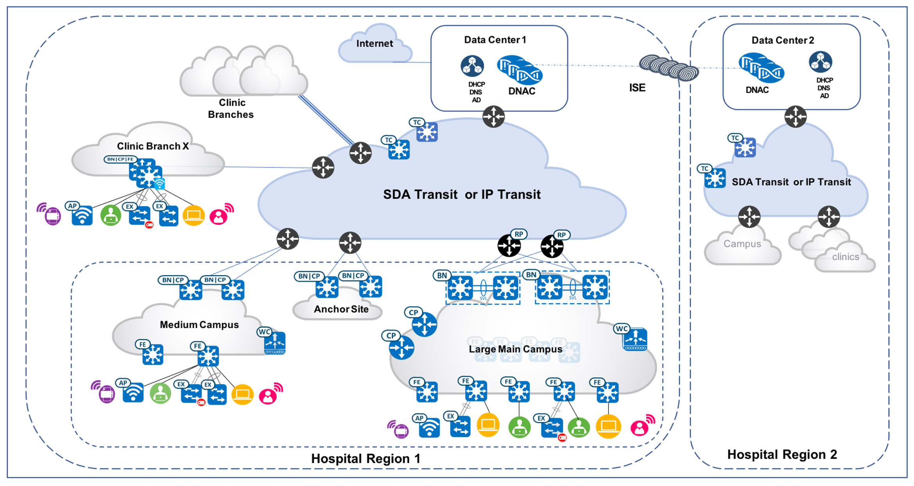
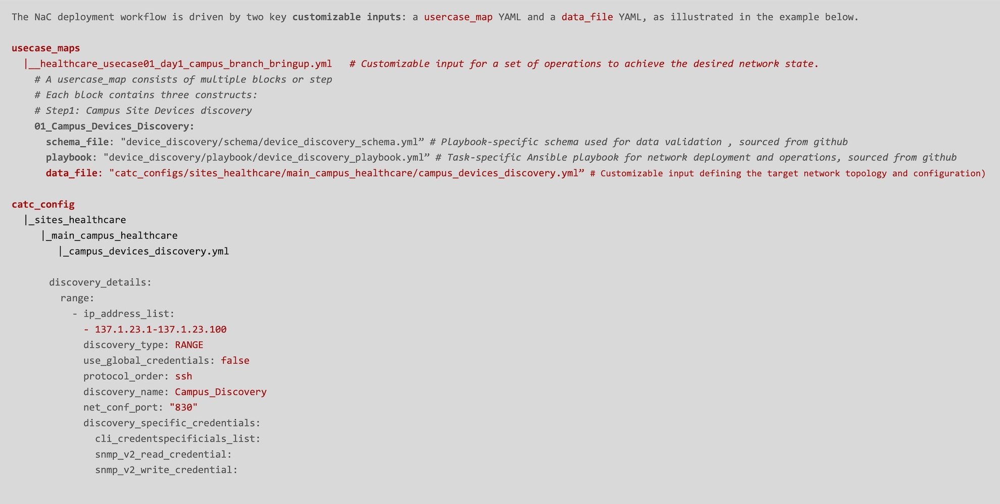
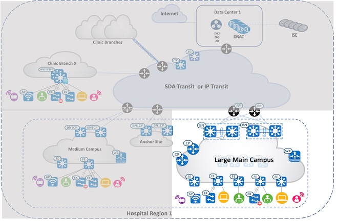
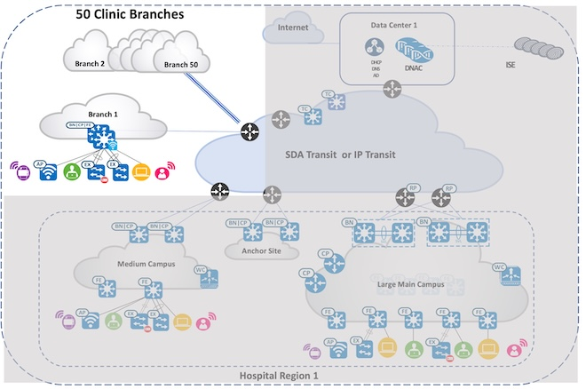

<p align="center">
	<em><code> Catalyst Center Network as Code with Ansible Playbooks User Guide for Healthcare Vertical</code></em>
</p>
<p align="center">
	<!-- default option, no dependency badges. -->
</p>
<br>

##  Table of Contents

- [Overview](#overview)
- [Compatibility Matrix](#compatibility-matrix)
- [Network Topology](#network-topology)  
- [Project Structure](#project-structure)
- [Customizable Inputs](#customizable-inputs)
- [Project Index](#project-index)
- [Getting Started](#getting-started)
  - [Prerequisites](#prerequisites)
  - [Installation](#installation)
  - [Usage](#usage)
- [Contributing](#contributing)
- [License](#license)
- [Acknowledgments](#acknowledgments)

---
## Overview
This GitHub project provides a complete Network as Code (NaC) framework for deploying Cisco Software-Defined Access (SDA) in healthcare environments using Catalyst Center and Ansible automation.
By leveraging Ansible's automation capabilities, this project streamlines the end-to-end configuration process, reduces manual errors, provides easy customization, and ensures consistency across your network.

---
## Compatibility Matrix
The following matrix shows the supported and verified version combinations for the usecases described in this repository.
			<table>
			<tr>
				<td><b>Cisco Catalyst Center version	</b></td>
				<td><b>2.3.7.9</b></td>
			</tr>
			<tr>
				<td><b>Ansible "cisco.dnac" version</b></td>
				<td><b>6.31.3</b></td>
				<td><b><code> ansible-galaxy collection install cisco.dnac:6.31.3 --force --ignore-certs # setup.sh </code></b></td>
			</tr>
			<tr>
				<td><b>Python "dnacentersdk" version </b></td>
				<td><b>2.9.1</b></td>
				<td><b><code>python -m pip install dnacentersdk==2.9.1 # setup.sh </code></b></td>
			</tr>
			</table>

---
## Network Topology


---
## Project Structure
This project provides a complete Network as Code (NaC) solution for deploying Cisco Software-Defined Access (SDA) in healthcare environments using Catalyst Center and Ansible automation. The structure includes declarative YAML configurations (catc_configs/), orchestrated deployment scenarios (usecase_maps/), automated cleanup capabilities (catc_delete_configs/), environment setup script (setup.sh), execution tools (scripts/), and Catalyst Center access configuration (catalystcenter_inventory/). This enables healthcare IT teams to achieve repeatable, reliable SDA deployments with full lifecycle management from initial campus setup through ongoing operations and decommissioning.

```sh
└── CatC_Network_as_Code.git/
    ├── ansible.cfg
    ├── ansible_inventory
    │   └── catalystcenter_inventory
    ├── catc_configs
    │   └── sites_healthcare
    |        |── main_campus_healthcare
    |        |    └── YAML Input files for configuration for Main Campus Site
    |        |    |── campus_devices_compliance.yml
    |        |    |── campus_devices_credentials.yml
    |        |    |── campus_devices_discovery.yml
    |        |    |── campus_devices_inventory.yml
    |        |    |── campus_devices_provision.yml
    |        |    |── campus_nw_settings_ippools.yml
    |        |    |── campus_sda_fabric_devices.yml
    |        |    |── campus_sda_fabric_gateways.yml
    |        |    |── campus_sda_fabric_hostonboarding.yml
    |        |    |── campus_sda_fabric_sites_zones.yml
    |        |    |── campus_sda_fabric_vns.yml
    |        |    |── campus_swim_activation_border_cp.yml
    |        |    |── campus_swim_activation_edges.yml
    |        |    |── campus_swim_activation_im.yml
    |        |    |── campus_swim_cco_download.yml
    |        |    |── campus_swim_distribution.yml
    |        |    |── campus_swim_tag_golden_images.yml
    |        |    |── campus_new_devices_compliance.yml
    |        |    |── campus_new_devices_discovery.yml
    |        |    |── campus_new_devices_inventory.yml
    |        |    |── campus_new_devices_provision.yml
    |        |    |── campus_new_devices_sda_fabric_devices.yml
    |        |    |── campus_new_devices_sda_fabric_hostonboarding.yml
    |        |    
    |        └── clinic_branches_healthcare
    |        |    └── YAML Input files for configuration for all the brnaches sites 
    |        |    |── branches_devices_compliance.yml
    |        |    |── branches_devices_credentials.yml
    |        |    |── branches_devices_discovery.yml
    |        |    |── branches_devices_inventory.yml
    |        |    |── branches_devices_provision.yml
    |        |    |── branches_nw_settings_ippools.yml
    |        |    |── branches_sda_fabric_devices.yml
    |        |    |── branches_sda_fabric_gateways.yml
    |        |    |── branches_sda_fabric_hostonboarding.yml
    |        |    |── branches_sda_fabric_sites_zones.yml
    |        |    |── branches_sda_fabric_vns.yml
    |        |    |── branches_swim_activation_fiabs.yml
    |        |    |── branches_swim_cco_download.yml
    |        |    |── branches_swim_distribution.yml
    |        |    |── branches_swim_tag_golden_images.yml
    |        |    
    |        └── <Other Sites> 
    ├── requirements.txt
    ├── scripts
    │   └── run_playbooks.py
    ├── setup.sh
    └── usecase_maps
        ├── healthcare_usecase01_day1_campus_branch_bringup.yml
        ├── healthcare_usecase02_day1_clinic_branch_bringup.yml
        ├── healthcare_usecase03_dayN_campus_main_network_upgrade.yml
        ├── healthcare_usecase04_dayN_clinic_branch_network_upgrade.yml
        └── healthcare_usecase05_dayN_campus_fabric_edge_onboarding.yml
```
## Customizable Inputs


## Project Index
<details open>
	<summary><b><code>catc_network_as_code_healthcare.git</code></b></summary>
	<details> <!-- __root__ submodule -->
		<summary><b>__root__</b></summary>
		<blockquote>
			<table>
			<tr>
				<td><b><a href='https://github.com/DNACENSolutions/NetworkasCode_CVPs/tree/main/nac_healthcare_sda/NaC_1_0_Healthcare_SDA/setup.sh'>setup.sh</a></b></td>
				<td><code>-  Setup script to create your python environment and install catalyst center python sdk (dnacentersdk) and ansible collection (cisco.dnac)</code></td>
			</tr>
			<tr>
				<td><b><a href='https://github.com/DNACENSolutions/NetworkasCode_CVPs/tree/main/nac_healthcare_sda/NaC_1_0_Healthcare_SDA/requirements.txt'>requirements.txt</a></b></td>
				<td><code>-  This file contains the required python modules. this file is used by setup.sh script</code></td>
			</tr>
			</table>
		</blockquote>
	</details>
	<details> <!-- scripts submodule -->
		<summary><b>scripts</b></summary>
		<blockquote>
			<table>
			<tr>
				<td><b><a href='https://github.com/DNACENSolutions/NetworkasCode_CVPs/tree/main/nac_healthcare_sda/NaC_1_0_Healthcare_SDA/scripts/run_playbooks.py'>run_playbooks.py</a></b></td>
				<td><code>-  This python tool is to run the ansible playbooks with inputs files preprogrammed in the usecase_maps files. the tool lets you choose option to validate the input, execute the playbook or do both. further it gives option for user to run the catalyst center configuration use cases individually, or in a sub-group of use case, or all the use case in the order specified in the input file selected from usecase_maps directory.</code></td>
			</tr>
			</table>
		</blockquote>
	</details>
	<details> <!-- usecase_maps submodule -->
		<summary><b>usecase_maps </b></summary>
		<blockquote>
			<table>
			<tr>
			    <td><b><a href='https://github.com/DNACENSolutions/NetworkasCode_CVPs/tree/main/nac_healthcare_sda/NaC_1_0_Healthcare_SDA/usecase_maps/healthcare_usecase01_day1_campus_branch_bringup.yml'>healthcare_usecase01_day1_campus_branch_bringup.yml</a></b><br><br>
				
				</td>
			<td><br><br><code> -  This yaml usecase deploys a large main campus fabric with below scale : <br> 
				 - 2 co-located border/cps, 100 fabric edges; <br> 
				 - 64 virtual networks, 256 ip pools; <br>
				 - onboard all 150 ports on a 3-member-stack fabric edge <br>
                This usecase consists of 9 operations in below sequence :<br><br>
                #step1: campus site devices discovery <br>
                #step2: campus site create sda fabric sites fabric zones<br>
                #step3: campus site reserve ip address pools <br>
                #step4: campus site assign virtual networks to fabric <br>
                #step5: campus site assign l2 and l3 gateways to fabric <br>
                #step6: campus site assign devices inventory properties <br>
                #step7: campus site assign and provision devices<br>
                #step8: campus site add devices to fabric site as boder, cp and edge nodes <br>
                #step9: campus site enable host onboarding in fabric edge devices <br><br></code></td>
			</tr>
			<tr>
				<td><b><a href='https://github.com/DNACENSolutions/NetworkasCode_CVPs/tree/main/nac_healthcare_sda/NaC_1_0_Healthcare_SDA/usecase_maps/healthcare_usecase02_day1_clinic_branch_bringup.yml'>healthcare_usecase02_day1_clinic_branch_bringup.yml</a></b><br><br>
				 
				</td>
                <td><br><br><code>-  This yaml usecase deploys 50 remote branch fiab sites, each with ip transit and sda transit enabled. <br>
                This usecase consists of 8 operations in below sequence :<br><br>
                #step1: branch sites devices discovery <br>
                #step2: branch sites create sda fabric sites <br>
                #step3: branch sites reserve ip address pools <br>
                #step4: branch sites assign virtual networks to fabric <br>
                #step5: branch sites assign l2 and l3 gateways to fabric <br>
                #step6: branch sites assign devices inventory properties<br>
                #step7: branch sites assign and provision devices <br>
                #step8: branch sites add devices to fabric site as fiab (border|cp|edge) with ip transit and sda transit <br><br></code></td>
			</tr>
			<tr>
				<td><b><a href='https://github.com/DNACENSolutions/NetworkasCode_CVPs/tree/main/nac_healthcare_sda/NaC_1_0_Healthcare_SDA/usecase_maps/healthcare_usecase03_dayN_campus_main_network_upgrade.yml'>healthcare_usecase03_dayn_campus_main_network_upgrade.yml</a></b></td>
                <td><code>-  This yaml usecase performs network upgrade at main campus site: <br>
				- 2 co-located border/cps;<br>
				- 1 intermediate node; <br>
				- 10 fabric edges <br>
                This usecase consists of 7 operations in below sequence :<br><br>
                #step1: swim upgrade the devices on sites - cco download<br>
                #step2: swim upgrade the devices on sites - tagging golden images<br>
                #step3: swim upgrade the devices on sites - image distribution<br>
                #step4: swim upgrade the devices on sites - image activation on edge nodes<br>
                #step5: swim upgrade the devices on sites - image activation on intermedia-nodes<br>
                #step6: swim upgrade the devices on sites - image activation on border-cp-nodes<br>
                #step7: post swim network devices compliance check<br><br></code></td>
			</tr>
			<tr>
				<td><b><a href='https://github.com/DNACENSolutions/NetworkasCode_CVPs/tree/main/nac_healthcare_sda/NaC_1_0_Healthcare_SDA/usecase_maps/healthcare_usecase04_dayN_clinic_branch_network_upgrade.yml'>healthcare_usecase04_dayn_clinic_branch_network_upgrade.ym</a></b></td>
                <td><code>-  This yaml usecase performs network ugrade at 5 remote branches, each with fiab.<br>
                This usecase consists of 5 operations in below sequence : <br><br>
                #step1: swim upgrade the devices on sites - cco download<br>
                #step2: swim upgrade the devices on sites - tagging golden images<br>
                #step3: swim upgrade the devices on sites - image distribution<br>
                #step4: swim upgrade the devices on sites - image activation on fiab nodes<br>
                #step5: post swim network devices compliance check <br><br></code></td>
			</tr>
			<tr>
				<td><b><a href='https://github.com/DNACENSolutions/NetworkasCode_CVPs/tree/main/nac_healthcare_sda/NaC_1_0_Healthcare_SDA/usecase_maps/healthcare_usecase05_dayN_campus_fabric_edge_onboarding.yml'>healthcare_usecase05_dayn_campus_fabric_edge_onboarding.yml</a></b></td>
                <td><code>-  This yaml usecase performs network expansion via onboarding a new fabric edge and onboarding all ports on this edge device for wired and wireless applications. <br>
                This usecase consists of 6 operations in below sequence:<br><br>
                #step1 : discover new devices for the site<br>
                #step2 : assign new devices inventory properties<br>
                #step3 : assign new devices to sites and provision new devices on sites<br>
                #step4 : add new devices to fabric as edge(s) <br>
                #step5 : manage host port onboarding on new edge devices<br>
                #step6 : check network compliance on new devices <br><br></code></td>
			</tr>
			</table>
		</blockquote>
	</details>
	<details> <!-- catc_configs submodule -->
		<summary><b>catc_configs</b></summary>
		<blockquote>
			<details>
				<summary><b>sites</b></summary>
				<blockquote>
					<details>
						<summary><b>main_campus_healthcare</b></summary>
						<blockquote>
							<table>
							<tr>
								<td><b><a href='https://github.com/DNACENSolutions/NetworkasCode_CVPs/tree/main/nac_healthcare_sda/NaC_1_0_Healthcare_SDA/catc_configs/sites_healthcare/main_campus_healthcare/campus_devices_discovery.yml'> campus_devices_discovery.yml </a></b></td>
								<td>
								<code>- This file contains configurations required to discover network devices and add them to the inventory.</code><br> 
								<code>- This example discovers devices via ip address range(s) </code><br> 
								<code>- Related playbook <a href='https://github.com/cisco-en-programmability/catalyst-center-ansible-iac/blob/main/workflows/device_discovery/readme.md'>device_discovery_playbook</a></code>
								</td>
							</tr>
							<tr>
								<td><b><a href='https://github.com/DNACENSolutions/NetworkasCode_CVPs/tree/main/nac_healthcare_sda/NaC_1_0_Healthcare_SDA/catc_configs/sites_healthcare/main_campus_healthcare/campus_sda_fabric_sites_zones.yml'>campus_sda_fabric_sites_zones.yml</a></b></td>
								<td>
								<code>- This file contains configuration required to create fabric sites. </code><br> 
								<code>- This example create a single fabric site. </code><br>
								<code>- Related playbook <a href='https://github.com/cisco-en-programmability/catalyst-center-ansible-iac/blob/main/workflows/sda_fabric_sites_zones/readme.md'>sda_fabric_sites_zones_playbook</a></code>
								</td>
							</tr>
							<tr>
								<td><b><a href='https://github.com/DNACENSolutions/NetworkasCode_CVPs/tree/main/nac_healthcare_sda/NaC_1_0_Healthcare_SDA/catc_configs/sites_healthcare/main_campus_healthcare/campus_nw_settings_ippools.yml'>campus_nw_settings_ippools.yml</a></b></td>
								<td>
									<code>- This file contains configurations required to design and reserve the IP pools for the site.</code><br>
									<code>- This example reserves 256 IP pools for the campus site.</code><br>
									<code>- Related playbook <a href='https://github.com/cisco-en-programmability/catalyst-center-ansible-iac/blob/main/workflows/network_settings/readme.md'>network_settings_playbook</a></code>
								</td>
							</tr>
							<tr>
								<td><b><a href='https://github.com/DNACENSolutions/NetworkasCode_CVPs/tree/main/nac_healthcare_sda/NaC_1_0_Healthcare_SDA/catc_configs/sites_healthcare/main_campus_healthcare/campus_sda_fabric_vns.yml'>campus_sda_fabric_vns.yml</a></b></td>
								<td>
									<code>- This file contains configurations required to assign VNs (virtual networks) to fabric sites.</code><br>
									<code>- This example assigns a total of 64 VNs to a single fabric.</code><br><br>
									<code>⚠️ Scale consideration:</code><br>
									<code>- Catalyst Center 2.3.7.9 R-API for adding VNs supports max 20 VNs per payload. For more than 20, construct YAML in blocks (each block &lt;=20 VNs).</code><br><br>
									<code>✏️ Example YAML (add 40 VNs to a fabric):</code><br>
									<code>sda_fabric_virtual_networks_details:</code><br>
									<code># add first 20 VNs</code><br>
									<code>- virtual_networks:</code><br>
									<code>&emsp;- vn_name: "scale_vn_1"</code><br>
									<code>&emsp;&emsp;fabric_site_locations:</code><br>
									<code>&emsp;&emsp;...</code><br>
									<code>&emsp;- vn_name: "scale_vn_20"</code><br>
									<code>&emsp;&emsp;fabric_site_locations:</code><br>
									<code># add next 20 VNs</code><br>
									<code>- virtual_networks:</code><br>
									<code>&emsp;- vn_name: "scale_vn_21"</code><br>
									<code>&emsp;&emsp;fabric_site_locations:</code><br>
									<code>&emsp;&emsp;...</code><br>
									<code>&emsp;- vn_name: "scale_vn_40"</code><br>
									<code>&emsp;&emsp;fabric_site_locations:</code><br><br>
									<code>- Related playbook <a href='https://github.com/cisco-en-programmability/catalyst-center-ansible-iac/blob/main/workflows/sda_virtual_networks_l2_l3_gateways/readme.md'>sda_virtual_networks_l2_l3_gateways_playbook</a></code>
								</td>
							</tr>
							<tr>
								<td><b><a href='https://github.com/DNACENSolutions/NetworkasCode_CVPs/tree/main/nac_healthcare_sda/NaC_1_0_Healthcare_SDA/catc_configs/sites_healthcare/main_campus_healthcare/campus_sda_fabric_gateways.yml'>campus_sda_fabric_gateways.yml</a></b></td>
								<td>
									<code>- This file contains configurations required to assign L2 and L3 (anycast) gateways to fabric sites.</code><br>
									<code>- This example assigns a total of 256 L3 anycast gateways (4 gateways per VN × 64 VNs).</code><br><br>
									<code>⚠️ Scale consideration:</code><br>
									<code>- Catalyst Center 2.3.7.9 R-API for adding gateways supports max 20 gateways per payload. For more than 20, construct YAML in blocks (each block &lt;=20 gateways).</code><br><br>
									<code>✏️ Example YAML (add 40 gateways to a fabric):</code><br>
									<code>sda_fabric_virtual_networks_details:</code><br>
									<code># add first 20 gateways</code><br>
									<code>- anycast_gateways:</code><br>
									<code>&emsp;- vn_name: "any_vn"</code><br>
									<code>&emsp;&emsp;fabric_site_locations:</code><br>
									<code>&emsp;&emsp;ip_pool_name: "scale_pool_1"</code><br>
									<code>&emsp;&emsp;...</code><br>
									<code>&emsp;- vn_name: "any_vn"</code><br>
									<code>&emsp;&emsp;fabric_site_locations:</code><br>
									<code>&emsp;&emsp;ip_pool_name: "scale_pool_20"</code><br>
									<code># add next 20 gateways</code><br>
									<code>- anycast_gateways:</code><br>
									<code>&emsp;- vn_name: "any_vn"</code><br>
									<code>&emsp;&emsp;fabric_site_locations:</code><br>
									<code>&emsp;&emsp;ip_pool_name: "scale_pool_21"</code><br>
									<code>&emsp;&emsp;...</code><br>
									<code>&emsp;- vn_name: "any_vn"</code><br>
									<code>&emsp;&emsp;fabric_site_locations:</code><br>
									<code>&emsp;&emsp;ip_pool_name: "scale_pool_40"</code><br><br>
									<code>- Related playbook <a href='https://github.com/cisco-en-programmability/catalyst-center-ansible-iac/blob/main/workflows/sda_virtual_networks_l2_l3_gateways/readme.md'>sda_virtual_networks_l2_l3_gateways_playbook</a></code>
								</td>
							</tr>
							<tr>
								<td><b><a href='https://github.com/DNACENSolutions/NetworkasCode_CVPs/tree/main/nac_healthcare_sda/NaC_1_0_Healthcare_SDA/catc_configs/sites_healthcare/main_campus_healthcare/campus_devices_inventory.yml'>campus_devices_inventory.yml</a></b></td>
								<td>
									<code>- This file contains configurations for inventory operations: add, assign to site, provision, update, resync, role change, delete.</code><br>
									<code>- This example assigns roles (access, distribution, core, border) to all devices.</code><br>
									<code>- Related playbook <a href='https://github.com/cisco-en-programmability/catalyst-center-ansible-iac/blob/main/workflows/inventory/readme.md'>inventory_playbook</a></code>
								</td>
							</tr>
							<tr>
								<td><b><a href='https://github.com/DNACENSolutions/NetworkasCode_CVPs/tree/main/nac_healthcare_sda/NaC_1_0_Healthcare_SDA/catc_configs/sites_healthcare/main_campus_healthcare/campus_devices_provision.yml'>campus_devices_provision.yml</a></b></td>
								<td>
									<code>- This file contains configurations for provisioning operations (assign, provision, reprovision, unprovision).</code><br>
									<code>- This example assigns devices to the site and provisions them.</code><br>
									<code>- Related playbook <a href='https://github.com/cisco-en-programmability/catalyst-center-ansible-iac/blob/main/workflows/provision/readme.md'>provision_playbook</a></code>
								</td>
							</tr>
							<tr>
								<td><b><a href='https://github.com/DNACENSolutions/NetworkasCode_CVPs/tree/main/nac_healthcare_sda/NaC_1_0_Healthcare_SDA/catc_configs/sites_healthcare/main_campus_healthcare/campus_sda_fabric_devices.yml'>campus_sda_fabric_devices.yml</a></b></td>
								<td>
									<code>- This file contains configurations for fabric device roles (control plane, border, edge, wireless controller) and border L2/L3 handoff settings.</code><br>
									<code>- This example assigns 2 border/CP nodes and 100 edge nodes in a single fabric site.</code><br><br>
									<code>⚠️ Performance consideration:</code><br>
									<code>- When multiple fabric sites exist, place all devices for the same fabric into a single list to generate one fabric task, reducing orchestration overhead.</code><br>
									<code>✏️ Example (2 fabric sites):</code><br>
									<code>fabric_devices_details:</code><br>
									<code>- fabric_devices:</code><br>
									<code>&emsp;fabric_name: "scale_fabric_1"</code><br>
									<code>&emsp;device_config:</code><br>
									<code>&emsp;&emsp;- device_ip: ip_1</code><br>
									<code>&emsp;&emsp;&emsp;device_roles: [control_plane_node, border_node]</code><br>
									<code>&emsp;&emsp;- device_ip: ip_2</code><br>
									<code>&emsp;&emsp;&emsp;device_roles: [edge_node]</code><br>
									<code>&emsp;&emsp;...</code><br>
									<code>- fabric_devices:</code><br>
									<code>&emsp;fabric_name: "scale_fabric_2"</code><br>
									<code>&emsp;device_config:</code><br>
									<code>&emsp;&emsp;- device_ip: ip_a</code><br>
									<code>&emsp;&emsp;&emsp;device_roles: [control_plane_node, border_node]</code><br>
									<code>&emsp;&emsp;- device_ip: ip_b</code><br>
									<code>&emsp;&emsp;&emsp;device_roles: [edge_node]</code><br><br>
									<code>⚠️ Dependency consideration:</code><br>
									<code>- If a fabric site has zones, create/control-plane/border devices at the site level before adding devices under zones.</code><br>
									<code>✏️ Example (site + child zone):</code><br>
									<code>fabric_devices_details:</code><br>
									<code>- fabric_devices:</code><br>
									<code>&emsp;fabric_name: "fabric_site"</code><br>
									<code>&emsp;device_config:</code><br>
									<code>&emsp;&emsp;- device_ip: ip_cp_border</code><br>
									<code>&emsp;&emsp;&emsp;device_roles: [control_plane_node, border_node]</code><br>
									<code>&emsp;&emsp;- device_ip: ip_edge_1</code><br>
									<code>&emsp;&emsp;&emsp;device_roles: [edge_node]</code><br>
									<code>- fabric_devices:</code><br>
									<code>&emsp;fabric_name: "fabric_zone"</code><br>
									<code>&emsp;device_config:</code><br>
									<code>&emsp;&emsp;- device_ip: ip_zone_edge_1</code><br>
									<code>&emsp;&emsp;&emsp;device_roles: [edge_node]</code><br><br>
									<code>⚠️ Scale consideration:</code><br>
									<code>- Catalyst Center 2.3.7.9 R-API max: 50 devices per payload per fabric. The playbook auto-batches beyond 50 while you can still list all devices together.</code><br>
									<code>✏️ Example (100 devices single fabric):</code><br>
									<code>fabric_devices_details:</code><br>
									<code>- fabric_devices:</code><br>
									<code>&emsp;fabric_name: "big_fabric_site"</code><br>
									<code>&emsp;device_config:</code><br>
									<code>&emsp;&emsp;- device_ip: ip_1</code><br>
									<code>&emsp;&emsp;&emsp;device_roles: [control_plane_node, border_node]</code><br>
									<code>&emsp;&emsp;- device_ip: ip_2</code><br>
									<code>&emsp;&emsp;&emsp;device_roles: [edge_node]</code><br>
									<code>&emsp;&emsp;...</code><br>
									<code>&emsp;&emsp;- device_ip: ip_100</code><br>
									<code>&emsp;&emsp;&emsp;device_roles: [edge_node]</code><br>
									<code>- Related playbook <a href='https://github.com/cisco-en-programmability/catalyst-center-ansible-iac/blob/main/workflows/sda_fabric_device_roles/readme.md'>sda_fabric_device_roles_playbook</a></code>
								</td>
							</tr>
							<tr>
								<td><b><a href='https://github.com/DNACENSolutions/NetworkasCode_CVPs/tree/main/nac_healthcare_sda/NaC_1_0_Healthcare_SDA/catc_configs/sites_healthcare/main_campus_healthcare/campus_sda_fabric_hostonboarding.yml'>campus_sda_fabric_hostonboarding.yml</a></b></td>
								<td>
									<code>- This file contains configurations for host (port) onboarding: add/update/delete port assignments and port channels.</code><br>
									<code>- This example onboards 150+ ports on a 3-member stack edge.</code><br>
									<code>⚠️ Scale: API supports max 400 ports per payload; split large sets into blocks.</code><br>
									<code>- Related playbook <a href='https://github.com/cisco-en-programmability/catalyst-center-ansible-iac/blob/main/workflows/sda_hostonboarding/readme.md'>sda_hostonboarding_playbook</a></code>
								</td>
							</tr>
							<tr>
								<td><b><a href='https://github.com/DNACENSolutions/NetworkasCode_CVPs/tree/main/nac_healthcare_sda/NaC_1_0_Healthcare_SDA/catc_configs/sites_healthcare/main_campus_healthcare/campus_swim_cco_download.yml'>campus_swim_cco_download.yml</a></b></td>
								<td>
									<code>- This file contains configurations for image lifecycle: CCO download, tagging, distribution, activation.</code><br>
									<code>- This example downloads Catalyst images from CCO into the repository.</code><br>
									<code>- Related playbook <a href='https://github.com/cisco-en-programmability/catalyst-center-ansible-iac/blob/main/workflows/swim/readme.md'>swim_playbook</a></code>
								</td>
							</tr>
							<tr>
								<td><b><a href='https://github.com/DNACENSolutions/NetworkasCode_CVPs/tree/main/nac_healthcare_sda/NaC_1_0_Healthcare_SDA/catc_configs/sites_healthcare/main_campus_healthcare/campus_swim_tag_golden_images.yml'>campus_swim_tag_golden_images.yml</a></b></td>
								<td>
									<code>- This file contains configurations for golden image tagging and management.</code><br>
									<code>- This example tags golden images for target devices.</code><br>
									<code>- Related playbook <a href='https://github.com/cisco-en-programmability/catalyst-center-ansible-iac/blob/main/workflows/swim/readme.md'>swim_playbook</a></code>
								</td>
							</tr>
							<tr>
								<td><b><a href='https://github.com/DNACENSolutions/NetworkasCode_CVPs/tree/main/nac_healthcare_sda/NaC_1_0_Healthcare_SDA/catc_configs/sites_healthcare/main_campus_healthcare/campus_swim_distribution.yml'>campus_swim_distribution.yml</a></b></td>
								<td>
									<code>- This file contains configurations for image distribution to devices.</code><br>
									<code>- This example distributes staged images to targets.</code><br>
									<code>- Related playbook <a href='https://github.com/cisco-en-programmability/catalyst-center-ansible-iac/blob/main/workflows/swim/readme.md'>swim_playbook</a></code>
								</td>
							</tr>
							<tr>
								<td><b><a href='https://github.com/DNACENSolutions/NetworkasCode_CVPs/tree/main/nac_healthcare_sda/NaC_1_0_Healthcare_SDA/catc_configs/sites_healthcare/main_campus_healthcare/campus_swim_activation_edges.yml'>campus_swim_activation_edges.yml</a></b></td>
								<td>
									<code>- This file contains configurations for image activation on edge devices.</code><br>
									<code>- This example activates images on edge nodes.</code><br>
									<code>- Related playbook <a href='https://github.com/cisco-en-programmability/catalyst-center-ansible-iac/blob/main/workflows/swim/readme.md'>swim_playbook</a></code>
								</td>
							</tr>
							<tr>
								<td><b><a href='https://github.com/DNACENSolutions/NetworkasCode_CVPs/tree/main/nac_healthcare_sda/NaC_1_0_Healthcare_SDA/catc_configs/sites_healthcare/main_campus_healthcare/campus_swim_activation_im.yml'>campus_swim_activation_im.yml</a></b></td>
								<td>
									<code>- This file contains configurations for image activation on intermediate devices.</code><br>
									<code>- This example activates images on intermediate nodes.</code><br>
									<code>- Related playbook <a href='https://github.com/cisco-en-programmability/catalyst-center-ansible-iac/blob/main/workflows/swim/readme.md'>swim_playbook</a></code>
								</td>
							</tr>
							<tr>
								<td><b><a href='https://github.com/DNACENSolutions/NetworkasCode_CVPs/tree/main/nac_healthcare_sda/NaC_1_0_Healthcare_SDA/catc_configs/sites_healthcare/main_campus_healthcare/campus_swim_activation_border_cp.yml'>campus_swim_activation_border_cp.yml</a></b></td>
								<td>
									<code>- This file contains configurations for image activation on border and control-plane devices.</code><br>
									<code>- This example activates images on border/CP nodes.</code><br>
									<code>- Related playbook <a href='https://github.com/cisco-en-programmability/catalyst-center-ansible-iac/blob/main/workflows/swim/readme.md'>swim_playbook</a></code>
								</td>
							</tr>
							<tr>
								<td><b><a href='https://github.com/DNACENSolutions/NetworkasCode_CVPs/tree/main/nac_healthcare_sda/NaC_1_0_Healthcare_SDA/catc_configs/sites_healthcare/main_campus_healthcare/campus_devices_compliance.yml'>campus_devices_compliance.yml</a></b></td>
								<td>
									<code>- This file contains configurations for device compliance assessment.</code><br>
									<code>- This example runs compliance checks on multiple fabric devices.</code><br>
									<code>- Related playbook <a href='https://github.com/cisco-en-programmability/catalyst-center-ansible-iac/blob/main/workflows/network_compliance/readme.md'>network_compliance_playbook</a></code>
								</td>
							</tr>
							<tr>
								<td><b><a href='https://github.com/DNACENSolutions/NetworkasCode_CVPs/tree/main/nac_healthcare_sda/NaC_1_0_Healthcare_SDA/catc_configs/sites_healthcare/main_campus_healthcare/campus_new_devices_discovery.yml'>campus_new_devices_discovery.yml</a></b></td>
								<td>
									<code>- This file contains configurations required to discover new network devices and add them to the inventory.</code><br>
									<code>- This example discovers a single new device.</code><br>
									<code>- Related playbook <a href='https://github.com/cisco-en-programmability/catalyst-center-ansible-iac/blob/main/workflows/device_discovery/readme.md'>device_discovery_playbook</a></code>
								</td>
							</tr>							
							<tr>
								<td><b><a href='https://github.com/DNACENSolutions/NetworkasCode_CVPs/tree/main/nac_healthcare_sda/NaC_1_0_Healthcare_SDA/catc_configs/sites_healthcare/main_campus_healthcare/campus_new_devices_inventory.yml'>campus_new_devices_inventory.yml</a></b></td>
								<td>
									<code>- This file contains configurations for inventory operations for a newly discovered device.</code><br>
									<code>- This example assigns the access role to the new device.</code><br>
									<code>- Related playbook <a href='https://github.com/cisco-en-programmability/catalyst-center-ansible-iac/blob/main/workflows/inventory/readme.md'>inventory_playbook</a></code>
								</td>
							</tr>
							<tr>
								<td><b><a href='https://github.com/DNACENSolutions/NetworkasCode_CVPs/tree/main/nac_healthcare_sda/NaC_1_0_Healthcare_SDA/catc_configs/sites_healthcare/main_campus_healthcare/campus_new_devices_provision.yml'>campus_new_devices_provision.yml</a></b></td>
								<td>
									<code>- This file contains provisioning configurations for the newly discovered device.</code><br>
									<code>- This example assigns the new device to the site and provisions it.</code><br>
									<code>- Related playbook <a href='https://github.com/cisco-en-programmability/catalyst-center-ansible-iac/blob/main/workflows/provision/readme.md'>provision_playbook</a></code>
								</td>
							</tr>
							<tr>
								<td><b><a href='https://github.com/DNACENSolutions/NetworkasCode_CVPs/tree/main/nac_healthcare_sda/NaC_1_0_Healthcare_SDA/catc_configs/sites_healthcare/main_campus_healthcare/campus_new_devices_sda_fabric_devices.yml'>campus_new_devices_sda_fabric_devices.yml</a></b></td>
								<td>
									<code>- This file contains configurations to add the new device to the fabric as an edge node.</code><br>
									<code>- This example assigns fabric edge role to the new device.</code><br>
									<code>- Related playbook <a href='https://github.com/cisco-en-programmability/catalyst-center-ansible-iac/blob/main/workflows/sda_fabric_device_roles/readme.md'>sda_fabric_device_roles_playbook</a></code>
								</td>
							</tr>							
							<tr>
								<td><b><a href='https://github.com/DNACENSolutions/NetworkasCode_CVPs/tree/main/nac_healthcare_sda/NaC_1_0_Healthcare_SDA/catc_configs/sites_healthcare/main_campus_healthcare/campus_new_devices_compliance.yml'>campus_new_devices_compliance.yml</a></b></td>
								<td>
									<code>- This file contains configurations to perform compliance check on the new device.</code><br>
									<code>- This example runs compliance for a single device.</code><br>
									<code>- Related playbook <a href='https://github.com/cisco-en-programmability/catalyst-center-ansible-iac/blob/main/workflows/network_compliance/readme.md'>network_compliance_playbook</a></code>
								</td>
							</tr>							
							</table>
						</blockquote>
					</details>
					<details>
						<summary><b>clinic_branches_healthcare</b></summary>
						<blockquote>
							<table>
							<tr>
								<td><b><a href='https://github.com/DNACENSolutions/NetworkasCode_CVPs/tree/main/nac_healthcare_sda/NaC_1_0_Healthcare_SDA/catc_configs/sites_healthcare/clinic_branches_healthcare/branches_device_discovery.yml'>branches_device_discovery.yml</a></b></td>
								<td>
								<code>- This file contains configurations required to discover network devices and add them to the inventory. </code><br>
								<code>- This example discovers devices via ip address range(s)</code><br>
								<code>- Related playbook <a href='https://github.com/cisco-en-programmability/catalyst-center-ansible-iac/blob/main/workflows/device_discovery/readme.md'>device_discovery_playbook</a></code>
								</td>
							</tr>
							<tr>
								<td><b><a href='https://github.com/DNACENSolutions/NetworkasCode_CVPs/tree/main/nac_healthcare_sda/NaC_1_0_Healthcare_SDA/catc_configs/sites_healthcare/clinic_branches_healthcare/branches_sda_fabric_sites_zones.yml'>branches_sda_fabric_sites_zones.yml</a></b></td>
								<td>
								<code>- This file contains configuration required to create fabric sites. </code><br>
								<code>- This example creates 50 remote branch sites with closed-authetication profile </code><br> 
								<code>- Related playbook <a href='https://github.com/cisco-en-programmability/catalyst-center-ansible-iac/blob/main/workflows/sda_fabric_sites_zones/readme.md'>sda_fabric_sites_zones_playbook</a></code>
								</td>
							</tr>
							<tr>
								<td><b><a href='https://github.com/DNACENSolutions/NetworkasCode_CVPs/tree/main/nac_healthcare_sda/NaC_1_0_Healthcare_SDA/catc_configs/sites_healthcare/clinic_branches_healthcare/branches_nw_settings_ippools.yml'>branches_nw_settings_ippools.yml</a></b></td>
								<td>
								<code>- This file contains configurations required to design and reserve the ip pools for the site.</code> <br>
								<code>- This example reserves 150 ip pools across 50 branch sites. </code><br>
								<code>- Reserve ip address pools for each branch sites. <br> ❯ related playbook <a href='https://github.com/cisco-en-programmability/catalyst-center-ansible-iac/blob/main/workflows/network_settings/readme.md'>network_settings_playbook</a></code>
								</td>
							</tr>
							<tr>
								<td><b><a href='https://github.com/DNACENSolutions/NetworkasCode_CVPs/tree/main/nac_healthcare_sda/NaC_1_0_Healthcare_SDA/catc_configs/sites_healthcare/clinic_branches_healthcare/branches_sda_fabric_vns.yml'>branches_sda_fabric_vns.yml</a></b></td>
								<td>
								<code>- This file contains configurations required to assign vns (virtual networks) to fabric sites.</code><br>
								<code>- This example assign 50 vns across 50 fabric sites (1 vns per fabric x 50 fabric sites), and assign infra_vn to all 50 fabric sites </code><br>
								<code>⚠️ Scale consideration:</code><br>
								<code>catc 2.3.7.9 rapi for adding vn supports max 20 vn per payload. with more than 20 vns, yaml needs to be constructed in blocks where each block contains 20 vns.</code><br>
								<code>catc 2.3.7.9 rapi for adding vn , a single virtual network cannot be assigned to more than 200 unique fabric sites or zones in a single request. with more than 200 fabric sites/zones which shared the same vn, yaml needs to be constructed in blocks where each block contains 200 sites/zones.</code><br>
								<code>✏️ example yaml (add 40 vns to fabric)</code><br>
								<code>sda_fabric_virtual_networks_details:</code><br>
								<code># add first 20 vn</code><br>
								<code>- virtual_networks:</code><br>
								<code>&emsp; - vn_name: "scale_vn_1"</code><br>
								<code>&emsp; &emsp;   fabric_site_locations:</code><br>
								<code>&emsp; &emsp;   ...</code><br>
								<code>&emsp; - vn_name: "scale_vn_20"</code><br>
								<code>&emsp; &emsp;    fabric_site_locations:</code><br>
								<code># add next 20 vn</code><br>
								<code>- virtual_networks:</code><br>
								<code>&emsp; - vn_name: "scale_vn_21"</code><br>
								<code>&emsp; &emsp;   fabric_site_locations:</code><br>
								<code>&emsp; &emsp;   ...</code><br>
								<code>&emsp; - vn_name: "scale_vn_40"</code><br>
								<code>&emsp; &emsp;  fabric_site_locations:</code><br>
								<code>✏️ example yaml (add 1 vns to 300 fabric sites)</code><br>
								<code>sda_fabric_virtual_networks_details:</code><br>
								<code># assign "infra_vn" to first 200 sites</code><br>
								<code>- virtual_networks:</code><br>
								<code>&emsp; - vn_name: "infra_vn"</code><br>
								<code>&emsp; &emsp;   fabric_site_locations:</code><br>
								<code>&emsp; &emsp; &emsp; - site_name_hierarchy: "branch_site_1"</code><br>
								<code>&emsp; &emsp; &emsp; &emsp; fabric_type:  "fabric_site"</code><br>
								<code>&emsp; &emsp;   ...</code><br>
								<code>&emsp; &emsp; &emsp; - site_name_hierarchy: "branch_site_200"</code><br>
								<code>&emsp; &emsp; &emsp; &emsp; fabric_type:  "fabric_site"</code><br>
								<code># assign "infra_vn" to next 100 sites</code><br>
								<code>- virtual_networks:</code><br>
								<code>&emsp; - vn_name: "infra_vn"</code><br>
								<code>&emsp; &emsp;   fabric_site_locations:</code><br>
								<code>&emsp; &emsp; &emsp; - site_name_hierarchy: "branch_site_201"</code><br>
								<code>&emsp; &emsp; &emsp; &emsp; fabric_type:  "fabric_site"</code><br>
								<code>&emsp; &emsp;   ...</code><br>
								<code>&emsp; &emsp; &emsp; - site_name_hierarchy: "branch_site_300"</code><br>
								<code>&emsp; &emsp; &emsp; &emsp; fabric_type:  "fabric_site"</code><br>
								<code>-  related playbook <a href='https://github.com/cisco-en-programmability/catalyst-center-ansible-iac/blob/main/workflows/sda_virtual_networks_l2_l3_gateways/readme.md'>sda_virtual_networks_l2_l3_gateways_playbook</a></code>
								</td>
							</tr>
							<tr>
								<td><b><a href='https://github.com/DNACENSolutions/NetworkasCode_CVPs/tree/main/nac_healthcare_sda/NaC_1_0_Healthcare_SDA/catc_configs/sites_healthcare/clinic_branches_healthcare/branches_sda_fabric_gateways.yml'>branches_sda_fabric_gateways.yml</a></b></td>
								</td>
								<td>
								<code>-  This file contains configurations required to assign l2 gateways and l3 gateways to fabric sites.</code><br>
								<code>-  This example assign total 100 l3 anycast gateways to fabric sites. 2 gateways per fabric_site x 50 fabric sites.</code><br>
								<code>⚠️ Scale consideration:</code><br>
								<code>catc 2.3.7.9 rapi for adding gw supports max 20 gw per payload. with more than 20 gws, yaml needs to be constructed in blocks where each block contains 20 gws.</code><br>
								<code>✏️ example yaml (add 40 gws to fabric)</code><br>
								<code>sda_fabric_virtual_networks_details:</code><br>
								<code># add first 20 gateways</code><br>
								<code>- anycast_gateways:</code><br>
								<code>&emsp; - vn_name: "any_vn"</code><br>
								<code>&emsp; &emsp;   fabric_site_locations:</code><br>
								<code>&emsp; &emsp;   ip_pool_name: "scale_pool_1"</code><br>
								<code>&emsp; &emsp;   ...</code><br>
								<code>&emsp; - vn_name: "any_vn"</code><br>
								<code>&emsp; &emsp;   fabric_site_locations:</code><br>
								<code>&emsp; &emsp;   ip_pool_name: "scale_pool_20"</code><br>
								<code># add next 20 gateways</code><br>
								<code>- anycast_gateways:</code><br>
								<code>&emsp; - vn_name: "any_vn"</code><br>
								<code>&emsp; &emsp;   fabric_site_locations:</code><br>
								<code>&emsp; &emsp;   ip_pool_name: "scale_pool_21"</code><br>
								<code>&emsp; &emsp;   ...</code><br>
								<code>&emsp; - vn_name: "any_vn"</code><br>
								<code>&emsp; &emsp;   fabric_site_locations:</code><br>
								<code>&emsp; &emsp;   ip_pool_name: "scale_pool_40"</code><br>
								<code>-  assign 2 l3 gateways to each of the 50 fabric sites.</code><br>
								<code>❯ related playbook <a href='https://github.com/cisco-en-programmability/catalyst-center-ansible-iac/blob/main/workflows/sda_virtual_networks_l2_l3_gateways/readme.md'>sda_virtual_networks_l2_l3_gateways_playbook</a></code>
								</td>
							</tr>
							<tr>
								<td><b><a href='https://github.com/DNACENSolutions/NetworkasCode_CVPs/tree/main/nac_healthcare_sda/NaC_1_0_Healthcare_SDA/catc_configs/sites_healthcare/clinic_branches_healthcare/branches_inventory.yml'>branches_inventory.yml</a></b></td>
								<td>
								<code>- This file contains configuration related to various inventory management tasks within your network, such as adding devices, assigning devices to sites, provisioning, updating devices, resyncing  devices, changing device roles, and deleting devices from the inventory. </code><br>
								<code>- This example assigns inventory role - Access - to all 50 devices accorss 50 sites. </code><br>
								<code>- Related playbook <a href='https://github.com/cisco-en-programmability/catalyst-center-ansible-iac/blob/main/workflows/inventory/readme.md'>inventory_playbook</a></code>
								</td>
							</tr>
							<tr>
								<td><b><a href='https://github.com/DNACENSolutions/NetworkasCode_CVPs/tree/main/nac_healthcare_sda/NaC_1_0_Healthcare_SDA/catc_configs/sites_healthcare/clinic_branches_healthcare/branches_devices_provision.yml'>branches_devices_provision.yml</a></b></td>
								<td>
								<code>- This file contains configurations related to device provisioning, such as assigning device to sites, provisioning, reprovisioning and deleting provisioned devices in catalyst center inventory. </code><br> 
								<code>- This example assigns devices to sites and provision devices in all 50 sites. </code><br>
								<code>- Related playbook <a href='https://github.com/cisco-en-programmability/catalyst-center-ansible-iac/blob/main/workflows/provision/readme.md'>provision_playbook</a></code>
								</td>
							</tr>
							<tr>
								<td><b><a href='https://github.com/DNACENSolutions/NetworkasCode_CVPs/tree/main/nac_healthcare_sda/NaC_1_0_Healthcare_SDA/catc_configs/sites_healthcare/clinic_branches_healthcare/branches_sda_fabric_devices.yml'>branches_sda_fabric_devices.yml</a></b></td>
								<td>
								<code>- This file contains configurations related to fabric device roles, such as assigning and managing device roles (control plane node, edge node, border node, wireless controller) within the sda fabric. this file also contains configuration of border settings for layer 2 and layer 3 handoffs. </code><br> 
								<code>- This example assigns all 50 fiab (border/cp/edge) across 50 fabric sites (1 fiab per fabric_site x 50 fabric sites) </code><br>
								<code>- Related playbook <a href='https://github.com/cisco-en-programmability/catalyst-center-ansible-iac/blob/main/workflows/sda_hostonboarding/readme.md'>sda_hostonboarding_playbook</a></code>
								</td>
							</tr>
							<tr>
								<td><b><a href='https://github.com/DNACENSolutions/NetworkasCode_CVPs/tree/main/nac_healthcare_sda/NaC_1_0_Healthcare_SDA/catc_configs/sites_healthcare/clinic_branches_healthcare/branches_swim_cco_download.yml'>branches_swim_cco_download.yml</a></b></td>
								<td>
								<code>- This file contains configuration related to manage and upgrade software images on cisco devices, such as image download, golden image tagging, image distribution and image activation </code><br>
								<code>- This example download catalyst switch software image from cco to catalyst center image repository . </code><br>
								<code>- Related playbook <a href='https://github.com/cisco-en-programmability/catalyst-center-ansible-iac/blob/main/workflows/swim/readme.md'>swim_playbook</a></code>
								</td>
							</tr>
							<tr>
								<td><b><a href='https://github.com/DNACENSolutions/NetworkasCode_CVPs/tree/main/nac_healthcare_sda/NaC_1_0_Healthcare_SDA/catc_configs/sites_healthcare/clinic_branches_healthcare/branches_swim_tag_golden_images.yml'>branches_swim_tag_golden_images.yml</a></b></td>
								<td>
								<code>- This file contains configuration related to manage and upgrade software images on cisco devices, such as image download, golden image tagging, image distribution and image activation </code><br>
								<code>- This example tags golden images for devices . </code><br>
								<code>- Related playbook <a href='https://github.com/cisco-en-programmability/catalyst-center-ansible-iac/blob/main/workflows/swim/readme.md'>swim_playbook</a></code>
								</td>
							</tr>
							<tr>
								<td><b><a href='https://github.com/DNACENSolutions/NetworkasCode_CVPs/tree/main/nac_healthcare_sda/NaC_1_0_Healthcare_SDA/catc_configs/sites_healthcare/clinic_branches_healthcare/branches_swim_distribution.yml'>branches_swim_distribution.yml</a></b></td>
								<td>
								<code>-  This file contains configuration related to manage and upgrade software images on cisco devices, such as image downloading, golden image tagging, image distribution and image activation. </code><br>
								<code>-  This example distribute images to the targeted devices. </code><br>
								<code>-  related playbook <a href='https://github.com/cisco-en-programmability/catalyst-center-ansible-iac/blob/main/workflows/swim/readme.md'>swim_playbook</a></code>
								</td>
							</tr>
							<tr>
								<td><b><a href='https://github.com/DNACENSolutions/NetworkasCode_CVPs/tree/main/nac_healthcare_sda/NaC_1_0_Healthcare_SDA/catc_configs/sites_healthcare/clinic_branches_healthcare/branches_swim_activation_fiabs.yml'>branches_swim_activation_fiabs.yml</a></b></td>
								<td>
								<code>- This file contains configuration related to management of device compliances. </code><br>
								<code>- This example performs compliance check on all the newly upgraded devices. </code><br>
								<code>- Related playbook <a href='https://github.com/cisco-en-programmability/catalyst-center-ansible-iac/blob/main/workflows/swim/readme.md'>swim_playbook</a></code>
								</td>
							</tr>
							<tr>
								<td><b><a href='https://github.com/DNACENSolutions/NetworkasCode_CVPs/tree/main/nac_healthcare_sda/NaC_1_0_Healthcare_SDA/catc_configs/sites_healthcare/clinic_branches_healthcare/branches_devices_compliance.yml'>branches_network_compliance.yml</a></b></td>
								<td>
								<code>- This file contains configuration related to management of device compliance within your network. </code><br>
								<code>- This example performs compliance check on multiple fabric devices. </code><br> 
								<code>- Related playbook <a href='https://github.com/cisco-en-programmability/catalyst-center-ansible-iac/blob/main/workflows/network_compliance/readme.md'>network_compliance_playbook</a></code>
								</td>
							</tr>
							</table>
						</blockquote>
					</details>
				</blockquote>
			</details>
		</blockquote>
	</details>
	<details> <!-- ansible_inventory submodule -->
		<summary><b>ansible_inventory</b></summary>
		<blockquote>
			<details>
				<summary><b>catalystcenter_inventory</b></summary>
				<blockquote>
					<table>
					<tr>
						<td><b><a href='https://github.com/DNACENSolutions/NetworkasCode_CVPs/tree/main/nac_healthcare_sda/NaC_1_0_Healthcare_SDA/ansible_inventory/catalystcenter_inventory/hosts.yml'>hosts.yml</a></b></td>
					    <td>
						<code>- This is a sample Host file to be created for your Catalyst Center to be able to run the existing playbooks.</code><br>
						<code> ✏️ Sample Inventory file </code><br>
						<code>catalyst_center_hosts:</code><br>
						<code>&emsp; hosts:</code><br>
						<code>&emsp; &emsp; any_hostname:</code><br>
						<code>&emsp; &emsp; &emsp; catalyst_center_password: Catalyst Center Credentials password</code><br>
						<code>&emsp; &emsp; &emsp; catalyst_center_host: Catalyst Center Host IP address Reachable fron ansible server</code><br>
						<code>&emsp; &emsp; &emsp; catalyst_center_port: 443</code><br>
						<code>&emsp; &emsp; &emsp; catalyst_center_timeout: 60</code><br>
						<code>&emsp; &emsp; &emsp; catalyst_center_api_task_timeout: 1200</code><br>
						<code>&emsp; &emsp; &emsp; catalyst_center_username: Catalyst Center Credentials username</code><br>
						<code>&emsp; &emsp; &emsp; catalyst_center_version: Catalyst Center Release. (i.e. 2.3.7.9)</code><br>
						<code>&emsp; &emsp; &emsp; catalyst_center_verify: false</code><br>
						<code>&emsp; &emsp; &emsp; catalyst_center_debug: true</code><br>
						<code>&emsp; &emsp; &emsp; catalyst_center_log_level: DEBUG</code><br>
						<code>&emsp; &emsp; &emsp; catalyst_center_log: true</code><br>
						<code>&emsp; &emsp; &emsp; catalyst_center_log_append: true</code><br>
						<code>&emsp; &emsp; &emsp; catalyst_center_log_file_path: log file location. (i.e.catc_logs)</code>
						</td>	
					</tr>
					</table>
				</blockquote>
			</details>
		</blockquote>
	</details>
</details>

---
## Getting Started

### Prerequisites

Before getting started with catc_sd_access_campus.git, ensure your runtime environment meets the following requirements:

- **Programming language:** shell
- **Package manager:** pip


### Installation

Install catc_sd_access_campus using one of the following methods:

**Build from source:**

1. Clone the catc_sd_access_campus.git repository:
```sh
-  git clone https://github.com/dnacensolutions/catc_sd_access_campus.git
```

2. Navigate to the project directory:
```sh
-  cd NetworkasCode_CVPs
-  cd nac_healthcare_sda/NaC_1_0_Healthcare_SDA
```

3. Install the project dependencies:

```sh
using `bash`
-  source setup.sh
```

### Usage
Run catc_sd_access_campus using the following command:

```sh
using `python3`
-  python3 scripts/run_playbooks.py
```
---

## Contributing

- **💬 [Join the discussions](https://github.com/dnacensolutions/catc_sd_access_campus.git/discussions)**: Share your insights, provide feedback, or ask questions.
- **🐛 [Report issues](https://github.com/dnacensolutions/catc_sd_access_campus.git/issues)**: Submit bugs found or log feature requests for the `catc_sd_access_campus.git` project.
- **💡 [Submit pull requests](https://github.com/dnacensolutions/catc_sd_access_campus.git/blob/main/contributing.md)**: Review open PRs, and submit your own PRs.

<details closed>
<summary>Contributing guidelines</summary>

1. **Fork the repository**: Start by forking the project repository to your GitHub account.
2. **Clone locally**: Clone the forked repository to your local machine using a git client.
   ```sh
   git clone https://github.com/dnacensolutions/catc_sd_access_campus.git
   ```
3. **Create a new branch**: Always work on a new branch, giving it a descriptive name.
   ```sh
   git checkout -b new-feature-x
   ```
4. **Make your changes**: Develop and test your changes locally.
5. **Commit your changes**: Commit with a clear message describing your updates.
   ```sh
   git commit -m 'Implemented new feature x.'
   ```
6. **Push to GitHub**: Push the changes to your forked repository.
   ```sh
   git push origin new-feature-x
   ```
7. **Submit a pull request**: Create a PR against the original project repository. Clearly describe the changes and their motivations.
8. **Review**: Once your PR is reviewed and approved, it will be merged into the main branch. Congratulations on your contribution!
</details>

<details closed>
<summary>Contributor graph</summary>
<br>
</details>

---

## License

This project is protected under the [select-a-license](https://choosealicense.com/licenses) license. For more details, refer to the [LICENSE](https://choosealicense.com/licenses/) file.

---

## Acknowledgments

- List any resources, contributors, inspiration, etc. here.

---
