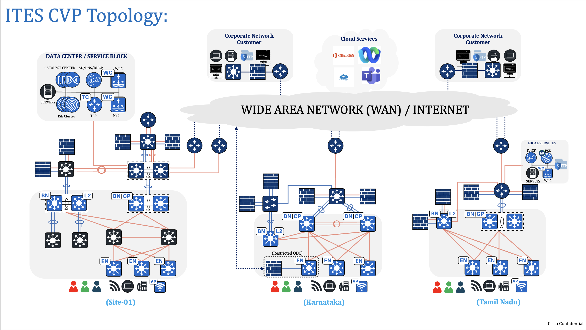

<p align="center">
	<em><code>-  Catalyst Center Network as Code -  ITES Vertical - With  Ansible Playbooks</code></em>
</p>
<p align="center"><!-- default option, no dependency badges. -->
</p>
<p align="center">
	<!-- default option, no dependency badges. -->
</p>
<br>




##  Table of Contents

-  [Overview](#Overview )
- [ Project Structure](#project-structure)
- [ Project Index](#project-index)
- [ Getting Started](#getting-started)
  - [ Prerequisites](#prerequisites)
  - [ Installation](#installation)
  - [ Usage](#usage)
  - [ Testing](#testing)
- [ Project Roadmap](#project-roadmap)
- [ Contributing](#contributing)
- [ License](#license)
- [ Acknowledgments](#acknowledgments)

---
##  Overview
This GitHub project provides a comprehensive Ansible automatioin framework for network deployment and operation of on a freshly installed Catalyst center. By leveraging Ansible's automation capabilities, this project streamlines the end-to-end configuration process, reduces manual errors, provides easy cusotomization, and ensures consistency across your network.

---
##  Project Structure
```sh
└── CatC_ITES_Automation.git/
    ├── ansible.cfg
    ├── ansible_inventory
    │   └── catalystcenter_inventory
    ├── catc_configs
    │   ├── global
    │   │   └── YAML input files for Catalyst Center Global Configurations (device credentials, IP pools, image tagging etc.)
    │   │       ├── catc_and_ise_integration.yml
    │   │       ├── day0_device_credentials.yml
    │   │       ├── day0_ip_pool.yml
    │   │       ├── day0_network_settings.yml
    │   │       ├── day0_site_creation.yml
    │   │       ├── day1_ip_pool.yml
    │   │       ├── day1_site_creation.yml
    │   │       └── dayn_FV_network_devices_CCO_download_tag_golden_images_distribution.yml
    │   └── sites
    │       ├── Karnataka
    │       │   ├── day0_device_credentials.yml
    │       │   ├── day0_ip_pool.yml
    │       │   ├── day0_lan_automation.yml
    │       │   ├── day0_network_settings.yml
    │       │   ├── day1_lan_automation.yml
    │       │   ├── day1_sda_device_role.yml
    │       │   ├── day1_sda_fabric_site.yml
    │       │   ├── day1_sda_l2l3_VN.yml
    │       │   ├── day1_sda_transits.yml
    │       │   ├── dayn_FV_network_devices_primary_site_images_activation.yml
    │       │   ├── device_discovery.yml
    │       │   ├── device_provision.yml
    │       │   ├── day_roaming_VN
    │       │   │   ├── dayn_device_role.yml
    │       │   │   ├── dayn_ip_pool.yml
    │       │   │   └── dayn_L3_VN.yml
    │       │   ├── dayn_C2S_gateway_outside_and_dedicated_firewall
    │       │   │   ├── dayn_device_role.yml
    │       │   │   ├── dayn_L2_Vlan.yml
    │       │   │   └── dayn_wired_host_onboarding.yml
    │       │   └── dayn_C2S_gateway_outside_and_shared_firewall
    │       │       ├── dayn_device_role.yml
    │       │       ├── dayn_L2_Vlan.yml
    │       │       └── dayn_wired_host_onboarding.yml
    │       └── Tamil_Nadu
    │           ├── day1_device_creds.yml
    │           ├── day1_device_discovery.yml
    │           ├── day1_device_provision.yml
    │           ├── day1_ip_pool.yml
    │           ├── day1_network_settings.yml
    │           ├── day1_new_site_sda_device_role.yml
    │           ├── day1_new_site_sda_fabric_site.yml
    │           ├── day1_new_site_sda_l2l3_VN.yml
    │           ├── day1_new_site_sda_transits.yml
    │           ├── dayn_FV_network_devices_secondary_site_images_activation.yml
    │           ├── dayn_C2S_gateway_inside_and_dedicated_firewall
    │           │   ├── dayn_device_role.yml
    │           │   ├── dayn_Ip_Pool_Assignment_to_Site.yml
    │           │   ├── dayn_L3VN_Anycast_Gateway.yml
    │           │   └── dayn_wired_host_onboarding.yml
    │           ├── dayn_C2S_gateway_inside_and_shared_firewall
    │           │   ├── dayn_device_role.yml
    │           │   ├── dayn_Ip_Pool_Assignment_to_Site.yml
    │           │   ├── dayn_L3VN_Anycast_Gateway.yml
    │           │   └── dayn_wired_host_onboarding.yml
    │           └── dayn_S2S_restricted_ODC
    │               ├── dayn_device_role.yml
    │               ├── dayn_fabric_zone.yml
    │               ├── dayn_host_onboarding.yml
    │               └── dayn_L2_Vlan.yml
    ├── requirements.txt
    ├── scripts_
    │   └── run_playbooks.py
    ├── setup.sh
    └── usecase_maps
        ├── day0_lan_automation.yml
        ├── day0_settings_and_integration.yml
        ├── day1_lan_automation_Brownfield.yml
        ├── day1_lan_automation_Greenfield.yml
        ├── day1_new_site_sda_fabric_provision.yml
        ├── day1_sda_fabric_provision.yml
        ├── day1_settings_and_integration.yml
        ├── dayn_C2S_gateway_inside_and_dedicated_firewall.yml
        ├── dayn_C2S_gateway_inside_and_shared_firewall.yml
        ├── dayn_C2S_gateway_outside_and_dedicated_firewall.yml
        ├── dayn_C2S_gateway_outside_and_shared_fabric.yml
        ├── dayn_Image_Upgrade_Across_Campus.yml
        ├── dayn_S2S_gateway_inside_and_dedicated_firewall.yml
        ├── dayn_S2S_gateway_inside_and_shared_firewall.yml
        ├── dayn_S2S_gateway_outside_and_dedicated_firewall.yml
        ├── dayn_S2S_gateway_outside_and_shared_firewall.yml
        ├── dayn_S2S_restricted_ODC.yml
        └── dayn_site_to_site_roaming_VN.yml


```

##  Project Index
<details open>
	<summary><b><code>CATC_NETWORK_AS_CODE_ITES.GIT</code></b></summary>
	<details> <!-- __root__ Submodule -->
		<summary><b>__root__</b></summary>
		<blockquote>
			<table>
			<tr>
				<td><b><a href='https://github.com/DNACENSolutions/NetworkasCode_CVPs/tree/main/nac_ites_sda/NaC_1_0_ITES_SDA/setup.sh'>setup.sh</a></b></td>
				<td><code>-  Setup script to create your python environment and install Catalyst Center Python SDK (dnacentersdk) and Ansible collection (cisco.dnac)</code></td>
			</tr>
			<tr>
				<td><b><a href='https://github.com/DNACENSolutions/NetworkasCode_CVPs/tree/main/nac_ites_sda/NaC_1_0_ITES_SDA/requirements.txt'>requirements.txt</a></b></td>
				<td><code>-  This file contains the required python modules. This file is used by setup.sh script</code></td>
			</tr>
			</table>
		</blockquote>
	</details>
	<details> <!-- scripts Submodule -->
		<summary><b>scripts</b></summary>
		<blockquote>
			<table>
			<tr>
				<td><b><a href='https://github.com/DNACENSolutions/NetworkasCode_CVPs/tree/main/nac_ites_sda/NaC_1_0_ITES_SDA/scripts/run_playbooks.py'>run_playbooks.py</a></b></td>
				<td><code>-  This Python tool is to run the Ansible playbooks with Inputs files preprogrammed in the usecase_maps files. The Tools lets you choose option to Validate the input, Execute the playbook or do both. Further it gives option for user to run the Catalyst Center Configuration usecases individually, or in a sub-group of usecase , or all the usecase in the order specified in the input file selected from usecase_maps directory.</code></td>
			</tr>
			</table>
		</blockquote>
	</details>
	<details> <!-- usecase_maps Submodule -->
		<summary><b>usecase_maps </b></summary>
		<blockquote>
			<table>
			<tr>
				<td><b><a href='https://github.com/DNACENSolutions/NetworkasCode_CVPs/tree/main/nac_ites_sda/NaC_1_0_ITES_SDA/usecase_maps/day0_settings_and_integration.yml'>day0_settings_<br>and_integration.yml</a></b></td>
            <td> 
            <code>- This usecase performs essential Day0 configurations to prepare the infrastructure for SDA automation by integrating ISE with DNAC, creating the site hierarchy, setting up global device credentials, network settings, and assigning them to the target site (e.g., Karnataka).</code><br>
            <code>- This usecase consists of 8 operations in the following sequence:</code><br>
            <code>  #Step1: Integrate Cisco ISE with Catalyst Center for RADIUS services and TrustSec policies</code><br>
            <code>  #Step2: Create hierarchical site structure including areas, buildings, and floors</code><br>
            <code>  #Step3: Define global device credentials in Catalyst Center</code><br>
            <code>  #Step4: Assign global credentials to the Karnataka site</code><br>
            <code>  #Step5: Define global IP pools including transit and VN pools</code><br>
            <code>  #Step6: Define global network settings such as DNS, SNMP, and syslog</code><br>
            <code>  #Step7: Assign IP pools to the Karnataka site</code><br>
            <code>  #Step8: Apply global network settings to the Karnataka site</code>
            </td>
			</tr>
			<tr>
				<td><b><a href='https://github.com/DNACENSolutions/NetworkasCode_CVPs/tree/main/nac_ites_sda/NaC_1_0_ITES_SDA/usecase_maps/day0_lan_automation.yml'>day0_lan_automation.yml</a></b></td>
                <td>
                <code>- This use case handles the initial bring-up of a fabric site by automating the discovery and provisioning of seed and downstream devices. It simplifies onboarding by using LAN Automation to detect connected fabric edge nodes.</code><br>
                <code>- This use case includes the following 4 operations:</code><br> 
                <code>  #Step1: Discover seed devices in the network using CLI/SNMP-based discovery methods.</code><br> 
                <code>  #Step2: Provision the discovered seed devices to prepare them for acting as LAN Automation controllers.</code><br> 
                <code>  #Step3: Run LAN Automation to dynamically discover access switches connected to the seed devices.</code><br> 
                <code>  #Step4: Provision the newly discovered downstream devices with appropriate management IPs and configuration.</code><br><br>
                <code>⚠️ <b>Note:</b> Ensure that management IPs are assigned during LAN Automation if immediate provisioning of discovered devices is planned.</code></td>
			</tr>
            <tr>
				<td><b><a href='https://github.com/DNACENSolutions/NetworkasCode_CVPs/tree/main/nac_ites_sda/NaC_1_0_ITES_SDA/usecase_maps/day1_settings_and_integration.yml'>day1_settings_<br>and_integration.yml</a></b></td>
                <td>
                <code>- This use case configures foundational Day 1 settings for onboarding a newly added site into the fabric domain. It involves site addition, IP pool design, and essential network configurations specific to the new site.</code><br> 
                <code>- This use case performs the following 5 operations:</code><br> 
                <code>  #Step1: Create a new hierarchical site under the DNAC site tree structure.</code><br> 
                <code>  #Step2: Assign pre-defined device credentials (CLI, SNMP, etc.) to the new site for future provisioning and management.</code><br> 
                <code>  #Step3: Create global IP pools to be consumed by various sites and services.</code><br> 
                <code>  #Step4: Allocate and assign the relevant IP pool slices to the newly added site.</code><br> 
                <code>  #Step5: Configure site-specific network settings such as DNS, DHCP, NTP, and syslog to enable baseline device communication and service resolution.</code></td>
			</tr>
			<tr>
				<td><b><a href='https://github.com/DNACENSolutions/NetworkasCode_CVPs/tree/main/nac_ites_sda/NaC_1_0_ITES_SDA/usecase_maps/day1_lan_automation_Brownfield.yml'>day1_lan_automation<br>_Brownfield.yml</a></b></td>
                <td>
                <code>- This use case supports Brownfield site expansion by integrating newly added switches into an already operational SDA fabric. It automates the discovery of new devices via LAN Automation and provisions them to extend the fabric topology.</code><br> 
                <code>- This use case consists of the following 2 operations:</code><br> 
                <code>  #Step1: Run LAN Automation to discover additional devices connected to existing fabric infrastructure.</code><br> 
                <code>  #Step2: Provision the discovered devices by assigning management IPs, applying configurations, and registering them to the fabric.</code><br><br>
                <code>⚠️ <b>Note:</b> Ensure management IPs are assigned during LAN Automation to allow seamless provisioning. This is especially critical for executing both steps in a single run without manual intervention.</code>
                </td>
			</tr>
			<tr>
				<td><b><a href='https://github.com/DNACENSolutions/NetworkasCode_CVPs/tree/main/nac_ites_sda/NaC_1_0_ITES_SDA/usecase_maps/day1_lan_automation_Greenfield.yml'>day1_lan_automation<br>_Greenfield.yml</a></b></td>
                <td>
                <code>- This use case brings up a completely new SDA fabric site (Greenfield deployment). It covers the end-to-end flow from discovering seed devices, provisioning them, running LAN Automation to onboard downstream devices, and finally provisioning the newly discovered nodes.</code><br> 
                <code>- This use case consists of the following 4 operations:</code><br>
                <code>  #Step1: Discover seed devices that serve as anchors for LAN Automation.</code><br> 
                <code>  #Step2: Provision the discovered seed devices with required configurations and credentials.</code><br> 
                <code>  #Step3: Run LAN Automation to discover downstream connected fabric nodes (e.g., Edge or Intermediate nodes).</code><br> 
                <code>  #Step4: Provision and onboard the newly discovered fabric devices into the fabric site topology.</code><br><br> 
                <code>⚠️ <b>Note:</b> Assigning management IPs during LAN Automation is crucial for enabling seamless provisioning in the same run.</code></td>
			</tr>
			<tr>
				<td><b><a href='https://github.com/DNACENSolutions/NetworkasCode_CVPs/tree/main/nac_ites_sda/NaC_1_0_ITES_SDA/usecase_maps/day1_new_site_sda_fabric_provision.yml'>day1_new_site_sda<br>_fabric_provision.yml</a></b></td>
                <td>
                <code>- This use case provisions a newly added site as a Cisco SDA Fabric site. It involves setting up the fabric structure, configuring Layer 3 IP transit for external connectivity, defining virtual networks with Anycast Gateways, and assigning appropriate device roles.</code><br>
                <code>- This use case includes the following 4 key operations:</code><br> 
                <code>  #Step1: Designate the site as an SDA Fabric site to enable fabric-based operations.</code><br> 
                <code>  #Step2: Configure Layer 3 IP Transit for external handoff to upstream networks (e.g., WAN, Data Center).</code><br> 
                <code>  #Step3: Create Layer 2 and Layer 3 Virtual Networks along with Anycast Gateways for host communication.</code><br> 
                <code>  #Step4: Assign fabric roles such as Border, Control Plane, and Edge to the devices within the site.</code></td>
			</tr>
            <tr>
				<td><b><a href='https://github.com/DNACENSolutions/NetworkasCode_CVPs/tree/main/nac_ites_sda/NaC_1_0_ITES_SDA/usecase_maps/day1_sda_fabric_provision.yml'>day1_sda<br>_fabric_provision.yml</a></b></td>
                <td>
                <code>-  This use case is focused on enabling **SDA Fabric provisioning for an already existing site** on Day 1. Unlike the <b>day1_new_site_sda_fabric_provision.yml</b> flow (which adds a new site and makes it fabric-ready), this workflow assumes that the site has already been onboarded earlier and is now being transitioned into the SDA fabric domain.</code><br>
                <code>- The workflow performs the following key operations:</code><br>
                <code>  #Step1: Convert the existing site into a Fabric Site, establishing SDA fabric boundaries.</code><br>
                <code>  #Step2: Set up IP Transit configurations to enable L3 handoff between fabric and traditional networks (northbound connectivity).</code><br>
                <code>  #Step3: Create L2 and L3 Virtual Networks, including anycast gateways, for segmenting user traffic and enabling mobility.</code><br>
                <code>  #Step4: Assign SDA device roles (Control Plane, Border, Edge) to participating network devices for fabric-based traffic control.</code><br><br>
                <code>⚠️ This use case is typically triggered after Day 0 onboarding or LAN automation is complete and is part of formalizing the site’s transition into an SDA-enabled environment.</code></td>
			</tr>
            <tr>
				<td><b><a href='https://github.com/DNACENSolutions/NetworkasCode_CVPs/tree/main/nac_ites_sda/NaC_1_0_ITES_SDA/usecase_maps/dayn_Image_Upgrade_Across_Campus.yml'>dayn_Image_Upgrade_<br>Across_Campus.yml</a></b></td>
                <td>
                <code>- This Day-N use case handles **network-wide software image upgrades** across the entire SDA campus using **SWIM (Software Image Management)** via DNAC. It ensures consistent image compliance and eliminates version drifts across fabric devices.</code><br>
                <code>- The process is divided into three steps:</code><br>
                <code>  #Step1: <b>Global Image Distribution</b>  All required golden images are downloaded from CCO (Cisco.com) and distributed to targeted devices across the campus, regardless of site or role.</code><br>
                <code>  #Step2: <b>Image Activation on the Primary Site</b>  SWIM activates the distributed images at the main hub site (e.g., Karnataka). This involves image validation, compatibility checks, and reboot orchestration (if necessary).</code><br>
                <code>  #Step3: <b>Image Activation on the Secondary Site</b>  The same activation process is repeated on the secondary hub site (e.g., Tamil Nadu) to maintain uniformity across geographically distributed fabric zones.</code><br><br>
                <code>⚠️ This ensures all fabric and non-fabric devices across the enterprise operate on validated, secure, and consistent image versions — a critical Day-N activity for lifecycle management and compliance.</code></td>
			</tr>
            <tr>
				<td><b><a href='https://github.com/DNACENSolutions/NetworkasCode_CVPs/tree/main/nac_ites_sda/NaC_1_0_ITES_SDA/usecase_maps/dayn_C2S_gateway_inside_&_dedicated_firewall.yml'>dayn_C2S_gateway_inside_&<br>_dedicated_firewall.yml</a></b></td>
                <td>
                <code>- This Day-N use case provisions **Client-to-Site (C2S) VPN access** via an **inside gateway with a dedicated firewall**. It facilitates secure, isolated remote access to enterprise resources, with dedicated segmentation at the network and security layer.</code><br>
                <code>- Key Steps:</code><br>
                <code>  #Step1: <b>IP Pool Reservation</b>  An L3 IP pool is assigned to the site specifically for the dedicated C2S VPN gateway and associated Anycast Gateway. This pool is exclusive to a specific VPN domain and its clients.</code><br>
                <code>  #Step2: <b>L3 VN + Anycast Gateway Creation</b> A new L3 virtual network is created and bound to the site along with its Anycast Gateway configuration. This forms the data plane for C2S remote clients.</code><br>
                <code>  #Step3: <b>Device Role Assignment</b>  Fabric devices (e.g., border/edge) are assigned their roles for this newly created VN. The dedicated firewall is linked as the only upstream security device, enforcing full traffic isolation.</code><br>
                <code>  #Step4: <b>Wired Host Onboarding</b> Wired clients are onboarded into the new virtual network. The path from remote user → VPN → dedicated firewall → onboarded device is validated end-to-end.</code><br><br>
                <code>⚠️ <b>Key Distinction from Shared Firewall:</b></code><br>
                <code> In this use case, the firewall is dedicated: only one IP pool and one client context is used, ensuring exclusive traffic segmentation.</code><br>
                <code> In a shared firewall setup (as handled in a different use case), multiple pools may route through a single firewall, requiring logical separation via VRFs or ACLs.</code><br>
                <code>💡 <b>Use Case Applicability:</b> </code><br>
                <code>  Ideal for high-security organizations (e.g., financial institutions, government) requiring strict separation of VPN access paths without overlap across clients or business units.</code></td>
			</tr>
            <tr>
				<td><b><a href='https://github.com/DNACENSolutions/NetworkasCode_CVPs/tree/main/nac_ites_sda/NaC_1_0_ITES_SDA/usecase_maps/dayn_C2S_gateway_inside_%26_shared_firewall.yml'>dayn_C2S_gateway_inside_&<br>_shared_firewall.yml</a></b></td>
                <td>
                <code>- This Day-N use case enables Client-to-Site (C2S) VPN access via an internal gateway using a shared firewall.</code><br>
                <code>- It provisions shared infrastructure to allow remote users, such as support executives or delivery agents,
                to securely connect to ITES systems without requiring isolated security appliances per client.</code><br>
                <code>  #Step1: IP Pool Assignment</code><br>
                <code>   Multiple IP pools are reserved and associated with the site to support traffic segregation across different client environments handled by the ITES provider.</code><br>
                <code>  #Step2: L3 VN and Anycast Gateway Setup</code><br>
                <code>   Virtual networks and anycast gateways are configured to route traffic from remote client endpoints through
                the enterprise fabric network, ensuring proper segmentation and reachability.</code><br>
                <code>  #Step3: Device Role Assignment</code><br>
                Fabric devices are assigned roles (such as edge or border) to establish the intended routing and security</code><br>
                policies for C2S traffic through the shared firewall.</code><br>
                <code>  #Step4: Wired Host Onboarding</code><br>
                Local wired clients (such as branch or on-site support systems) are onboarded to the same VPN network for<br>
                functional validation and continuous integration.</code><br><br>
                <code>⚠️ Key Difference from Dedicated Firewall:</code><br>
                <code> In this shared firewall model, a single firewall instance handles multiple client IP pools with logical isolation enforced through VRFs and access policies. It is ideal for ITES operations managing multiple clients from the same infrastructure, offering operational efficiency with shared security resources.</code><br><br>
                <code>💡 Use Case Example:</code><br>
                <code> An ITES provider delivering customer service for multiple domains (e.g., telecom, e-commerce, insurance) can use a shared firewall to enable secure C2S VPN access for remote agents, while maintaining separation via VRFs and ACLs instead of physical firewalls.</code></td>
			</tr>
            <tr>
				<td><b><a href='https://github.com/DNACENSolutions/NetworkasCode_CVPs/tree/main/nac_ites_sda/NaC_1_0_ITES_SDA/usecase_maps/dayn_C2S_gateway_outside_&_dedicated_firewall.yml'>dayn_C2S_gateway_outside_&<br>_dedicated_firewall.yml</a></b></td>
                <td><code>-  This Day-N use case enables Client-to-Site (C2S) VPN access via a gateway located outside the fabric,<br>
                leveraging a dedicated firewall for strict traffic segmentation. The external firewall terminates the VPN,<br>
                and the traffic is handed off to the SDA fabric via a single L2 VLAN extending to the Border node.<br><br>
                #Step1: Fabric Site Creation<br>
                The target site is designated and initialized as a fabric site within DNAC.<br>
                #Step2: L2 Virtual Network (VLAN) Creation<br>
                A single VLAN is provisioned to establish Layer 2 connectivity between the external firewall and Border node.<br>
                #Step3: Device Role Assignment<br>
                Devices in the fabric (e.g., Border, Edge) are assigned appropriate roles to support traffic ingress from<br>
                the external gateway into the SDA fabric.<br>
                #Step4: Wired Host Onboarding<br>
                Client-facing wired hosts are onboarded into the same VLAN-based VN to complete E2E connectivity testing.<br>
                Key Design Characteristic:<br>
                The L2 handoff path connects the dedicated firewall to the Border node through a single VLAN<br>
                (e.g., VLAN 100). Traffic isolation is physical — only one IP pool and one client context are present.<br><br>
                ⚠️Difference from Shared Firewall Variant:<br>
                Unlike the shared firewall scenario (where multiple VLANs are trunked to the Border for different clients),<br>
                this setup uses a single VLAN mapped to one specific service context. Logical isolation is not needed,<br>
                as traffic is already physically segregated.<br><br>
                Use Case Example:<br>
                An ITES provider handling secure backend processing for a banking client can use a dedicated external firewall<br>
                and single VLAN to onboard remote employees via C2S VPN, ensuring exclusive resource access.</code></td>
			</tr>
            <tr>
				<td><b><a href='https://github.com/DNACENSolutions/NetworkasCode_CVPs/tree/main/nac_ites_sda/NaC_1_0_ITES_SDA/usecase_maps/dayn_C2S_gateway_outside_&_shared_firewall.yml'>dayn_C2S_gateway_outside_&<br>_shared_firewall.yml</a></b></td>
                <td><code>-  This Day-N use case enables Client-to-Site (C2S) VPN access via a gateway located outside the fabric,<br>
                utilizing a shared firewall to support multiple client contexts. VPN tunnels terminate at the firewall,<br>
                and client traffic enters the SDA fabric through dedicated Layer 2 VLANs mapped to different services.<br><br>
                #Step1: Fabric Site Creation<br>
                The site is promoted to a fabric site in DNAC to support SDA configurations.<br>
                #Step2: L2 Virtual Network (VLAN) Creation<br>
                Multiple VLANs are created and extended from the shared firewall to the Border node,<br>
                enabling logical segmentation across different clients or services.<br>
                #Step3: Device Role Assignment<br>
                Fabric devices such as Border and Edge nodes are assigned roles to ensure correct<br>
                traffic handling for each VLAN/VRF pair.<br>
                #Step4: Wired Host Onboarding<br>
                Local hosts (e.g., service endpoints or agent systems) are connected to corresponding VLANs<br>
                and validated for end-to-end VPN reachability.<br><br>
                Key Design Characteristic:<br>
                Each VLAN from the shared firewall corresponds to a logically isolated context<br>
                (e.g., VRF-A for Client A, VRF-B for Client B), enabling scalable multi-tenant support.<br><br>
                ⚠️Difference from Dedicated Firewall Variant:<br>
                In contrast to the dedicated model (with one VLAN and one client per firewall),<br>
                this setup allows multiple clients to share infrastructure without compromising logical isolation.<br><br>
                Use Case Example:<br>
                An ITES provider supporting multiple clients (e.g., telecom, healthcare, banking)<br>
                can terminate all remote user VPNs on a single shared firewall and segregate their traffic<br>
                using separate VLANs and VRFs into the SDA fabric.
                </code></td>
			</tr>
            <tr>
				<td><b><a href='https://github.com/DNACENSolutions/NetworkasCode_CVPs/tree/main/nac_ites_sda/NaC_1_0_ITES_SDA/usecase_maps/dayn_S2S_gateway_inside_&_dedicated_firewall.yml'>dayn_S2S_gateway_inside_&<br>_dedicated_firewall.yml</a></b></td>
                <td><code>-  This Day-N use case provisions Site-to-Site (S2S) VPN connectivity using a gateway located inside the fabric<br>
                along with a dedicated firewall. It is designed to establish a permanent, secure VPN tunnel between the ITES site<br>
                and an external client or remote office.<br><br>
                #Step1: IP Pool Reservation<br>
                A unique L3 IP pool is assigned to the site for S2S traffic. This pool is mapped exclusively to the VPN domain<br>
                used for communicating with a specific partner/client location.<br>
                #Step2: L3 Virtual Network and Anycast Gateway Setup<br>
                An L3 VN is created to route encrypted S2S traffic via the fabric. The Anycast Gateway ensures consistent<br>
                reachability for devices receiving VPN-terminated traffic within the ITES network.<br>
                #Step3: Device Role Assignment<br>
                Fabric devices (e.g., edge, control, border nodes) are configured to support the VN and direct S2S traffic<br>
                through a dedicated firewall. This guarantees isolation from other client or internal flows.<br>
                #Step4: Wired Host Onboarding<br>
                On-prem ITES systems—like data sync services, partner access nodes, or hosted backend systems—are onboarded<br>
                into the new VN to validate end-to-end S2S VPN connectivity.<br><br>
                ⚠️Key Design Note:<br>
                Unlike shared firewall setups that multiplex VPN tunnels via logical isolation, this model offers physical<br>
                and routing-level exclusivity. A dedicated firewall ensures no cross-tenant leakage or traffic overlap.<br><br>
                Use Case Example:<br>
                An ITES company running a payroll processing service for a state government agency may set up a dedicated<br>
                S2S tunnel between the data center and the agency’s HQ. This allows real-time data exchange while meeting<br>
                security isolation and compliance requirements.</code></td>
			</tr>
            <tr>
				<td><b><a href='https://github.com/DNACENSolutions/NetworkasCode_CVPs/tree/main/nac_ites_sda/NaC_1_0_ITES_SDA/usecase_maps/dayn_S2S_gateway_inside_&_shared_firewall.yml'>ddayn_S2S_gateway_inside_&<br>_shared_firewall.yml</a></b></td>
                <td><code>-  This Day-N use case provisions Site-to-Site (S2S) VPN connectivity using a gateway located inside the SDA fabric<br>
                along with a shared firewall. The setup enables multiple ITES customer locations to establish encrypted tunnels<br>
                into a central data center using logically isolated paths through a common firewall infrastructure.<br><br>
                #Step1: IP Pool Reservation<br>
                Multiple L3 IP pools are reserved for different remote partner/customer sites. These pools allow<br>
                each tunnel to be isolated via VRFs or security policies even while using a shared firewall.<br>
                #Step2: L3 Virtual Network and Anycast Gateway Setup<br>
                A shared L3 VN is created along with anycast gateway configuration to route encrypted S2S traffic<br>
                from multiple external locations into the fabric through distinct logical domains.<br>
                #Step3: Device Role Assignment<br>
                Fabric devices such as border nodes and edges are assigned proper roles to steer incoming S2S traffic<br>
                through the shared firewall while maintaining client-specific segmentation.<br>
                #Step4: Wired Host Onboarding<br>
                On-prem apps and services (e.g., client-dedicated VMs, database servers) are onboarded to validate<br>
                connectivity with the respective remote office through the corresponding S2S VPN tunnel.<br><br>
                ⚠️Key Design Note:<br>
                Logical isolation via VRFs, ACLs, and per-client IP pools allows multi-tenant support<br>
                over a common firewall—ideal for ITES operations hosting multiple clients at once.<br><br>
                Use Case Example:<br>
                An ITES provider offering infrastructure services to healthcare and telecom clients may set up<br>
                dedicated tunnels for each client's remote site. Using a shared firewall, both tunnels terminate<br>
                into logically separated VRFs inside the fabric, securely connecting remote offices to hosted platforms.</code></td>
			</tr>
            <tr>
				<td><b><a href='https://github.com/DNACENSolutions/NetworkasCode_CVPs/tree/main/nac_ites_sda/NaC_1_0_ITES_SDA/usecase_maps/dayn_S2S_gateway_outside_&_dedicated_firewall.yml'>dayn_S2S_gateway_outside_&<br>_dedicated_firewall.yml</a></b></td>
                <td><code>-  This Day-N use case provisions Site-to-Site (S2S) VPN connectivity through a dedicated firewall<br>
                placed outside the fabric. The decrypted traffic is handed off to the SDA fabric via L2 VLANs extending<br>
                to the Border node. This setup is ideal for ITES clients needing high security and full tunnel isolation.<br><br>
                #Step1: Fabric Site Creation<br>
                A fabric site is created to onboard all relevant devices, allowing internal forwarding of post-VPN traffic<br>
                from the dedicated firewall into the enterprise domain.<br>
                #Step2: L2 Virtual Network Creation<br>
                A dedicated L2 VN is provisioned to carry S2S traffic into the fabric. Each S2S tunnel is linked to<br>
                a specific VLAN that terminates at the fabric Border device.<br>
                #Step3: Device Role Assignment<br>
                Devices are assigned roles (edge, border, control) to facilitate the traffic path from the VPN endpoint<br>
                through to the target application segment inside the fabric.<br>
                #Step4: Wired Host Onboarding<br>
                Target enterprise services (e.g., CRMs, call routing platforms, data warehouses) are onboarded<br>
                to validate end-to-end reachability for the specific remote site.<br><br>
                ⚠️Key Design Note:<br>
                The S2S VPN tunnel terminates at the external dedicated firewall. Post decryption,<br>
                the data is handed off into the fabric through a dedicated VLAN.<br><br>
                Use Case Example:<br>
                An ITES provider running support for a financial client may set up a dedicated firewall<br>
                and VLAN (e.g., VLAN 300) for secure S2S communication from the bank’s branch network<br>
                into the hosted back-office CRM application, ensuring full tunnel isolation.</code></td>
			</tr>
            <tr>
				<td><b><a href='https://github.com/DNACENSolutions/NetworkasCode_CVPs/tree/main/nac_ites_sda/NaC_1_0_ITES_SDA/usecase_maps/dayn_S2S_gateway_outside_&_shared_firewall.yml'>dayn_S2S_gateway_outside_&<br>_shared_firewall.yml</a></b></td>
                <td><code>-  This Day-N use case provisions Site-to-Site (S2S) VPN connectivity through a shared firewall<br>
                located outside the SDA fabric. Multiple branch tunnels terminate on a single firewall, and their traffic<br>
                is logically separated using different VLANs and VRFs before entering the fabric.<br><br>
                #Step1: Fabric Site Creation<br>
                A fabric site is created to provide LAN-level handoff from the external firewall. This allows routed<br>
                or bridged traffic from all connected branches to flow toward enterprise services inside the SDA domain.<br>
                #Step2: Multiple L2 VNs Creation<br>
                Each remote branch is assigned a unique VLAN and associated L2 virtual network. These VLANs are trunked<br>
                from the firewall to the Border node, maintaining logical separation via VRFs or access policies.<br>
                #Step3: Device Role Assignment<br>
                Border and edge roles are mapped to SDA devices to direct incoming S2S branch traffic through the correct<br>
                pathways and policy domains inside the ITES fabric.<br>
                #Step4: Wired Host Onboarding<br>
                Onboarding ensures that internal services, like backend process servers or reporting tools, are reachable<br>
                by the correct VRF-mapped VLAN associated with each remote branch site.<br><br>
                ⚠️Key Design Note:<br>
                Tunnels from multiple sites (e.g., different client branches) land on a shared firewall.<br>
                Each decrypted flow is forwarded over its respective VLAN, which maps to an internal VRF.<br><br>
                Use Case Example:<br>
                An ITES firm serving multiple clients across regions connects their branch routers to a shared VPN<br>
                termination firewall in the main data center. VLAN 300 (Client-A), VLAN 301 (Client-B), etc., are<br>
                extended to the Border node to segregate traffic while optimizing infrastructure reuse.</code></td>
			</tr>
            <tr>
				<td><b><a href='https://github.com/DNACENSolutions/NetworkasCode_CVPs/tree/main/nac_ites_sda/NaC_1_0_ITES_SDA/usecase_maps/dayn_site_to_site_roaming_VN.yml'>dayn_site_to_site_<br>roaming_VN.yml</a></b></td>
                <td><code>-  This Day-N use case enables Site-to-Site (S2S) roaming by provisioning a location-agnostic L3 VN,<br>
                allowing ODC users in ITES to operate securely from any site while enforcing strict access boundaries.<br><br>
                #Step1: IP Pool Reservation<br>
                A dedicated subnet is reserved for roaming ODC users. This IP pool will be mapped to the roaming VN<br>
                and advertised only at remote sites (excluding the home site).<br>
                #Step2: L3 VN and Anycast Gateway Setup<br>
                The roaming VN is created and deployed with Anycast Gateway across all participating ITES sites except<br>
                the home site. This provides users seamless connectivity from any remote location.<br>
                #Step3: Device Role Assignment<br>
                Fabric devices (Border/Edge) are configured at remote sites to onboard ODC users into the roaming VN.<br>
                The traffic is identified and routed toward the home site using SGT-based Policy-Based Routing (PBR).<br><br>
                ⚠️Key Design Note:<br>
                Roaming traffic exits through the home site's dedicated firewall, ensuring centralized security control.<br>
                ISE is integrated for identity-based access enforcement. Segmentation is applied using Macro (VN) or<br>
                Micro (SGT) methods to isolate different ODC environments and prevent inter-client access.<br><br>
                Use Case Example:<br>
                An ITES employee who normally works from the Chennai ODC can now log in from the Coimbatore site.<br>
                The roaming VN automatically classifies and forwards their traffic to Chennai's firewall via a secure<br>
                S2S tunnel, giving them access only to Chennai's ODC applications — maintaining security and compliance.<br><br>
                Tech Tip:<br>
                Roaming VNs allow consistent and secure access regardless of user location. They're vital for Return-To-Office<br>
                (RTO) strategies and distributed ODC models within the ITES sector.</code></td>
			</tr>
            <tr>
				<td><b><a href='https://github.com/DNACENSolutions/NetworkasCode_CVPs/tree/main/nac_ites_sda/NaC_1_0_ITES_SDA/usecase_maps/dayn_S2S_restricted_ODC.yml'>dayn_S2S_restricted_ODC.yml</a></b></td>
                <td><code>-  This Day-N use case provisions a Site-to-Site (S2S) ODC with a dedicated firewall acting<br>
                as a gateway and directly connected to the fabric edge, ensuring tight traffic control<br>
                and isolation within the ITES environment.<br><br>
                #Step1: Fabric Site Creation<br>
                A new fabric site (zone) is created using Cisco Catalyst Center to enable SD-Access<br>
                provisioning. This includes zoning and edge/border role designation.<br>
                #Step2: L2 VN Creation<br>
                A Layer 2 Virtual Network is created and added to the site. This VN will carry ODC user<br>
                traffic and enable VLAN-based segregation.<br>
                #Step3: Device Role Assignment<br>
                Edge nodes are assigned device roles. The ODC firewall is connected to the edge node on a<br>
                trunk port, ensuring it can handle all tagged VLAN traffic from multiple ODC systems.<br>
                #Step4: Wired Host Onboarding<br>
                ODC systems and users are onboarded through the configured edge nodes. Firewall policies<br>
                enforce access control and traffic logging for audit/compliance.<br><br>
                ⚠️Key Design Note:<br>
                The dedicated firewall is not upstream but directly part of the fabric zone. It acts as<br>
                the default gateway for the ODC. VPNs are used for S2S connectivity with the home site or<br>
                external network. Segmentation is applied using Macro (VN) or Micro (SGT) techniques.<br><br>
                Use Case Example:<br>
                An ITES ODC in Karnataka is onboarded into SD-Access. All client systems connect to a Layer 2<br>
                VN terminating at a dedicated firewall connected to the edge. This firewall acts as both the<br>
                default gateway and VPN terminator, offering site-to-site secure communication.<br><br>
                Security Advantage:<br>
                Since traffic doesn't leave the fabric for policy enforcement, latency is reduced and audit<br>
                visibility is improved. Each ODC remains isolated at the edge itself.</code></td>
			</tr>
			</table>
		</blockquote>
	</details>
	<details> <!-- catc_configs Submodule -->
		<summary><b>catc_configs</b></summary>
		<blockquote>
			<details>
				<summary><b>global</b></summary>
				<blockquote>
					<table>
                    <tr>
						<td><b><a href='https://github.com/DNACENSolutions/NetworkasCode_CVPs/tree/main/nac_ites_sda/NaC_1_0_ITES_SDA/catc_configs/ites_global/catc_and_ise_integration.yml'>catc_and_ise_integration.yml</a></b></td>
						<td><code>-  Integrate Catalyst Center with ISE for Radius Authentication, and Add AAA Servers</code></td>
                        <td><code>-  Related Playbook <a href='https://github.com/cisco-en-programmability/catalyst-center-ansible-iac/blob/main/workflows/ise_radius_integration/README.md'>ise_radius_integration_playbook</a></code></td>
					</tr>
                    <tr>
						<td><b><a href='https://github.com/DNACENSolutions/NetworkasCode_CVPs/tree/main/nac_ites_sda/NaC_1_0_ITES_SDA/catc_configs/ites_global/day0_site_creation.yml'>day0_site_creation.yml</a></b></td>
						<td><code>-  Creating Sites which includes areas, buildings and floors with floor images.</code></td>
                        <td><code>-  Related Playbook <a href='https://github.com/cisco-en-programmability/catalyst-center-ansible-iac/blob/main/workflows/site_hierarchy/README.md'>Network_design_site_hierarchy_playbook</a></code></td>
					</tr>
					<tr>
						<td><b><a href='https://github.com/DNACENSolutions/NetworkasCode_CVPs/tree/main/nac_ites_sda/NaC_1_0_ITES_SDA/catc_configs/ites_global/day0_network_settings.yml'>day0_network_settings.yml</a></b></td>
						<td><code>-  These configurations are network setting for Servers like AAA, NTP etc and also telemetry configuration to be configuration at global level.</code></td>
                        <td><code>-  Related Playbook <a href='https://github.com/cisco-en-programmability/catalyst-center-ansible-iac/blob/main/workflows/network_settings/README.md'>Network_settings_playbook</a></code></td>
					</tr>
					<tr>
						<td><b><a href='https://github.com/DNACENSolutions/NetworkasCode_CVPs/tree/main/nac_ites_sda/NaC_1_0_ITES_SDA/catc_configs/ites_global/day0_device_credentials.yml'>day0_device_credentials.yml</a></b></td>
						<td><code>-  Create global device credentials can be used across sites</code></td>
                        <td><code>-  Related Playbook <a href='https://github.com/cisco-en-programmability/catalyst-center-ansible-iac/blob/main/workflows/device_credentials/README.md'>Device_credentials_playbook</a></code></td>
					</tr>
					<tr>
						<td><b><a href='https://github.com/DNACENSolutions/NetworkasCode_CVPs/tree/main/nac_ites_sda/NaC_1_0_ITES_SDA/catc_configs/ites_global/day0_ip_pool.yml'>day0_ip_pool.yml</a></b></td>
						<td><code>-  Add  Network Settings Global IP Pools</code></td>
                        <td><code>-  Related Playbook <a href='https://github.com/cisco-en-programmability/catalyst-center-ansible-iac/blob/main/workflows/network_settings/README.md'>IP_pool_reservation_playbook</a></code></td>
					</tr>
                    <tr>
						<td><b><a href='https://github.com/DNACENSolutions/NetworkasCode_CVPs/tree/main/nac_ites_sda/NaC_1_0_ITES_SDA/catc_configs/ites_global/dayn_FV_network_devices_CCO_download_tag_golden_images_distribution.yml'>dayn_FV_network_devices_CCO_download_tag_golden_images_distribution.yml</a></b></td>
						<td><code>-  SWIM Upgrade the devices on sites - Tagging Golden Images</code></td>
                        <td><code>-  Related Playbook <a href='https://github.com/cisco-en-programmability/catalyst-center-ansible-iac/blob/main/workflows/swim/README.md'>Software_image_management_playbook</a></code></td>
					</tr>
					</table>
				</blockquote>
			</details>
			<details>
				<summary><b>sites</b></summary>
				<blockquote>
					<details>
						<summary><b>Karnataka</b></summary>
						<blockquote>
							<table>
							<tr>
								<td><b><a href='https://github.com/DNACENSolutions/NetworkasCode_CVPs/tree/main/nac_ites_sda/NaC_1_0_ITES_SDA/catc_configs/ites_sites/Karnataka/device_discovery.yml'>device_discovery.yml</a></b></td>
								<td><code>-  This files contains configurations required to discover your network  devices and add them to the inventory.</code></td>
								<td><code>-  Related Playbook <a href='https://github.com/cisco-en-programmability/catalyst-center-ansible-iac/blob/main/workflows/device_discovery/README.md'>Device_discovery_playbook</a></code></td>
							</tr>
                            <tr>
								<td><b><a href='https://github.com/DNACENSolutions/NetworkasCode_CVPs/tree/main/nac_ites_sda/NaC_1_0_ITES_SDA/catc_configs/ites_sites/Karnataka/device_provision.yml'>device_provision.yml</a></b></td>
								<td><code>-  This files contains configurations required to provision your network  devices.</code></td>
								<td><code>-  Related Playbook <a href='https://github.com/cisco-en-programmability/catalyst-center-ansible-iac/blob/main/workflows/provision/README.md'>Device_provision_playbook</a></code></td>
							</tr>
                            <tr>
								<td><b><a href='https://github.com/DNACENSolutions/NetworkasCode_CVPs/tree/main/nac_ites_sda/NaC_1_0_ITES_SDA/catc_configs/ites_sites/Karnataka/day0_lan_automation.yml'>day0_lan_automation.yml</a></b></td>
								<td><code>-  This files contains configurations required to perform lan automation.This is Greenfield deployement in which we are adding new site and devices and discovering/provisioning devices via lan automation.</code></td>
								<td><code>-  Related Playbook <a href='https://github.com/cisco-en-programmability/catalyst-center-ansible-iac/blob/main/workflows/lan_automation/README.md'>LAN_automation_playbook</a></code></td>
							</tr>
                            <tr>
								<td><b><a href='https://github.com/DNACENSolutions/NetworkasCode_CVPs/tree/main/nac_ites_sda/NaC_1_0_ITES_SDA/catc_configs/ites_sites/Karnataka/day1_lan_automation.yml'>day1_lan_automation.yml</a></b></td>
								<td><code>-  This files contains configurations required to perform lan automation.This is Brownfield deployement in which we are adding new devices in the existing site and discovering/provisioning devices via lan automation.</code></td>
								<td><code>-  Related Playbook <a href='https://github.com/cisco-en-programmability/catalyst-center-ansible-iac/blob/main/workflows/lan_automation/README.md'>LAN_automation_playbook</a></code></td>
							</tr>
                            <tr>
								<td><b><a href='https://github.com/DNACENSolutions/NetworkasCode_CVPs/tree/main/nac_ites_sda/NaC_1_0_ITES_SDA/catc_configs/ites_sites/Karnataka/day0_ip_pool.yml'>day0_ip_pool.yml</a></b></td>
								<td><code>-  This files contains configurations required to design and reserve the IP Pools for the site.</code></td>
								<td><code>-  Related Playbook <a href='https://github.com/cisco-en-programmability/catalyst-center-ansible-iac/blob/main/workflows/network_settings/README.md'>Network_settings_playbook</a></code></td>
							</tr>
							<tr>
								<td><b><a href='https://github.com/DNACENSolutions/NetworkasCode_CVPs/tree/main/nac_ites_sda/NaC_1_0_ITES_SDA/catc_configs/ites_sites/Karnataka/day1_sda_fabric_site.yml'>day1_sda_fabric_site.yml</a></b></td>
								<td><code>-  Creating Fabric Site and Zones.</code></td>
								<td><code>-  Related Playbook <a href='https://github.com/cisco-en-programmability/catalyst-center-ansible-iac/blob/main/workflows/sda_fabric_sites_zones/README.md'>SDA_fabric_sites_zones_playbook</a></code></td>
							</tr>
							<tr>
								<td><b><a href='https://github.com/DNACENSolutions/NetworkasCode_CVPs/tree/main/nac_ites_sda/NaC_1_0_ITES_SDA/catc_configs/ites_sites/Karnataka/day1_sda_l2l3_VN.yml'>day1_sda_l2l3_VN.yml</a></b></td>
								<td><code>-  This files contains configurations required to assign VNs (virtual networks), L2 gateways and L3 gateways to Fabric sites.</code></td>
								<td><code>-  Related Playbook <a href='https://github.com/cisco-en-programmability/catalyst-center-ansible-iac/blob/main/workflows/sda_virtual_networks_l2l3_gateways/README.md'>SDA_virtual_networks_l2_l3_gateways_playbook</a></code></td>
							</tr>
							<tr>
								<td><b><a href='https://github.com/DNACENSolutions/NetworkasCode_CVPs/tree/main/nac_ites_sda/NaC_1_0_ITES_SDA/catc_configs/ites_sites/Karnataka/day1_sda_transits.yml'>day1_sda_transits.yml</a></b></td>
								<td><code>-  This files contains configurations required to create Fabric Transits.</code></td>
								<td><code>-  Related Playbook <a href='https://github.com/cisco-en-programmability/catalyst-center-ansible-iac/blob/main/workflows/sda_fabric_transits/README.md'>SDA_fabric transits_playbook</a></code></td>
							</tr>
							<tr>
								<td><b><a href='https://github.com/DNACENSolutions/NetworkasCode_CVPs/tree/main/nac_ites_sda/NaC_1_0_ITES_SDA/catc_configs/ites_sites/Karnataka/day1_sda_device_role.yml'>day1_sda_device_role.yml</a></b></td>
								<td><code>-  This files contains configurations required for creating L3/L2 handoffs and assigning device roles.</code></td>
								<td><code>-  Related Playbook <a href='https://github.com/cisco-en-programmability/catalyst-center-ansible-iac/blob/main/workflows/sda_fabric_device_roles/README.md'>SDA_fabric_device_roles_playbook</a></code></td>
							</tr>
                            <tr>
								<td><b><a href='https://github.com/DNACENSolutions/NetworkasCode_CVPs/tree/main/nac_ites_sda/NaC_1_0_ITES_SDA/catc_configs/ites_sites/Karnataka/dayn_FV_network_devices_primary_site_images_activation.yml'>dayn_FV_network_devices_primary_site_images_activation.yml</a></b></td>
								<td><code>-  This files contains configurations required for activation of images on the devices.</code></td>
								<td><code>-  Related Playbook <a href='https://github.com/cisco-en-programmability/catalyst-center-ansible-iac/blob/main/workflows/swim/README.md'>Software_image_management_playbook</a></code></td>
							</tr>
                            <tr>
								<td><b><a href='https://github.com/DNACENSolutions/NetworkasCode_CVPs/tree/main/nac_ites_sda/NaC_1_0_ITES_SDA/catc_configs/ites_sites/Karnataka/dayn_C2S_gateway_outside_%26_shared_firewall'>dayn_C2S_gateway_outside_&<br>_shared_firewall</a></b></td>
								<td><code>-  This folder contains configurations required for bringing Client to Site ODC with gateway outside and shared firewall<br>
                                <a href='https://www-author3.cisco.com/c/en/us/td/docs/cloud-systems-management/network-automation-and-management/catalyst-center/cisco-validated-solution-profiles/validated_profile_ites_vertical.html?wcmmode=disabled#ClienttositeODCwithasharedfirewallandgatewayoutsideofthefabric'> Refer here for more info on the usecase</a></code></td>
								<td><code>-  Related Playbooks<br>
                                <a href='https://github.com/cisco-en-programmability/catalyst-center-ansible-iac/blob/main/workflows/sda_fabric_device_roles/README.md'>SDA_fabric_device_roles_playbook</a><br>
                                <a href='https://github.com/cisco-en-programmability/catalyst-center-ansible-iac/blob/main/workflows/sda_virtual_networks_l2l3_gateways/README.md'>SDA_virtual_networks_l2_l3_gateways_playbook</a><br>
                                <a href='https://github.com/cisco-en-programmability/catalyst-center-ansible-iac/blob/main/workflows/sda_hostonboarding/README.md'>SDA_host_onboarding_playbook</a>
                                </code></td>
							</tr>
                            <tr>
								<td><b><a href='https://github.com/DNACENSolutions/NetworkasCode_CVPs/tree/main/nac_ites_sda/NaC_1_0_ITES_SDA/catc_configs/ites_sites/Karnataka/dayn_C2S_gateway_outside_%26_dedicated_firewall'>dayn_C2S_gateway_outside_&<br>_dedicated_firewall</a></b></td>
								<td><code>-  This folder contains configurations required for bringing Client to Site ODC with gateway outside and dedicated firewall<br>
                                <a href='https://www-author3.cisco.com/c/en/us/td/docs/cloud-systems-management/network-automation-and-management/catalyst-center/cisco-validated-solution-profiles/validated_profile_ites_vertical.html?wcmmode=disabled#ClienttositeODCwithadedicatedfirewallandgatewayoutsidethefabric'> Refer here for more info on the usecase</a></code></td>
								<td><code>-  Related Playbooks<br>
                                <a href='https://github.com/cisco-en-programmability/catalyst-center-ansible-iac/blob/main/workflows/sda_fabric_device_roles/README.md'>SDA_fabric_device_roles_playbook</a><br>
                                <a href='https://github.com/cisco-en-programmability/catalyst-center-ansible-iac/blob/main/workflows/sda_virtual_networks_l2l3_gateways/README.md'>SDA_virtual_networks_l2_l3_gateways_playbook</a><br>
                                <a href='https://github.com/cisco-en-programmability/catalyst-center-ansible-iac/blob/main/workflows/sda_hostonboarding/README.md'>SDA_host_onboarding_playbook</a>
                                </code></td>
							</tr>
                            <tr>
								<td><b><a href='https://github.com/DNACENSolutions/NetworkasCode_CVPs/tree/main/nac_ites_sda/NaC_1_0_ITES_SDA/catc_configs/ites_sites/Karnataka/dayn_roaming_VN'>dayn_roaming_VN</a></b></td>
								<td><code>-  This folder contains configurations required for bringing Site to Site roaming VN with shared/dedicated firewall<br>
                                <a href='https://www-author3.cisco.com/c/en/us/td/docs/cloud-systems-management/network-automation-and-management/catalyst-center/cisco-validated-solution-profiles/validated_profile_ites_vertical.html?wcmmode=disabled#LocationagnosticaccessforsitetositeODCwithdedicatedfirewallandanycastgateway'> Refer here for more info on the usecase</a></code></td>
								<td><code>-  Related Playbooks<br>
                                <a href='https://github.com/cisco-en-programmability/catalyst-center-ansible-iac/blob/main/workflows/sda_fabric_device_roles/README.md'>SDA_fabric_device_roles_playbook</a><br>
                                <a href='https://github.com/cisco-en-programmability/catalyst-center-ansible-iac/blob/main/workflows/sda_virtual_networks_l2l3_gateways/README.md'>SDA_virtual_networks_l2_l3_gateways_playbook</a><br>
                                <a href='https://github.com/cisco-en-programmability/catalyst-center-ansible-iac/blob/main/workflows/network_settings/README.md'>IP_pool_creation_playbook</a>
                                </code></td>
							</tr>
							</table>
						</blockquote>
					</details>
                    <details>
						<summary><b>Tamil Nadu</b></summary>
						<blockquote>
							<table>
                            <tr>
                                <td><b><a href='https://github.com/DNACENSolutions/NetworkasCode_CVPs/tree/main/nac_ites_sda/NaC_1_0_ITES_SDA/catc_configs/ites_sites/Tamil_Nadu/day1_network_settings.yml'>day0_ip_pool.yml</a></b></td>
                                <td><code>-  This files contains configurations required to design and reserve the IP Pools for the site.</code></td>
                                <td><code>-  Related Playbook <a href='https://github.com/cisco-en-programmability/catalyst-center-ansible-iac/blob/main/workflows/network_settings/README.md'>Network_settings_playbook</a></code></td>
                            </tr>
                            <tr>
								<td><b><a href='https://github.com/DNACENSolutions/NetworkasCode_CVPs/tree/main/nac_ites_sda/NaC_1_0_ITES_SDA/catc_configs/ites_sites/Tamil_Nadu/day1_device_discovery.yml'>day1_device_discovery.yml</a></b></td>
								<td><code>-  This files contains configurations required to discover your network  devices and add them to the inventory.</code></td>
								<td><code>-  Related Playbook <a href='https://github.com/cisco-en-programmability/catalyst-center-ansible-iac/blob/main/workflows/device_discovery/README.md'>Device_discovery_playbook</a></code></td>
							</tr>
                            <tr>
								<td><b><a href='https://github.com/DNACENSolutions/NetworkasCode_CVPs/tree/main/nac_ites_sda/NaC_1_0_ITES_SDA/catc_configs/ites_sites/Tamil_Nadu/day1_device_provision.yml'>day1_device_provision.yml</a></b></td>
								<td><code>-  This files contains configurations required to provision your network  devices.</code></td>
								<td><code>-  Related Playbook <a href='https://github.com/cisco-en-programmability/catalyst-center-ansible-iac/blob/main/workflows/provision/README.md'>Device_provision_playbook</a></code></td>
							</tr>
							<tr>
								<td><b><a href='https://github.com/DNACENSolutions/NetworkasCode_CVPs/tree/main/nac_ites_sda/NaC_1_0_ITES_SDA/catc_configs/ites_sites/Tamil_Nadu/day1_new_site_sda_fabric_site.yml'>day1_new_site_sda_fabric_site.yml</a></b></td>
								<td><code>-  Creating Fabric Site and Zones.</code></td>
								<td><code>-  Related Playbook <a href='https://github.com/cisco-en-programmability/catalyst-center-ansible-iac/blob/main/workflows/sda_fabric_sites_zones/README.md'>SDA_fabric_sites_zones_playbook</a></code></td>
							</tr>
							<tr>
								<td><b><a href='https://github.com/DNACENSolutions/NetworkasCode_CVPs/tree/main/nac_ites_sda/NaC_1_0_ITES_SDA/catc_configs/ites_sites/Tamil_Nadu/day1_new_site_sda_l2l3_VN.yml'>day1_new_site_sda_l2l3_VN.yml</a></b></td>
								<td><code>-  This files contains configurations required to assign VNs (virtual networks), L2 gateways and L3 gateways to Fabric sites.</code></td>
								<td><code>-  Related Playbook <a href='https://github.com/cisco-en-programmability/catalyst-center-ansible-iac/blob/main/workflows/sda_virtual_networks_l2l3_gateways/README.md'>SDA_virtual_networks_l2_l3_gateways_playbook</a></code></td>
							</tr>
							<tr>
								<td><b><a href='https://github.com/DNACENSolutions/NetworkasCode_CVPs/tree/main/nac_ites_sda/NaC_1_0_ITES_SDA/catc_configs/ites_sites/Tamil_Nadu/day1_new_site_sda_transits.yml'>day1_new_site_sda_transits.yml</a></b></td>
								<td><code>-  This files contains configurations required to create Fabric Transits.</code></td>
								<td><code>-  Related Playbook <a href='https://github.com/cisco-en-programmability/catalyst-center-ansible-iac/blob/main/workflows/sda_fabric_transits/README.md'>SDA_fabric transits_playbook</a></code></td>
							</tr>
							<tr>
								<td><b><a href='https://github.com/DNACENSolutions/NetworkasCode_CVPs/tree/main/nac_ites_sda/NaC_1_0_ITES_SDA/catc_configs/ites_sites/Tamil_Nadu/day1_new_site_sda_device_role.yml'>day1_new_site_sda_device_role.yml</a></b></td>
								<td><code>-  This files contains configurations required for creating L3/L2 handoffs and assigning device roles.</code></td>
								<td><code>-  Related Playbook <a href='https://github.com/cisco-en-programmability/catalyst-center-ansible-iac/blob/main/workflows/sda_fabric_device_roles/README.md'>SDA_fabric_device_roles_playbook</a></code></td>
							</tr>
                            <tr>
								<td><b><a href='https://github.com/DNACENSolutions/NetworkasCode_CVPs/tree/main/nac_ites_sda/NaC_1_0_ITES_SDA/catc_configs/ites_sites/Tamil_Nadu/dayn_FV_network_devices_secondary_site_images_activation.yml'>dayn_FV_network_devices_secondary_site_images_activation.yml</a></b></td>
								<td><code>-  This files contains configurations required for activation of images on the devices.</code></td>
								<td><code>-  Related Playbook <a href='https://github.com/cisco-en-programmability/catalyst-center-ansible-iac/blob/main/workflows/swim/README.md'>Software_image_management_playbook</a></code></td>
							</tr>
                            <tr>
								<td><b><a href='https://github.com/DNACENSolutions/NetworkasCode_CVPs/tree/main/nac_ites_sda/NaC_1_0_ITES_SDA/catc_configs/ites_sites/Tamil_Nadu/dayn_C2S_gateway_inside_%26_dedicated_firewall'>dayn_C2S_gateway_inside_&<br>_dedicated_firewall</a></b></td>
								<td><code>-  This folder contains configurations required for bringing Client to Site ODC with gateway outside and shared firewall<br>
                                <a href='https://www-author3.cisco.com/c/en/us/td/docs/cloud-systems-management/network-automation-and-management/catalyst-center/cisco-validated-solution-profiles/validated_profile_ites_vertical.html?wcmmode=disabled#ClienttoSiteODCwithasharedfirewallandanycastgateway'> Refer here for more info on the usecase</a></code></td>
								<td><code>-  Related Playbooks<br>
                                <a href='https://github.com/cisco-en-programmability/catalyst-center-ansible-iac/blob/main/workflows/sda_fabric_device_roles/README.md'>SDA_fabric_device_roles_playbook</a><br>
                                <a href='https://github.com/cisco-en-programmability/catalyst-center-ansible-iac/blob/main/workflows/sda_virtual_networks_l2l3_gateways/README.md'>SDA_virtual_networks_l2_l3_gateways_playbook</a><br>
                                <a href='https://github.com/cisco-en-programmability/catalyst-center-ansible-iac/blob/main/workflows/sda_hostonboarding/README.md'>SDA_host_onboarding_playbook</a><br>
                                <a href='https://github.com/cisco-en-programmability/catalyst-center-ansible-iac/blob/main/workflows/network_settings/README.md'>IP_pool_creation_playbook</a>
                                </code></td>
							</tr>
                            <tr>
								<td><b><a href='https://github.com/DNACENSolutions/NetworkasCode_CVPs/tree/main/nac_ites_sda/NaC_1_0_ITES_SDA/catc_configs/ites_sites/Tamil_Nadu/dayn_C2S_gateway_inside_%26_shared_firewall'>dayn_C2S_gateway_inside_&<br>_shared_firewall</a></b></td>
								<td><code>-  This folder contains configurations required for bringing Client to Site ODC with gateway outside and shared firewall<br>
                                <a href='https://www-author3.cisco.com/c/en/us/td/docs/cloud-systems-management/network-automation-and-management/catalyst-center/cisco-validated-solution-profiles/validated_profile_ites_vertical.html?wcmmode=disabled#ClienttositeODCwithadedicatedfirewallconnectedtotheedgeandactingasgateway'> Refer here for more info on the usecase</a></code></td>
								<td><code>-  Related Playbooks<br>
                                <a href='https://github.com/cisco-en-programmability/catalyst-center-ansible-iac/blob/main/workflows/sda_fabric_device_roles/README.md'>SDA_fabric_device_roles_playbook</a><br>
                                <a href='https://github.com/cisco-en-programmability/catalyst-center-ansible-iac/blob/main/workflows/sda_virtual_networks_l2l3_gateways/README.md'>SDA_virtual_networks_l2_l3_gateways_playbook</a><br>
                                <a href='https://github.com/cisco-en-programmability/catalyst-center-ansible-iac/blob/main/workflows/sda_hostonboarding/README.md'>SDA_host_onboarding_playbook</a><br>
                                <a href='https://github.com/cisco-en-programmability/catalyst-center-ansible-iac/blob/main/workflows/network_settings/README.md'>IP_pool_creation_playbook</a>
                                </code></td>
							</tr>
                            <tr>
								<td><b><a href='https://github.com/DNACENSolutions/NetworkasCode_CVPs/tree/main/nac_ites_sda/NaC_1_0_ITES_SDA/catc_configs/ites_sites/Tamil_Nadu/dayn_S2S_restricted_ODC'>dayn_S2S_restricted_ODC</a></b></td>
								<td><code>-  This folder contains configurations required for bringing Client to Site ODC with gateway outside and shared firewall<br>
                                <a href='https://www-author3.cisco.com/c/en/us/td/docs/cloud-systems-management/network-automation-and-management/catalyst-center/cisco-validted-solution-profiles/validated_profile_ites_vertical.html?wcmmode=disabled#ClienttositeODCwithadedicatedfirewallconnectedtotheedgeandactingasgateway'> Refer here for more info on the usecase</a></code></td>
								<td><code>-  Related Playbooks<br>
                                <a href='https://github.com/cisco-en-programmability/catalyst-center-ansible-iac/blob/main/workflows/sda_fabric_device_roles/README.md'>SDA_fabric_device_roles_playbook</a><br>
                                <a href='https://github.com/cisco-en-programmability/catalyst-center-ansible-iac/blob/main/workflows/sda_virtual_networks_l2l3_gateways/README.md'>SDA_virtual_networks_l2_l3_gateways_playbook</a><br>
                                <a href='https://github.com/cisco-en-programmability/catalyst-center-ansible-iac/blob/main/workflows/sda_hostonboarding/README.md'>SDA_host_onboarding_playbook</a><br>
                                <a href='https://github.com/cisco-en-programmability/catalyst-center-ansible-iac/blob/main/workflows/sda_fabric_sites_zones/README.md'>SDA_fabric_site_zone_playbook</a>
                                </code></td>
							</tr>
                            </table>
                        </blockquote>
                    </details>
			</details>
		</blockquote>
	</details>
	<details> <!-- ansible_inventory Submodule -->
		<summary><b>ansible_inventory</b></summary>
		<blockquote>
			<details>
				<summary><b>catalystcenter_inventory</b></summary>
				<blockquote>
					<table>
					<tr>
						<td><b><a href='https://github.com/DNACENSolutions/CatC_SD_Access_campus.git/blob/master/ansible_inventory/catalystcenter_inventory_10.195.243.53/hosts.yml'>hosts.yml</a></b></td>
						<td><code>-  This is a sample Host file to be created for your Catalyst Center to be able to run the existing playbooks.
						Sample Inventory file
							---
							catalyst_center_hosts:
								hosts:
									give_any_hostname:
										dnac_password: Catalyst Center Credentials password
										dnac_host: Catalyst Center Host IP address Reachable fron ansible server.
										dnac_port: 443
										dnac_timeout: 60
										dnac_username: Catalyst Center Credentials username
										dnac_verify: false
										dnac_version: Catalyst Center Release. (i.e. 2.3.7.6)
										dnac_debug: true
										dnac_log_level: DEBUG
										dnac_log: true
										dnac_log_append: false
										dnac_log_file_path: log file location i.e.catc_logs
						</code></td>
					</tr>
					</table>
				</blockquote>
			</details>
		</blockquote>
	</details>
</details>

---
##  Getting Started

###  Prerequisites

Before getting started with CatC_SD_Access_campus.git, ensure your runtime environment meets the following requirements:

- **Programming Language:** Shell
- **Package Manager:** Pip


###  Installation

Install CatC_SD_Access_campus using one of the following methods:

**Build from source:**

1. Clone the CatC_SD_Access_campus.git repository:
```sh
-  git clone https://github.com/DNACENSolutions/CatC_SD_Access_campus.git
```

2. Navigate to the project directory:
```sh
-  cd CatC_SD_Access_campus
```

3. Install the project dependencies:


**Using `bash`** &nbsp; []()

```sh
-  source setup.sh
```

###  Usage
Run CatC_SD_Access_campus using the following command:
**Using `Python3`** &nbsp; []()

```sh
-  python3 scripts/run_playbooks.py
```
Follow the prompts. 
---
##  Project Roadmap

---

##  Contributing

- **💬 [Join the Discussions](https://github.com/DNACENSolutions/CatC_SD_Access_campus.git/discussions)**: Share your insights, provide feedback, or ask questions.
- **🐛 [Report Issues](https://github.com/DNACENSolutions/CatC_SD_Access_campus.git/issues)**: Submit bugs found or log feature requests for the `CatC_SD_Access_campus.git` project.
- **💡 [Submit Pull Requests](https://github.com/DNACENSolutions/CatC_SD_Access_campus.git/blob/main/CONTRIBUTING.md)**: Review open PRs, and submit your own PRs.

<details closed>
<summary>Contributing Guidelines</summary>

1. **Fork the Repository**: Start by forking the project repository to your github account.
2. **Clone Locally**: Clone the forked repository to your local machine using a git client.
   ```sh
   git clone https://github.com/DNACENSolutions/CatC_SD_Access_campus.git
   ```
3. **Create a New Branch**: Always work on a new branch, giving it a descriptive name.
   ```sh
   git checkout -b new-feature-x
   ```
4. **Make Your Changes**: Develop and test your changes locally.
5. **Commit Your Changes**: Commit with a clear message describing your updates.
   ```sh
   git commit -m 'Implemented new feature x.'
   ```
6. **Push to github**: Push the changes to your forked repository.
   ```sh
   git push origin new-feature-x
   ```
7. **Submit a Pull Request**: Create a PR against the original project repository. Clearly describe the changes and their motivations.
8. **Review**: Once your PR is reviewed and approved, it will be merged into the main branch. Congratulations on your contribution!
</details>

<details closed>
<summary>Contributor Graph</summary>
<br>
<p align="left">
   <a href="https://github.com{/DNACENSolutions/CatC_SD_Access_campus.git/}graphs/contributors">
      
   </a>
</p>
</details>

---

##  License

This project is protected under the [SELECT-A-LICENSE](https://choosealicense.com/licenses) License. For more details, refer to the [LICENSE](https://choosealicense.com/licenses/) file.

---

##  Acknowledgments

- List any resources, contributors, inspiration, etc. here.

---
